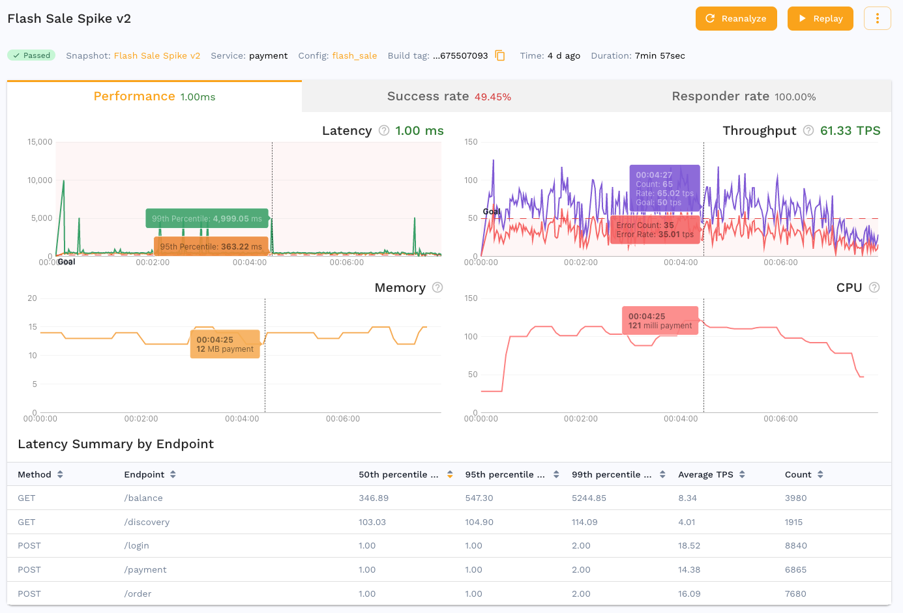
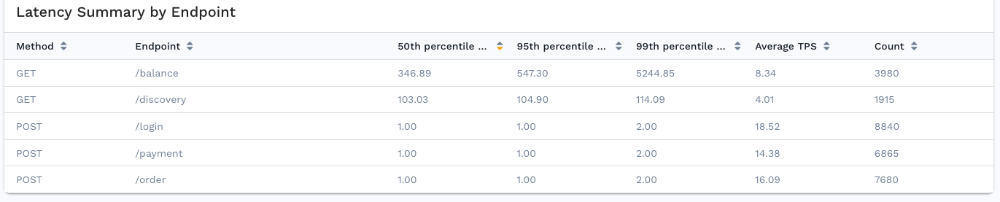

# Performance Details

The performance dashboard provides useful metrics around SRE golden signals.

## Performance Dashboard 

The performance view gives you information at a glance about how your code is performing in comparison to the [SRE Golden Signals](https://speedscale.com/2021/02/22/feature-spotlight-golden-signals/):

* **Latency** measured using both average, 95th and 99th percentile
* **Throughput** measured as traffic over time
  * RPS: requests per second
  * RPM: requests per minute
* **Saturation** measured by looking at CPU and Memory from the environment
* **Errors** there is an entire dashboard devoted to this information

## Latency Summary

The bottom of the report performance tab shows a summary of latency by
endpoint, aggregated metrics which apply to only a single endpoint. An endpoint
is a more generalized view of a URL without the host, port, query parameters,
etc.  Use this information to identify slow API calls and set
[goals](/reference/configuration/goals.md) to fail the report when an
endpoint falls outside service level objectives.

