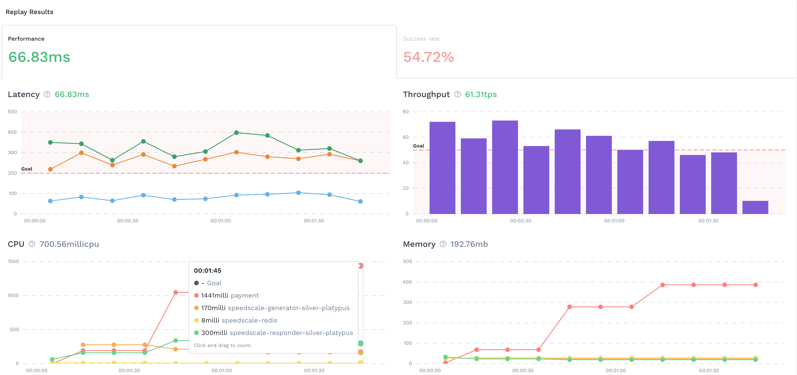
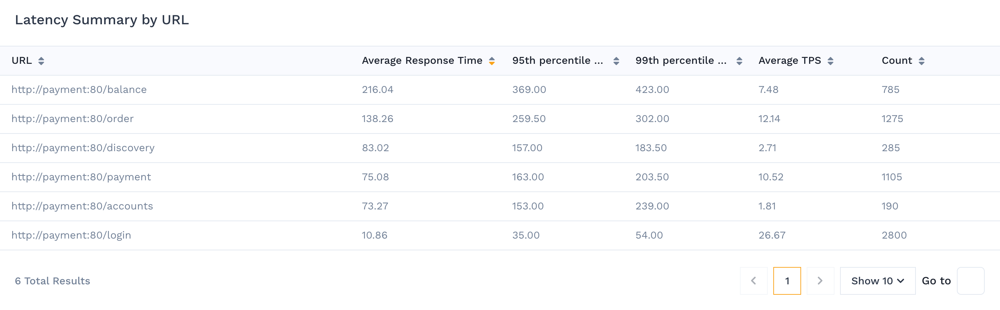

# Performance Details

The performance dashboard provides useful metrics around SRE golden signals.

## Performance Dashboard 

The performance view gives you information at a glance about how your code is performing in comparison to the [SRE Golden Signals](https://speedscale.com/2021/02/22/feature-spotlight-golden-signals/):

* **Latency** measured using both average, 95th and 99th percentile
* **Throughput** measured as traffic over time
  * TPS: transactions per second
  * TPM: transactions per minute
* **Saturation** measured by looking at CPU and Memory from the environment
* **Errors** there is an entire dashboard devoted to this information

As you scroll down you can find a summary of the performance by URL.

