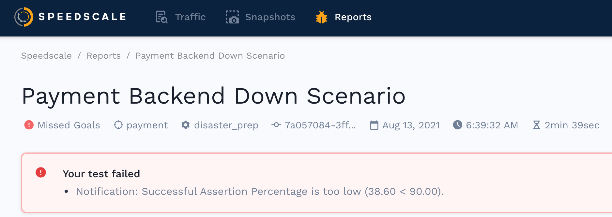

# Report Summary

At the top of the report are several key pieces of information.

## Replay Summary 

At a glance you should be able to see:

* What was the result of the replay? (Passed, Missed Goals, Running, Error)
* Which service did the traffic replay against?
* What replay configuration was used?
* What was the tag or commit hash from source control?
* When did the replay complete?
* How long did the replay take?
* If goals did were not met, what were they?

If you see a very low success rate, or your service displays other unusual
behavior, reach out on the [Speedscale Slack
community](http://slack.speedscale.com) or via
[email](mailto:support@speedscale.com) because you may need to configure data
transformation. Typically this is needed for authentication and time shifting.
The Speedscale team is working on a configuration UI but for now we're happier
to do the work for you than to have you stumble through this complex topic. If
you're feeling adventurous, you can jump over to
[transforms](../../reference/transform-traffic/README.md) to learn more,
but talking to us on Slack will be much easier.
