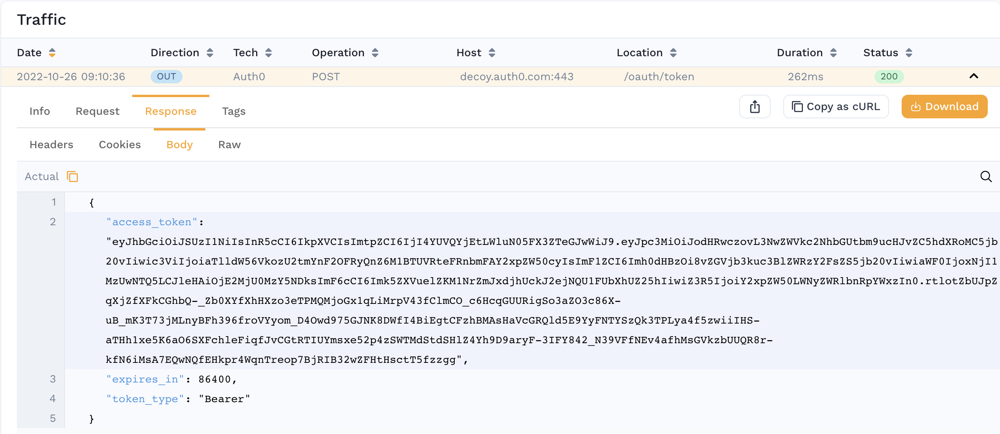
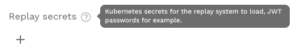

# Re-signing JWTs in mocks

Most real-world APIs require authentication. The most common type of authentication we see is JWT/OAuth2. This guide shows you how to train Speedscale to automatically re-sign JWTs when simulating backend services for your Service Under Test (SUT).

:::note
This workflow is currently in queue for complete automation by Speedscale engineering. If you'd like to view the new design and weigh in let us know in the [community](https://slack.speedscale.com). For now, please follow these instructions. The new system will be backwards compatible.
:::

## How do I know my app needs to resign JWTs?

1. Your application complains of invalid JWTs from the mocked service
2. Your application complains of being unable to authenticate with the mocked service
3. You see an outbound login-style transaction with a response payload containing the JSON key `access token`. For example:



## Prerequisites

* Find secret used to sign JWTs. Your application and the Speedscale responder must share the same secret for JWT re-signing to work.
* For this example we will assume your [secret](https://kubernetes.io/docs/concepts/configuration/secret/) is mounted in Kubernetes. Technically, the Speedscale responder is just looking for a file so you can adapt these instructions easily to run outside of Kubernetes.
* [Create a snapshot](./creating-a-snapshot.md) containing the traffic you need to re-sign

## Configure your transform

You must tell Speedscale which JWTs you want to re-sign. This is accomplished with a traffic transform.
1. Open the transform editor for your Snapshot
2. Select the Responder tab
3. Add a "JWT Resign" transform
4. Set the "path" to the correct file path so the responder can find it.
The path will always start with `/home/speedscale/secret/` and end with `secret_name/secret_key`. For example, let's say we have an RS256 TLS certficate stored in a Kubernetes secret called `jwt-demo`. The full path would be `/home/speedscale/secret/jwt-demo/tls.key` because the secret name is `jwt-demo` and by default Kubernetes stores TLS secrets with a key named `tls.key`. You can find more information in the Kubernetes [docs](https://kubernetes.io/docs/concepts/configuration/secret/)
5. (optional) Select a subet of traffic to apply the transform to. Remember, if "access_token" is not found in an RRPair then the responder will just skip it. This means there should be little issue with not configuring fine grained filters unless you have many `access_token`s that need to be treated differently.

When you're done, you should be able to click on the "Advanced" tab and see JSON resembling the following:
```JSON
{
  "id": "jwt-test",
  "responderResp": [
    {
      "filters": {
        "filters": [
          {
            "include": true
          }
        ]
      },
      "extractor": {
        "type": "http_res_body"
      },
      "transforms": [
        {
          "type": "json_path",
          "config": {
            "path": "access_token"
          }
        },
        {
          "type": "jwt_resign",
          "config": {
            "iss": "app.speedscale.com",
            "secretPath": "/home/speedscale/secret/jwt-demo/tls.key"
          }
        }
      ]
    }
  ]
}
```

## Mount your secrets to the responder from the UI

The secret must be made available to the responder in your cluster. We do this by instructing the operator to mount the secret when starting a replay. Don't worry, it's easy.

1. From the UI, select the [Test Config](https://dev.speedscale.com/config/standard) you would like to use for your replay.

:::note
Remember, you can clone the standard test config to get started.
:::

2. Add a secret to the cluster configuration.



For this example, we would simply enter the name of our secret in the cluster, `jwt-demo`.

(optional) If you are starting replays using a Traffic Replay CR, simply add a `secretRefs` to the spec. This step is only necessary if you are not using the UI to initiate a replay. Here is a complete example:

```yaml
---
apiVersion: speedscale.com/v1
kind: TrafficReplay
metadata:
  name: replay-jwt-resign
spec:
  snapshotID: 3bde4a60-580e-451d-90d1-0effc2f83c92
  workloadRef:
    kind: Deployment
    name: user
  secretRefs:
    - name: jwt-demo
```

Now, run your replay using your new test config and you're ready to go!

## Need Help?

Reach out on the [community Slack](https://slack.speedscale.com) if you need help!
