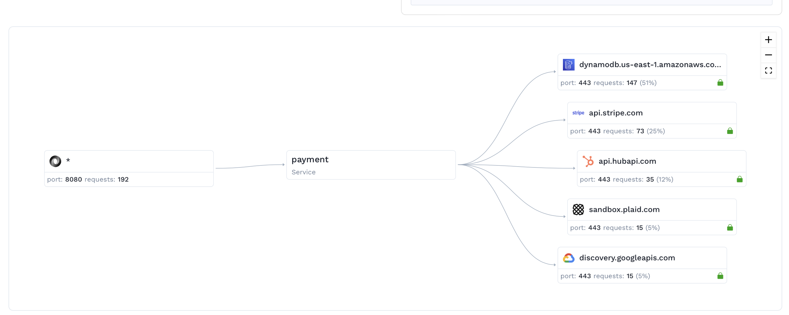
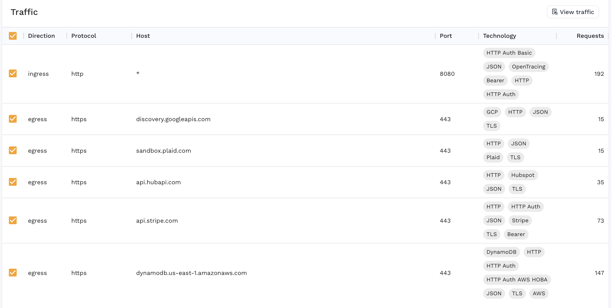
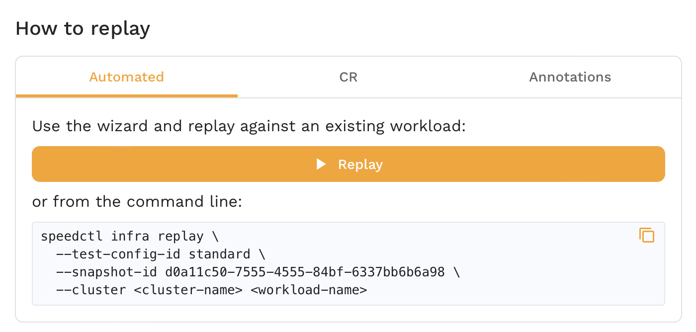
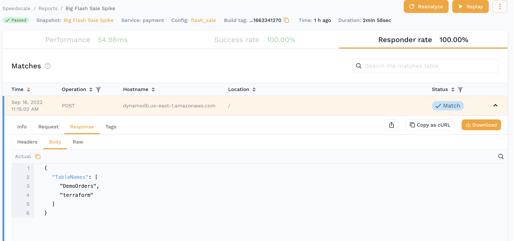
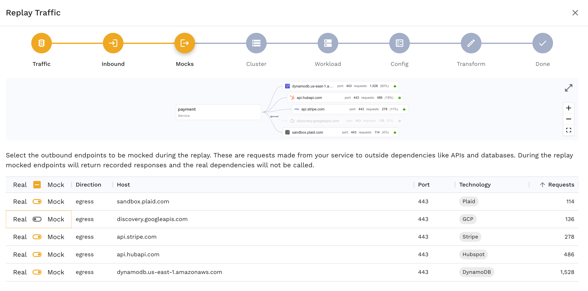
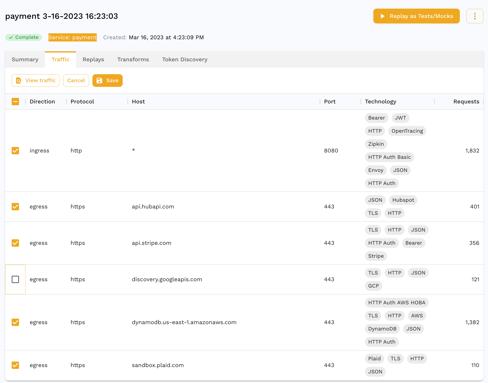
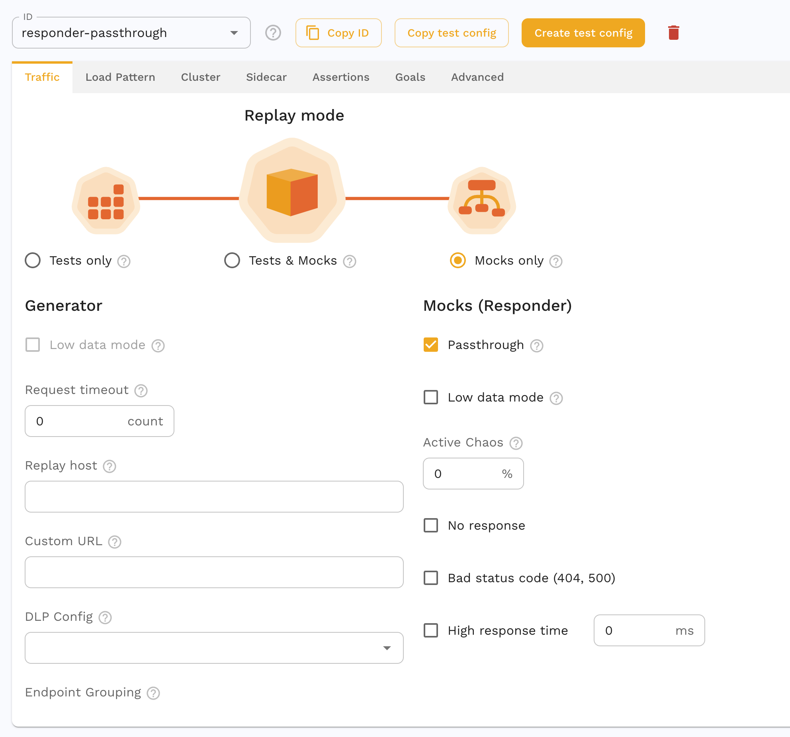
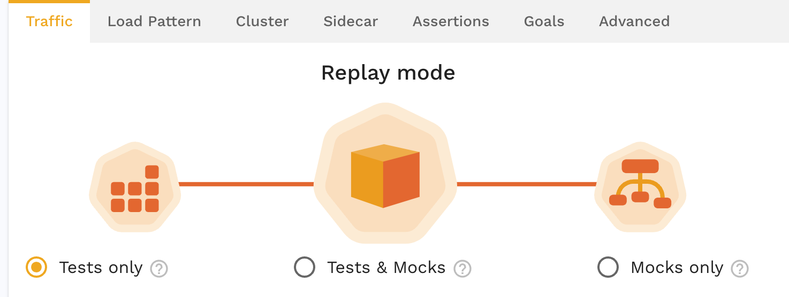

## Prerequisites
1. [The Operator is installed](../quick-start.md).
2. [A sidecar has been installed and traffic is being captured](/setup/sidecar/install/)
3. [Outbound TLS is being captured](./tls.md)
4. [A snapshot has been created](./creating-a-snapshot.md)

## Viewing the snapshot

We see here that our service has outbound calls to a variety of 3rd party APIs. We use DynamoDB, Stripe, Hubspot, Plaid and Google Cloud. Our goal is to run a test on this `payment` service without needing to rely on those external APIs. Speedscale allows us to mock these services out and reduce our dependency footprint during testing. A full list of supported technology is listed [here](../reference/technology-support.md). At Speedscale, we refer to these mocks as `responders`.

We can also see here that Speedscale has identified the type of backends these are. For eg. Hubspot is a JSON API and Stripe is similar but we've also identified `Bearer` authorization for the API requests. At this point we could uncheck certain backends if we did not them mocked out. For eg. I may not want to mock out DynamoDB because I have a dev instance setup but I want to mock out Stripe because I don't want to make actual credit card transactions. For now, we'll leave these all checked.

## Run a replay

Now we can run a replay using one of the three options presented here. Note that by default, both inbound and outbound traffic is generated and mocked respectively. If you want to run a workload with just the mocked backend for development but not run a full test replay, skip to [responder only mode](#responder-only).

After the replay is done, we can see the corresponding report. We have a 100% passing report and more importantly, we have a 100% responder rate. This means that we were successfully able to match all the requests made by the service under test via our signature matching algorithm. We can inspect the request and response pairs seen by the responder the same way we would with our general traffic capture.

## Responder Only

If we want to mock our backends indefinitely and not run a test, we can do this using responder only mode. Depending on your method of choice you can set the mode either via the annotation `replay.speedscale.com/mode: responder-only` or if you're using the TrafficReplay CRD, by setting the field `mode: responder-only`. This is a great way to develop services with external dependencies that:

* Have a cost associated with each API call. For eg. certain information APIs can cost a few cents per request which can add up quickly during development.
* Have disruptive side effects. For eg. we do not want to ever make real credit card charges and always want to mock out Stripe's API.
* Have low rate limits. Many public APIs such as Github's has strict rate limits which can be irritating to face when doing rapid iteration.

## Disabling some mock responses

Sometimes you don't want to mock everything in the environment. There are three ways to accomplish this:

1. *Disable an entire mock* - You can accomplish this by turning off the mock by unchecking it in the replay wizard:

You can also disable a mock from the snapshot summary page so that it is disabled for all replays utilizing that snapshot:

2. *Allow passthrough requests* - If you want to mock known requests but allow unrecognized transactions to continue to the original destination you can use `passthrough` mode. Just check the passthrough operation in your test config under the Mocks section:

3. *Disable the responder* - If you want all mocks to be disabled, regardless of snapshot configuration, set your test config for "Tests only" mode.

