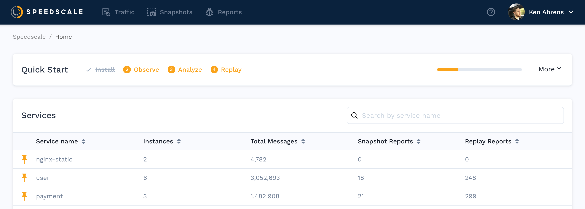
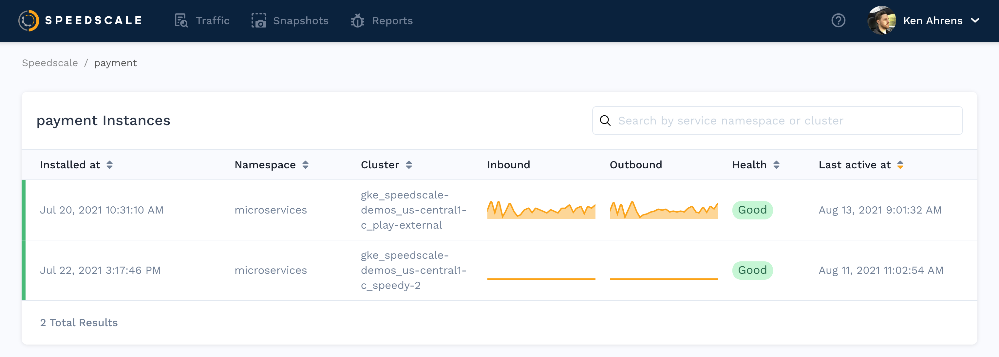

# Reviewing Services

Once the Speedscale proxy has collected traffic, your home page will begin to populate with a list of services.
Pin a service to keep it at the top of the list.

### Service Details 

Select any service to see recent instances, snapshots, reports, etc.
Your instance may show a flat line if the service is not receiving traffic or if the Speedscale proxy has been removed.

