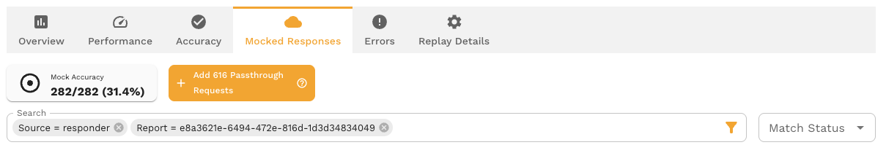
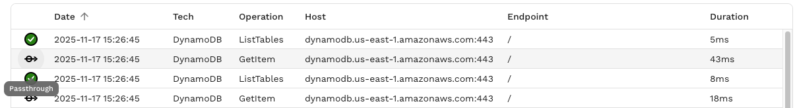
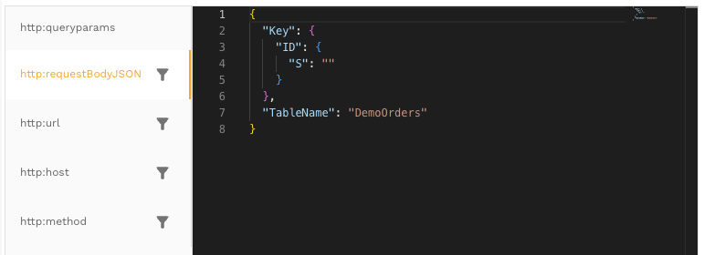
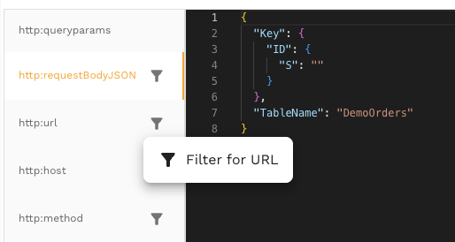
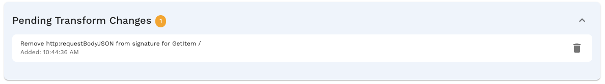

# How to Refine Signatures to Improve Mock Accuracy

## 1. Introduction

### 1.1 Purpose of This Guide

This guide teaches you how to refine request signatures in your service mock to maximize Mock Accuracy. By systematically adjusting how your mock server identifies and matches incoming requests to recorded responses, you'll ensure that your service mock (responder) returns the correct response for every request.

### 1.2 What You'll Learn

By the end of this guide, you will be able to:
- Understand and interpret Mock Accuracy metrics
- Identify signature mismatches in your reports
- Analyze differences between recorded and incoming requests
- Make informed decisions about which signature keys to remove or modify
- Apply transform chains to refine signatures
- Iteratively improve your Mock Accuracy to achieve 100% match rates

### 1.3 Prerequisites

Before using this guide, you should have:
- A [snapshot](../concepts/capture.md) containing recorded traffic from your service
- At least one [report](./reports/README.md) generated from test traffic
- Basic understanding of HTTP requests and responses
- Access to the Mocked Responses view in your reports

---

## 2. Understanding Mock Accuracy

### 2.1 What is Mock Accuracy?

Mock Accuracy is a metric that measures how well your service mock matches incoming requests to recorded responses. It represents the percentage of requests that the [responder](../reference/glossary.md#responder) successfully matched to a recorded signature, allowing it to return the appropriate mocked response. For more about service mocking, see [Mocks & Service Virtualization](../mocks/mocks.md).

A high Mock Accuracy means your mock server can reliably handle test traffic without needing to reach out to real backend services.

### 2.2 How Mock Accuracy is Calculated

Mock Accuracy is calculated as:

```
Mock Accuracy = (Number of Matches / Total Requests) × 100%
```

Where:
- **Matches**: Requests that exactly matched a recorded signature
- **Total Requests**: All requests received during the test run

For example, if your test generated 250 requests and 200 of them matched recorded signatures, your Mock Accuracy would be 80%.

### 2.3 Why Mock Accuracy Matters

High Mock Accuracy is critical for:
- **Reliable Testing**: Ensures your tests receive consistent, predictable responses
- **Test Isolation**: Eliminates dependencies on external services
- **Performance**: Avoids network latency from calling real services
- **Cost Reduction**: Reduces load on backend infrastructure during testing
- **Test Stability**: Prevents test failures due to backend service issues

### 2.4 Target Goals (Achieving 100% Match Rate)

The ultimate goal is to achieve **100% Mock Accuracy**, meaning every request in your test traffic finds a matching recorded signature. While 100% may not always be achievable (due to genuinely new request patterns), you should aim to:
- Achieve 95%+ accuracy for stable test suites
- Understand why any requests remain unmatched
- Continuously refine signatures as your application evolves


---

## 3. Core Concepts

### 3.1 What is a Signature?

A **signature** is a unique identifier for a request, composed of key-value pairs extracted from various parts of the HTTP request. The responder uses signatures to match incoming requests to recorded responses. For a deeper understanding of how signature matching works, see [Signature Matching](../mocks/signature.md).

#### 3.1.1 Signature Key-Value Pairs

A signature consists of multiple keys, each representing a different aspect of the request:

```
http:host = "api.example.com"
http:method = "POST"
http:url = "/users/create"
http:qp:client = "web"
http:qp:version = "2.0"
http:requestBodyJSON = "{\"name\":\"John\",\"timestamp\":1234567890}"
```

Each query parameter from the URL is extracted into a separate signature key with the `http:qp:` prefix. For example, a request to `/users/create?client=web&version=2.0` would generate the `http:qp:client` and `http:qp:version` keys shown above.

When an incoming request arrives, the responder extracts the same keys and compares them to recorded signatures. If all keys match exactly, the responder returns the corresponding recorded response.

#### 3.1.2 Common Signature Keys

The most frequently used signature keys include:

| Key | Description | Example |
|-----|-------------|---------|
| `http:host` | The target server hostname | `api.example.com` |
| `http:method` | HTTP method | `GET`, `POST`, `PUT`, `DELETE` |
| `http:url` | Request URL path | `/api/v1/users/123` |
| `http:requestBodyJSON` | JSON request body | `{"id": 123, "action": "update"}` |
| `http:requestBodyXML` | XML request body | `<request><id>123</id></request>` |
| `http:headers` | HTTP headers | `Content-Type: application/json` |
| `http:qp:*` | Individual query parameters (prefixed with `http:qp:`) | `http:qp:page = "1"`, `http:qp:limit = "10"` |

### 3.2 Understanding Transform Chains

#### 3.2.1 What are Transform Chains?

A **transform chain** is a set of operations that modify how signatures are extracted from requests. Transform chains allow you to make signatures more flexible by removing or modifying problematic keys that prevent matches. For a comprehensive overview of the transform system, see [Transform Overview](../transform/overview.md) or [Transform Concepts](../concepts/transforms.md).

#### 3.2.2 How Transform Chains Work

Transform chains are applied during signature extraction, before the matching process:

```
Incoming Request → Extract Signature → Apply Transform Chains → Compare to Recorded Signatures
```

Both recorded and incoming requests have the same transform chains applied, ensuring fair comparison.

#### 3.2.3 Common Transform Types

Transform chains use different transform types depending on the refinement goal. The most common types for signature modification are:

**1. delete_sig - Removing Granularity from Signatures**

The `delete_sig` transform is the most frequently used because users typically want to reduce signature granularity by removing keys that contain dynamic or non-semantic data:

```javascript
{
  "transforms": [
    {
      "type": "delete_sig",
      "config": {
        "key": "http:requestBodyJSON"
      }
    }
  ]
}
```

This transform removes the `http:requestBodyJSON` key entirely from all signatures that match the chain's filter criteria. Use this when a key's entire value is irrelevant to matching.

**2. scrub - Modifying Request Body Content**

The `scrub` transform modifies the content of request bodies (JSON or XML) by removing or replacing specific fields within the body, rather than removing the entire body key:

```javascript
{
  "transforms": [
    {
      "type": "scrub",
      "config": {
        "key": "http:requestBodyJSON",
        "path": "$.timestamp"
      }
    }
  ]
}
```

This transform removes the `timestamp` field from within the JSON request body, while keeping the rest of the body in the signature. Use this when most of the request body is semantic, but certain fields contain dynamic data.

**3. scrub_date - Normalizing Date/Time Fields**

The `scrub_date` transform is commonly used to normalize date and timestamp fields within request bodies to a consistent value:

```javascript
{
  "transforms": [
    {
      "type": "scrub_date",
      "config": {
        "key": "http:requestBodyJSON",
        "path": "$.createdAt"
      }
    }
  ]
}
```

This transform normalizes date/time values in the specified field, allowing requests with different timestamps to match. Use this when timestamps or dates vary between recorded and incoming requests but the rest of the body content should match.

### 3.3 Recorded vs. Incoming Requests

Understanding the difference between recorded and incoming requests is essential:

- **Recorded Requests**: Captured during the original traffic recording (snapshot creation). These represent the "known" request patterns.
- **Incoming Requests**: Generated during test runs. These are the requests your tests send that need to be matched against recorded signatures.

The goal of signature refinement is to make incoming request signatures match recorded signatures, even when some details differ.

### 3.4 Match Status Types

Every request in your report has a match status:

#### 3.4.1 Match: Exact Match Found

**Status**: Match
**Meaning**: The incoming request signature exactly matched a recorded signature. The responder successfully returned a mocked response.
**Action Required**: None. This is the desired state.

#### 3.4.2 No Match: No Match Found

**Status**: No Match
**Meaning**: The incoming request signature did not match any recorded signature. The responder could not determine which response to return.
**Action Required**: Investigate and refine the signature to create a match.

#### 3.4.3 Passthrough: Request Not Mocked

**Status**: Passthrough
**Meaning**: The request was sent to the real backend service instead of being mocked. This typically occurs when the request pattern wasn't present in the original recording.
**Action Required**: Consider adding this request pattern to your snapshot if it's part of your test suite.

---

## 4. Navigating to the Mocked Responses View

### 4.1 Opening a Report

To begin refining signatures:

1. Navigate to your project's reports section
2. Locate the report you want to analyze
3. Click on the report to open its details

Reports are generated from test runs and contain information about how well your mock server handled the test traffic.

### 4.2 Locating the Mock Accuracy Metric

The Mock Accuracy metric appears in two key locations:

**Report Overview Page**:
- Displayed as a metric card alongside other report statistics
- Shows the percentage and absolute numbers (e.g., "200/250 (80%)")
- Provides a high-level view of your mock's performance

**Responder Toolbar**:
- Located at the top of the Mocked Responses tab
- Shows the same metric with a standby icon
- Serves as a constant reminder of your current accuracy

### 4.3 Accessing the Mocked Responses Tab

To access the detailed view:

1. From the Report Overview page, click on the Mock Accuracy metric card, OR
2. Click on the "Mocked Responses" tab in the report navigation

Both actions take you to the Mocked Responses view, where you can see the detailed list of all requests and their match statuses.

### 4.4 Understanding the Report Overview Metrics

The Report Overview provides several metrics:

- **Total Requests**: Total number of requests in the test run
- **Mock Accuracy**: Percentage of requests that matched (Matches)
- **Passthrough Count**: Number of requests sent to real services
- **Miss Count**: Number of requests that failed to match

These metrics help you understand the overall health of your mock configuration before diving into specific request details.



---

## 5. Identifying Signature Mismatches

### 5.1 Viewing the RRPair List

The Mocked Responses tab displays an **RRPair List** ([Request-Response Pair](../reference/glossary.md#rrpair) List). Each row represents a single request from your test run, showing:

- Request method and URL
- Match status icon (Match, No Match, or Passthrough)
- Timestamp
- Response status code
- Service name

The list is typically sorted by timestamp but can be filtered and sorted by various criteria.

### 5.2 Identifying No Match and Passthrough Status Icons

Look for visual indicators in the list:

- **Match** (Green checkmark or success icon): Request matched successfully - no action needed
- **No Match** (Red X or error icon): Request failed to match - requires attention
- **Passthrough** (Yellow warning icon): Request went to real service - may require attention

Focus your refinement efforts on No Match and Passthrough requests, as these represent gaps in your mock coverage.

### 5.3 Selecting an RRPair for Analysis

To investigate a mismatch:

1. Scan the list for No Match or Passthrough icons
2. Click on the row representing the problematic request
3. The system will open a detailed view for analysis

Start with requests that occur frequently or represent critical paths in your application.

### 5.4 Opening the RRPair Details Drawer

When you click on an RRPair, a details drawer opens on the right side of the screen. This drawer contains multiple tabs:

- **Request**: Full details of the incoming request
- **Response**: Full details of the response (if any)
- **Signature**: The signature extracted from the request - this is where you'll spend most of your time
- **Transform**: History of transforms applied to this request

The Signature tab is your primary tool for understanding why a match failed.



---

## 6. Analyzing Signature Details

### 6.1 Navigating to the Signature Tab

With an RRPair selected and the details drawer open:

1. Click on the **Signature** tab
2. The tab displays a table of signature keys and their values
3. Keys are organized vertically with tabs for easy navigation

This view shows you exactly what the responder used to attempt matching this request.

### 6.2 Reading the Signature Key Table

The signature table displays:

- **Key Name**: The signature key (e.g., `http:method`, `http:url`)
- **Value**: The actual value extracted from the request
- **Status Indicator**: Visual indicator showing if this key caused a mismatch

The table uses vertical tabs for keys, allowing you to quickly navigate between different signature components. You may see a diff view similar to Visual Studio Code if there have been changes applied by the transform system.



### 6.3 Understanding Change Indicators

When a No Match occurs, the signature view shows change indicators (pills) that highlight differences:

#### 6.3.1 Added Keys (Plus + Pill)

**Indicator**: Green pill with "+" symbol
**Meaning**: This key exists in the incoming request but not in any recorded signature
**Implication**: The incoming request has additional data that wasn't present during recording

Example:
```
+ http:newHeader = "extra-data"
```

#### 6.3.2 Removed Keys (Minus - Pill)

**Indicator**: Red pill with "-" symbol
**Meaning**: This key existed in recorded signatures but is missing from the incoming request
**Implication**: The incoming request is missing data that was present during recording

Example:
```
- http:sessionToken = (missing)
```

#### 6.3.3 Modified Keys (Tilde ~ Pill)

**Indicator**: Yellow/Orange pill with "~" symbol
**Meaning**: This key exists in both recorded and incoming requests, but the values differ
**Implication**: The data changed between recording and replay

Example:
```
~ http:requestBodyJSON
  Recorded: {"userId": 123, "timestamp": 1234567890}
  Incoming: {"userId": 123, "timestamp": 9876543210}
```

Modified keys are the most common cause of mismatches and often require signature refinement.

### 6.4 Using Quick Filter Actions

The Signature tab provides quick filter buttons for common keys:

#### 6.4.1 Filter for Host

Creates a filter targeting requests to the same host:
```
Filter: http:host = "api.example.com"
```

Useful when you want to apply changes to all requests going to a specific server.

#### 6.4.2 Filter for URL

Creates a filter targeting requests to the same URL path:
```
Filter: http:url = "/api/v1/users"
```

Useful when refining signatures for a specific endpoint.

#### 6.4.3 Filter for Method

Creates a filter targeting requests with the same HTTP method:
```
Filter: http:method = "POST"
```

Useful when combining with other filters to target specific operations.

These quick filters help you create precise transform chains that affect only the requests you intend to modify.



---

## 7. Using the Signature Suggestions Dialog

### 7.1 When to Use Signature Suggestions

The **Signature Suggestions** dialog is your most powerful tool for understanding mismatches. Use it when:

- You see a No Match status and need to understand why
- The Signature tab shows modified keys (~ indicator)
- You want to see which recorded signatures are similar to the incoming request
- You need to decide which keys to remove or modify

A **"Suggestions..."** button appears in the Signature tab when the request status is not Match.

### 7.2 Opening the Suggestions Dialog

To open the dialog:

1. Navigate to the Signature tab of a No Match request
2. Click the **"Suggestions..."** button
3. The system retrieves up to 10 similar recorded signatures
4. The dialog opens with a side-by-side comparison

The retrieval process compares the incoming signature against all recorded signatures and returns the most similar matches.

### 7.3 Understanding the Side-by-Side Comparison

The dialog displays a split-screen comparison:

#### 7.3.1 Recorded Signature (Left Panel)

The left panel shows:
- **Title**: "Recorded" or "Recorded Signature"
- **Content**: The signature from the original traffic recording
- **Format**: JSON format with syntax highlighting
- **Keys**: All keys that were present in the recorded signature

This represents what the responder is looking for - the "target" signature.

#### 7.3.2 Suggested Signature (Right Panel)

The right panel shows:
- **Title**: "Suggested" or "Incoming Signature"
- **Content**: The signature extracted from the incoming request
- **Format**: JSON format with syntax highlighting
- **Keys**: All keys extracted from the incoming request
- **Highlights**: Differences are highlighted in the editor

This represents what actually arrived - the signature that failed to match.

The Monaco editor-based diff viewer makes it easy to spot differences with color coding:
- **Red**: Content removed or missing in incoming
- **Green**: Content added or extra in incoming
- **Yellow/Orange**: Content modified between recorded and incoming

### 7.4 Reviewing Similar Signatures (Up to 10)

The dialog can display up to 10 similar signatures from your recording:

1. Use the navigation controls (dropdown or arrows) to switch between suggestions
2. Each suggestion shows a different recorded signature that partially matched
3. The system orders suggestions by similarity score (most similar first)

Reviewing multiple suggestions helps you identify patterns:
- Which keys consistently differ across all suggestions?
- Are there keys that vary even among recorded signatures?
- Is there a common pattern to the differences?

### 7.5 Navigating Between Suggestions

To navigate suggestions:

1. **Dropdown Menu**: Select a specific suggestion number (1-10)
2. **Arrow Buttons**: Click previous/next arrows to move sequentially
3. **Keyboard Shortcuts**: Use arrow keys if supported

As you navigate, the left panel updates to show different recorded signatures while the right panel remains constant (showing your incoming request).

### 7.6 Auto-Selected Changed Keys

When the dialog opens, it automatically:

1. Identifies the first key that differs between recorded and incoming signatures
2. Scrolls both panels to that key's location
3. Highlights the difference for immediate visibility

This auto-selection helps you quickly identify the most likely cause of the mismatch without manually searching through potentially large JSON structures.


---

## 8. Making Signature Refinement Decisions

### 8.1 Identifying Problematic Keys

After reviewing the Signature Suggestions dialog, identify which keys are causing mismatches:

**Questions to ask:**
- Which keys show differences across all or most similar signatures?
- Are the differences in these keys meaningful for request matching?
- Would removing or modifying these keys cause incorrect matches?

Common problematic keys include:
- Timestamps
- Session tokens
- Request IDs
- Dynamic JSON content that changes per request
- Non-deterministic data

### 8.2 Determining Which Keys to Remove

Use this decision framework:

**Remove a key if:**
- ✅ The key contains dynamic data that changes every request
- ✅ The key is not essential for identifying the correct response
- ✅ The endpoint would return the same response regardless of this key's value
- ✅ Removing the key would enable matches without causing incorrect matches

**Keep a key if:**
- ❌ The key is essential for distinguishing between different responses
- ❌ Different values for this key should return different responses
- ❌ Removing it would cause requests to match incorrectly

### 8.3 When to Remove vs. Modify Keys

**Remove Entire Key** (delete_sig transform):
- Use when the key's entire value is irrelevant to response selection
- Example: Removing `http:requestBodyJSON` when the entire body contains only non-semantic metadata
- Most common approach for reducing signature granularity

**Scrub Fields Within Request Body** (scrub transform):
- Use when most of the request body is important, but specific fields contain dynamic data
- Example: Removing only the `timestamp` field from within a JSON body using `$.timestamp` path
- Keeps the signature granular while removing problematic fields

**Normalize Date/Time Fields** (scrub_date transform):
- Use when request bodies contain date or timestamp fields that vary but shouldn't affect matching
- Example: Normalizing `createdAt` timestamps so requests match regardless of when they were created
- Common for APIs that include timestamps in request payloads

For most initial refinement work, complete removal (`delete_sig`) is simpler and faster. Use `scrub` and `scrub_date` when you need more precise control over request body matching.

### 8.4 Common Problem Keys

#### 8.4.1 http:requestBodyJSON (Dynamic Request Bodies)

**Problem**: JSON request bodies often contain dynamic data like timestamps, UUIDs, or session-specific information.

**Example**:
```json
Recorded: {"action": "update", "timestamp": 1234567890, "requestId": "abc-123"}
Incoming: {"action": "update", "timestamp": 9876543210, "requestId": "xyz-789"}
```

**Solutions** (in order of granularity):
1. **Scrub specific fields** (scrub transform): Remove only the problematic fields like `timestamp` and `requestId` using JSONPath (e.g., `$.timestamp`, `$.requestId`), keeping the `action` field in the signature
2. **Normalize timestamps** (scrub_date transform): If the timestamp format needs to be preserved but normalized, use `scrub_date` to make all timestamps match a consistent value
3. **Remove entire body** (delete_sig transform): Remove `http:requestBodyJSON` entirely if the entire body is irrelevant to response selection

**Recommendation**: Start with scrub or scrub_date to maintain signature granularity where possible. Only use delete_sig if the entire request body is non-semantic.

#### 8.4.2 http:requestBodyXML (Dynamic XML Payloads)

**Problem**: Similar to JSON, XML bodies may contain dynamic elements.

**Example**:
```xml
Recorded: <request><timestamp>1234567890</timestamp><action>update</action></request>
Incoming: <request><timestamp>9876543210</timestamp><action>update</action></request>
```

**Solution**: Remove `http:requestBodyXML` if the XML content is not essential for matching.

#### 8.4.3 Timestamp and Session-Specific Fields

**Problem**: Fields like `timestamp`, `sessionId`, `requestId`, and `correlationId` are unique per request.

**Solution**: Remove these keys from the signature, as they rarely affect which response should be returned.

#### 8.4.4 http:qp:* (Dynamic Query Parameters)

**Problem**: Query parameters are split into individual signature keys with the `http:qp:` prefix. Some query parameters contain dynamic or session-specific values that change per request.

**Example**:
```
Recorded: http:qp:client = "web", http:qp:sessionId = "abc-123", http:qp:page = "1"
Incoming: http:qp:client = "web", http:qp:sessionId = "xyz-789", http:qp:page = "1"
```

**Solution**: Selectively remove only the dynamic query parameter keys (e.g., `http:qp:sessionId`, `http:qp:timestamp`) while keeping semantic ones (e.g., `http:qp:page`, `http:qp:client`) that affect which response should be returned.

**Advantage**: The `http:qp:` prefix structure allows fine-grained control - you can remove specific problematic query parameters without affecting others on the same endpoint.

### 8.5 Understanding the Impact of Removing Keys

Before removing a key, consider the impact:

**Positive Effects:**
- ✅ Increases match flexibility
- ✅ Allows requests with dynamic data to match recorded signatures
- ✅ Improves Mock Accuracy percentage

**Potential Risks:**
- ⚠️ May cause incorrect matches if the key actually distinguished between different responses
- ⚠️ Could mask legitimate signature variations that should result in different responses

**Example Risk Scenario**:
If you remove `http:url` from the signature, ALL requests to the same host would match regardless of endpoint, causing incorrect responses.

**Best Practice**: Start by removing keys that clearly contain dynamic, non-semantic data. Verify the impact by applying changes and checking the new Mock Accuracy.

---

## 9. Queuing Signature Changes

### 9.1 Using "Queue Remove from Signature"

Once you've identified a problematic key, queue its removal:

1. In the Signature Suggestions dialog, locate the problematic key
2. Click the **"Queue Remove from Signature"** button next to the key
3. A transform chain is created and added to the pending changes queue

**Note**: The "Queue Remove from Signature" button typically appears for keys like `http:requestBodyJSON` and `http:requestBodyXML`.

The term "queue" indicates that the change isn't applied immediately - it's staged for batch application later.

### 9.2 Understanding Transform Chain Creation

When you click "Queue Remove from Signature", the system creates a transform chain:

```javascript
{
  "filters": {
    "detectedLocation": "/api/v1/users",  // Target endpoint
    "detectedCommand": "POST"              // Target method
  },
  "transforms": [
    {
      "type": "delete_sig",
      "config": {
        "key": "http:requestBodyJSON"
      }
    }
  ],
  "tags": {
    "source": "signature-suggestions",
    "action": "remove-from-signature",
    "endpoint": "/api/v1/users",
    "operation": "POST"
  }
}
```

This chain:
- **Filters**: Targets only requests to `POST /api/v1/users`
- **Transforms**: Removes the `http:requestBodyJSON` key from signatures
- **Tags**: Metadata for tracking the transform's origin and purpose

:::tip
For more information on how transform chains work and the order of execution, see [Transform Overview](../transform/overview.md#extractors-and-transforms).
:::

### 9.3 Reviewing the Queued Transform Details

After queuing a transform, review its details:

#### 9.3.1 Target Filters (Endpoint & Operation)

The filters determine which requests are affected:
- `detectedLocation`: The URL path (e.g., `/api/v1/users`)
- `detectedCommand`: The HTTP method (e.g., `POST`)

Only requests matching BOTH filters will have the transform applied.

#### 9.3.2 Transform Type (delete_sig)

The `delete_sig` transform type specifically removes a signature key. When applied:
- The key is deleted from both recorded and incoming signatures
- Matching proceeds without considering this key
- The transform is permanent in the snapshot's configuration (until removed)

#### 9.3.3 Metadata Tags

Tags provide traceability:
- `source`: Where the transform originated (e.g., "signature-suggestions")
- `action`: What action was taken (e.g., "remove-from-signature")
- `endpoint` & `operation`: The targeted request pattern

These tags help you understand your transform chains later when reviewing the configuration.

### 9.4 Queuing Multiple Changes

You can queue multiple transforms before applying them:

1. Open Signature Suggestions for one No Match request
2. Queue a removal for a problematic key
3. Close the dialog and select another No Match request
4. Queue additional removals for that request
5. Repeat as needed

All queued transforms accumulate in the pending changes panel. This allows you to:
- Make multiple refinements at once
- Review all changes before applying them
- Batch-apply changes for efficient testing

**Best Practice**: Start with a few key removals (1-3) rather than queuing many at once. Apply and evaluate, then queue more if needed.

---

## 10. Managing Pending Transforms

### 10.1 Viewing the Pending Transforms Panel

The **Pending Transforms Panel** appears in the Responder toolbar area when you have queued transforms:

- Location: Below the Mock Accuracy metric and main toolbar buttons
- Appearance: Collapsible panel with a blue-tinted background
- Visibility: Only visible when there are pending transforms

The panel serves as a staging area where you can review all queued changes before applying them.

### 10.2 Understanding the Transform Count Badge

The pending transforms panel displays a count badge showing:

```
Pending Transforms (3)
```

This number represents the total queued transforms. It also appears on the **"Apply X Change(s) & Create New Report"** button, ensuring you always know how many changes will be applied.

### 10.3 Reviewing Queued Transforms

Each queued transform is displayed as a card showing:

#### 10.3.1 Transform Descriptions

Human-readable descriptions explain what each transform does:

```
Remove http:requestBodyJSON from signature for POST /api/v1/users
```

The description includes:
- **Action**: What will be done (e.g., "Remove")
- **Key**: Which signature key is affected (e.g., "http:requestBodyJSON")
- **Target**: Which endpoint and method (e.g., "POST /api/v1/users")

#### 10.3.2 Timestamps

Each transform card shows:
- **Queued At**: When the transform was added to the queue
- **Format**: Typically relative time (e.g., "2 minutes ago") or absolute timestamp

Timestamps help you track when changes were made, especially in longer refinement sessions.

### 10.4 Removing Individual Transforms

To remove a single transform from the queue:

1. Locate the transform card in the Pending Transforms Panel
2. Click the **Delete** button (trash icon) on the card
3. The transform is immediately removed from the queue
4. The count badge updates to reflect the new total

Use this when you:
- Queued a transform by mistake
- Changed your mind about a specific refinement
- Want to test other changes first

### 10.5 Using "Discard All" to Clear All Pending Changes

To remove all pending transforms at once:

1. Click the **"Discard All"** button in the Responder toolbar
2. A confirmation dialog may appear
3. All pending transforms are removed from the queue
4. The Pending Transforms Panel disappears

Use "Discard All" when:
- You want to start fresh with a different approach
- You queued too many changes and want to simplify
- You need to revert all staged changes before applying them

**Warning**: Discarding is permanent for queued transforms. Once discarded, you'll need to re-queue changes manually.



---

## 11. Applying Changes and Creating New Reports

### 11.1 When to Apply Changes

Apply your queued transforms when:

- ✅ You've queued 1-5 focused transforms for specific endpoints
- ✅ You've reviewed all pending transforms and verified they target the correct endpoints
- ✅ You're ready to test whether the changes improve Mock Accuracy
- ✅ You want to see the impact of your refinements

**Best Practice**: Apply changes in small batches (1-5 transforms) rather than queuing many at once. This makes it easier to identify which changes helped or hurt your Mock Accuracy.

### 11.2 Clicking "Apply X Change(s) & Create New Report"

To apply your pending transforms:

1. Locate the **"Apply X Change(s) & Create New Report"** button in the Responder toolbar
2. The button shows the exact number of pending transforms (e.g., "Apply 3 Change(s)...")
3. Click the button to begin the application process
4. A loading indicator appears while the system processes your request

The button is only visible when you have pending transforms queued.

### 11.3 Understanding the Backend Processing

When you click "Apply Changes", the following occurs:

#### 11.3.1 Transform Chains Added to Snapshot

Your queued transform chains are added to the snapshot's `tokenizerConfig.responder` configuration:

```javascript
snapshot.tokenizerConfig.responder = [
  ...existingTransforms,
  {
    filters: { detectedLocation: "/api/v1/users", detectedCommand: "POST" },
    transforms: [{ type: "delete_sig", config: { key: "http:requestBodyJSON" } }]
  }
  // ... more queued transforms
]
```

These transforms become part of the snapshot's permanent configuration.

#### 11.3.2 Mock Server Test Mode Execution

The system initiates a mock tuning job (`InitMockTuningJobWithSnapshot`):

1. **Replays test traffic** using the updated transform configuration
2. **Applies transform chains** to both recorded and incoming signatures
3. **Attempts matching** with the refined signatures
4. **Calculates new metrics** including the updated Mock Accuracy

This test mode allows you to see the impact of your transforms without affecting production mocking.

#### 11.3.3 New Report Generation

A new report is generated containing:
- Updated Mock Accuracy metrics
- New match statuses for each request (Match, No Match, or Passthrough)
- Transform history showing which transforms were applied
- Comparison data showing improvements or regressions

### 11.4 Automatic Redirect to New Report

After the backend processing completes:

1. The system automatically redirects you to the newly created report
2. The pending transforms queue is cleared (since they've been applied)
3. You're taken directly to the results of your refinements

This seamless flow allows you to immediately evaluate the impact of your changes.

### 11.5 Auto-Opening the Mocked Responses Tab

The new report automatically opens with the **Mocked Responses** tab active, showing:

- Updated Mock Accuracy metric
- Refreshed RRPair list with new match statuses
- Results of your signature refinements

This saves you navigation time and immediately shows whether your refinements improved the Mock Accuracy. Keep in mind that the mock accuracy report may take a few minutes to run. The page will update on its own or hit refresh.

---

## 12. Evaluating Results

### 12.1 Checking the Updated Mock Accuracy Metric

As soon as the new report opens, check the Mock Accuracy metric:

```
Before: 156/250 (62%)
After:  203/250 (81%)
```

This immediate comparison tells you whether your refinements were successful.

### 12.2 Comparing Before and After Percentages

Evaluate the impact:

**Significant Improvement** (10%+ increase):
- Your transform choices were effective
- Continue refining remaining mismatches using the same approach

**Moderate Improvement** (5-10% increase):
- You're on the right track
- Additional refinements needed
- Look for patterns in remaining No Match requests

**Minimal Improvement** (&lt;5% increase):
- The transforms may not have targeted the right keys
- Review the Signature Suggestions again
- Consider different keys or more targeted filters

**Regression** (decrease in accuracy):
- The transforms caused incorrect matches
- Revert the changes by using a previous report
- Reconsider which keys to remove

### 12.3 Identifying Remaining Mismatches

Even after improvements, scan the RRPair list for remaining No Match and Passthrough requests:

1. Sort or filter the list to show only No Match/Passthrough statuses
2. Identify common patterns:
   - Do they all target the same endpoint?
   - Do they share common signature characteristics?
   - Are there new problematic keys that emerged?

3. Prioritize by frequency:
   - Focus on endpoints with many No Match requests
   - Address high-volume endpoints first for maximum impact

### 12.4 Determining if Further Refinement is Needed

Decide whether to continue refining:

**Continue Refining If**:
- Mock Accuracy is below 95%
- There are clear patterns in remaining mismatches
- The remaining No Match requests represent critical test paths

**Stop Refining If**:
- Mock Accuracy is 95%+ (or 100%)
- Remaining No Match requests represent genuinely new request patterns not in the recording
- Further refinements would risk causing incorrect matches

**Acceptable End States**:
- **100%**: Perfect - all requests matched
- **95-99%**: Excellent - minor edge cases remain
- **90-95%**: Good - acceptable for most use cases
- **&lt;90%**: Needs more work - significant gaps in mock coverage


---

## 13. Iterative Refinement Process

### 13.1 The Refinement Cycle

Signature refinement is an iterative process:

#### 13.1.1 Analyze → Queue → Apply → Evaluate → Repeat

```
1. ANALYZE
   ↓ Review Mock Accuracy and identify No Match requests
   ↓ Open Signature Suggestions to understand differences
   ↓ Determine which keys are problematic

2. QUEUE
   ↓ Queue transforms to remove or modify problematic keys
   ↓ Review pending transforms panel

3. APPLY
   ↓ Apply pending transforms and create new report
   ↓ Wait for backend processing

4. EVALUATE
   ↓ Check new Mock Accuracy metric
   ↓ Compare before/after results

5. REPEAT
   ↓ If accuracy < 95%, return to ANALYZE
   ↓ If accuracy ≥ 95%, refinement complete
```

Each iteration should improve your Mock Accuracy incrementally.

### 13.2 Prioritizing Changes

Not all mismatches are equal. Prioritize by:

**1. Request Frequency**
- Address endpoints that No Match frequently first
- High-frequency endpoints have the biggest impact on overall Mock Accuracy

**2. Critical Paths**
- Focus on requests in critical test scenarios
- Ensure important user flows have reliable mocking

**3. Simplicity**
- Start with obvious problematic keys (timestamps, request IDs)
- Save complex cases for later iterations

**4. Related Endpoints**
- Group similar endpoints together
- Apply similar transforms to related requests

### 13.3 Working Through Multiple Mismatches

When facing many No Match requests:

**Step 1**: Group by endpoint
```
POST /api/v1/users - 25 No Match requests
GET /api/v1/orders - 18 No Match requests
PUT /api/v1/profile - 12 No Match requests
```

**Step 2**: Start with the highest-count endpoint

**Step 3**: Identify common keys causing mismatches
- Often, the same key causes issues across all requests to an endpoint

**Step 4**: Queue one transform for that endpoint

**Step 5**: Apply and evaluate

**Step 6**: Move to the next endpoint

This methodical approach prevents overwhelming yourself with too many simultaneous changes.

### 13.4 Reaching 100% Mock Accuracy

Achieving perfect Mock Accuracy requires:

**1. Complete Coverage**: Your original recording must contain examples of all request patterns your tests generate

**2. Proper Refinement**: All dynamic, non-semantic keys must be removed from signatures

**3. Stable Tests**: Your tests must not generate genuinely new request patterns not present in the recording

If you've refined signatures thoroughly but can't reach 100%, the remaining No Match requests likely represent:
- New features or endpoints not in the original recording
- Test data that differs from recorded data
- Edge cases not covered during recording

In these cases, you may need to re-record traffic or manually add the missing patterns to your snapshot.

### 13.5 When to Stop Refining

Stop refining when:

- ✅ Mock Accuracy is 95%+ (or your target threshold)
- ✅ Remaining No Match requests are rare edge cases
- ✅ Further refinements would risk causing incorrect matches
- ✅ The cost of additional refinement outweighs the benefit

**Acceptable completion criteria**:
- **100%**: Ideal for critical systems
- **98-99%**: Excellent for most applications
- **95-97%**: Good for applications with dynamic or unpredictable traffic

Remember: Higher accuracy isn't always better if it comes at the cost of incorrect matches. Balance is key.

---

## 14. Handling Passthrough Requests

### 14.1 Understanding Passthrough Status

A **Passthrough** request is one that:
- Was not mocked by the responder
- Was sent through to the real backend service
- May not have been present in the original recording

Passthrough requests indicate gaps in your mock coverage but don't necessarily represent matching failures.

### 14.2 When "Add Passthrough Requests" Appears

The **"Add Passthrough Requests"** button appears in the Responder toolbar when:

```
passthroughCount > 0
```

This button is shown when your test run generated requests that weren't in the original snapshot. The button displays the count:

```
Add Passthrough Requests (15)
```

### 14.3 Adding Passthrough Calls to Snapshot

To add passthrough requests to your snapshot:

1. Click the **"Add Passthrough Requests"** button
2. The system adds these request patterns to the snapshot
3. Future test runs will mock these requests instead of passing them through

This is useful when:
- Your application has evolved since the original recording
- Tests now cover new endpoints or features
- You want to eliminate dependencies on real backend services

**Note**: Adding passthrough requests requires that the backend responses were captured during the test run.

### 14.4 Impact on Mock Accuracy

Passthrough requests affect Mock Accuracy depending on how they're counted:

**If passthrough requests are excluded from Mock Accuracy calculation**:
- Mock Accuracy only considers requests that were attempted to be mocked
- Adding passthrough requests to the snapshot increases future Mock Accuracy

**If passthrough requests are included in Mock Accuracy calculation**:
- They count as mismatches, lowering the percentage
- Adding them to the snapshot improves Mock Accuracy in subsequent runs

Check your system's documentation to understand how passthrough requests factor into your Mock Accuracy metric.


---

## 15. Advanced Techniques

### 15.1 Copying Recorded vs. Suggested Signatures

In the Signature Suggestions dialog, you can copy signatures:

**"Copy Recorded" Button**:
- Copies the recorded signature JSON to your clipboard
- Useful for manual analysis or documentation
- Allows comparison with other signatures outside the UI

**"Copy Suggested" Button**:
- Copies the incoming (suggested) signature JSON to your clipboard
- Useful for sharing with team members or debugging

**Use Cases**:
- Documenting signature differences in bug reports
- Analyzing signatures programmatically
- Creating manual transform chains
- Comparing multiple signatures side-by-side in an external tool

### 15.2 Using Filter Actions Strategically

Combine quick filter actions to create precise transforms:

**Example 1: Target Specific Endpoint**
1. Click "Filter for Host" → targets `http:host = "api.example.com"`
2. Click "Filter for URL" → adds `http:url = "/api/v1/users"`
3. Click "Filter for Method" → adds `http:method = "POST"`
4. Result: Transform applies only to `POST api.example.com/api/v1/users`

**Example 2: Broad Application**
1. Click only "Filter for Host"
2. Result: Transform applies to all requests to that host, regardless of endpoint

**Strategic Usage**:
- Use all three filters when you want surgical precision
- Use only host filter when the issue affects an entire service
- Use host + URL when the issue affects all methods on an endpoint

### 15.3 Analyzing Transform History

For an RRPair, view the **Transform** tab to see:

- All transforms that were applied to this request
- The order in which they were applied
- The source and metadata of each transform

This helps you:
- Understand why a request matched or didn't match
- Debug unexpected matching behavior
- Trace the evolution of your signature configuration

**Use Case**: If Mock Accuracy decreases after applying transforms, review the transform history to identify which change caused the regression.

### 15.4 Understanding Transform Chain Priority

When multiple transform chains could apply to a request:

**Evaluation Order**:
1. Chains are evaluated in the order they appear in the configuration
2. All matching chains are applied (not just the first match)
3. Transforms within a chain are applied sequentially

**Implications**:
- Order matters when transforms interact
- Later transforms can undo or modify earlier transforms
- Overlapping chains combine their effects

**Best Practice**: Keep transform chains simple and non-overlapping when possible.

### 15.5 Working with Complex Request Bodies

For complex JSON or XML bodies:

**Challenge**: The entire body might differ due to a single nested field, but most of the body content is important for matching.

**Recommended Solutions**: Use scrub transforms to target specific problematic fields:

**1. Scrub Dynamic Fields** (Most Common):
Remove only the specific fields that contain dynamic data:
```javascript
{
  "type": "scrub",
  "config": {
    "key": "http:requestBodyJSON",
    "path": "$.metadata.timestamp"
  }
}
```

This removes only the `timestamp` field nested under `metadata`, keeping the rest of the request body in the signature.

**2. Scrub Multiple Fields**:
Apply multiple scrub transforms for different dynamic fields:
```javascript
[
  {
    "type": "scrub",
    "config": {
      "key": "http:requestBodyJSON",
      "path": "$.requestId"
    }
  },
  {
    "type": "scrub",
    "config": {
      "key": "http:requestBodyJSON",
      "path": "$.metadata.timestamp"
    }
  }
]
```

**3. Normalize Date Fields**:
Use scrub_date for timestamp fields that need normalization:
```javascript
{
  "type": "scrub_date",
  "config": {
    "key": "http:requestBodyJSON",
    "path": "$.createdAt"
  }
}
```

**Benefits**:
- Maintains signature granularity - different semantic values still produce different signatures
- Only removes problematic fields, keeping the signature as specific as possible
- Supports nested JSONPath expressions (e.g., `$.data.user.timestamp`)

**Note**: Scrub and scrub_date are the most commonly used transforms for request body refinement. These are available in standard configurations.

---

## 16. Best Practices

### 16.1 Start with Highest-Volume Endpoints

**Rationale**: Fixing one high-volume endpoint can significantly improve overall Mock Accuracy.

**Approach**:
1. Sort No Match requests by endpoint frequency
2. Identify the top 3-5 endpoints with the most mismatches
3. Refine those signatures first
4. Observe the dramatic improvement in Mock Accuracy

**Example**:
If `GET /api/v1/users` has 50 No Match requests and all other endpoints have 1-2 each, fixing `/api/v1/users` will increase your Mock Accuracy by up to 20% in a single change.

### 16.2 Test Changes Incrementally

**Rationale**: Applying many transforms at once makes it impossible to identify which changes helped or hurt.

**Best Practice**:
- Queue 1-3 transforms
- Apply and create new report
- Evaluate impact
- Queue additional transforms based on results

**Avoid**: Queuing 20 transforms and applying them all at once. If Mock Accuracy decreases, you won't know which transform caused the issue.

### 16.3 Document Your Refinement Decisions

**Rationale**: Understanding why you made certain refinement decisions helps with future maintenance and team knowledge sharing.

**What to Document**:
- Which keys you removed and why
- Endpoints that required signature refinement
- Any edge cases or special considerations
- Mock Accuracy progression over iterations

**Where to Document**:
- Team wiki or knowledge base
- Code comments in snapshot configuration
- Refinement log or changelog
- Tag metadata in transform chains (already included automatically)

### 16.4 Balance Specificity vs. Flexibility

**Rationale**: Too specific signatures fail to match minor variations; too flexible signatures cause incorrect matches.

**Finding Balance**:
- **Too Specific**: Signature includes timestamps, request IDs, session tokens → many No Match requests
- **Too Flexible**: Signature only includes http:host → incorrect matches across different endpoints
- **Balanced**: Signature includes endpoint, method, and semantic request data → reliable matching

**Example**:
For `POST /api/v1/users`:
- ✅ Keep: `http:host`, `http:method`, `http:url`
- ✅ Keep: Semantic body fields like `action`, `userId`
- ❌ Remove: `timestamp`, `requestId`, `sessionToken`

### 16.5 Review Transform Chains Regularly

**Rationale**: As your application evolves, transform chains can become outdated or ineffective.

**Regular Review**:
- Quarterly or after major releases
- Check if transform chains still make sense
- Remove obsolete transforms
- Update filters for endpoints that have changed

**Warning Signs**:
- Mock Accuracy starts declining over time
- New No Match patterns emerge on previously fixed endpoints
- Transforms target endpoints that no longer exist

### 16.6 Consider Downstream Impact

**Rationale**: Removing signature keys affects not just matching but also response selection.

**Questions to Ask**:
- If I remove this key, could two genuinely different requests match the same signature?
- Would this cause tests to receive incorrect responses?
- Are there edge cases where this key actually matters?

**Example Risk**:
Removing `http:url` would cause all requests to the same host to match, regardless of endpoint:
```
GET /api/v1/users → matches signature for GET /api/v1/orders
```
This would return the wrong response and break tests.

**Safe Practice**: Only remove keys that are truly non-semantic (timestamps, IDs) or that you've verified don't affect response selection.

---

## 17. Common Scenarios and Solutions

### 17.1 Scenario: Dynamic JSON Request Bodies

**Problem**: Request bodies contain timestamps, UUIDs, or other dynamic data that changes every request.

**Symptoms**:
```json
Recorded: {"action": "create", "timestamp": 1234567890, "uuid": "abc-123"}
Incoming: {"action": "create", "timestamp": 9876543210, "uuid": "xyz-789"}
```

**Solution Options** (from most granular to least):

**Option 1: Scrub Specific Fields** (Recommended)
1. Open Signature Suggestions for a No Match request with this pattern
2. Identify which fields are dynamic (`timestamp`, `uuid`) vs. semantic (`action`)
3. Create scrub transforms for the dynamic fields:
   - Queue a scrub transform with path `$.timestamp`
   - Queue a scrub transform with path `$.uuid`
4. This keeps `action` in the signature while removing only problematic fields

**Option 2: Normalize Timestamps**
1. If timestamps need to remain in signature but should be normalized:
2. Create a scrub_date transform with path `$.timestamp`
3. This normalizes all timestamp values to match consistently

**Option 3: Remove Entire Body** (Simple but less granular)
1. Open Signature Suggestions for a No Match request
2. Click "Queue Remove from Signature" for `http:requestBodyJSON`
3. Apply changes and verify that the endpoint matches based only on host, method, and URL
4. Use this only when the entire request body is non-semantic

**Recommendation**: Prefer Option 1 (scrub) to maintain maximum signature granularity. This ensures different `action` values will still result in different signatures.

### 17.2 Scenario: Session Tokens and Timestamps

**Problem**: Requests include session-specific headers or timestamp fields that differ between recording and replay.

**Symptoms**:
```
Recorded: http:headers = {"Authorization": "Bearer token123", "X-Timestamp": "2024-01-01T10:00:00Z"}
Incoming: http:headers = {"Authorization": "Bearer token789", "X-Timestamp": "2024-06-15T14:30:00Z"}
```

**Solution**:
1. If headers are in the signature as a single key, remove `http:headers` entirely
2. If individual headers are separate keys, remove `http:header:Authorization` and `http:header:X-Timestamp` specifically

**Note**: This assumes the endpoint returns the same response regardless of session token (common in test environments).

### 17.3 Scenario: Dynamic Query Parameters

**Problem**: Query parameters with dynamic or varying values between recorded and incoming requests.

**Symptoms**:
```
Recorded signature contains: http:qp:page = "1", http:qp:limit = "10", http:qp:sessionId = "abc123"
Incoming signature contains: http:qp:page = "1", http:qp:limit = "10", http:qp:sessionId = "xyz789"
```

**Solution**:
Query parameters are separated into individual signature keys with the `http:qp:` prefix. This allows you to selectively remove problematic parameters:

1. Identify which query parameter keys contain dynamic data (e.g., `http:qp:sessionId`, `http:qp:timestamp`)
2. Queue removal of only the problematic query parameter keys
3. Keep semantic query parameters that affect response selection (e.g., `http:qp:page`, `http:qp:limit`)

**Example**: If `sessionId` varies but `page` and `limit` are meaningful, remove only `http:qp:sessionId` from the signature.

**Note**: Removing query parameter keys selectively allows fine-grained control over which parameters affect matching.

### 17.4 Scenario: Similar Endpoints with Different Responses

**Problem**: Two endpoints are very similar, and overly flexible signatures cause requests to match incorrectly.

**Symptoms**:
```
GET /api/v1/users/123 → matches signature for GET /api/v1/users/456
GET /api/v1/orders → matches signature for GET /api/v1/products
```

**Solution**:
1. Keep signatures specific enough to distinguish between endpoints
2. Do NOT remove keys like `http:url` or path parameters
3. If you've been removing too many keys, restore some specificity

**Example**:
If you removed `http:url`, restore it:
- Remove the transform that deletes `http:url`
- Only remove truly dynamic keys like timestamps

**Testing**: After applying more specific signatures, verify that Mock Accuracy doesn't decrease due to legitimate matches failing.

### 17.5 Scenario: XML Payload Variations

**Problem**: XML payloads have whitespace differences, attribute order changes, or namespace variations.

**Symptoms**:
```xml
Recorded: <request><field1>value1</field1><field2>value2</field2></request>
Incoming: <request>
  <field1>value1</field1>
  <field2>value2</field2>
</request>
```

**Solution**:
1. Check if the responder normalizes XML automatically (common feature)
2. If not, remove `http:requestBodyXML` if the XML content doesn't affect response selection
3. For advanced cases, use XML canonicalization transforms if available

**Best Practice**: XML is often more forgiving than JSON for matching. Consult your platform's documentation on XML normalization.

---

## 18. Troubleshooting

### 18.1 Mock Accuracy Not Improving

**Symptoms**: You've applied multiple transforms but Mock Accuracy remains low or even decreases.

**Possible Causes**:
1. **Wrong Keys Removed**: You removed keys that were actually important for distinguishing requests
2. **Too Broad Filters**: Transforms are affecting unintended requests
3. **New Request Patterns**: Test traffic includes genuinely new requests not in the recording

**Solutions**:
- Review the Signature Suggestions for remaining No Match requests - are they different from previous No Match requests?
- Check the Transform tab to see which transforms are being applied
- Try reverting to an earlier report before the transforms were applied
- Re-examine which keys are causing mismatches

**Debugging Steps**:
1. Select a No Match request that should have matched after your transforms
2. View the Signature tab
3. Check the Transform tab to confirm your transforms were applied
4. Re-open Signature Suggestions to see if the differences persist
5. Identify whether the differences are in keys you thought you removed

### 18.2 Too Many Signature Keys to Manage

**Symptoms**: Signatures contain dozens of keys, making it overwhelming to identify problematic ones.

**Solutions**:
- Focus on keys with change indicators (+ - ~)
- Use Signature Suggestions to see only the keys that differ
- Start by removing the most obviously dynamic keys (timestamp, requestId, uuid, sessionToken)
- Ignore stable keys (host, method, URL) initially

**Simplification Strategy**:
1. Group No Match requests by endpoint
2. For each endpoint, look for the common problematic key across all No Match requests
3. Remove that one key for the endpoint
4. Re-evaluate after applying the change

**Advanced Tip**: If your platform supports it, request default transforms that automatically remove common dynamic keys across all endpoints.

### 18.3 Accidentally Removed Wrong Key

**Symptoms**: After applying a transform, many requests that previously matched (Match) now fail to match (No Match).

**Example**:
You accidentally removed `http:method`, causing all requests to the same URL to match regardless of whether they're GET, POST, PUT, or DELETE.

**Solutions**:
1. **Immediate**: Navigate back to the previous report (before applying the incorrect transform)
2. **Correct**: In the Pending Transforms panel (if still in queue), delete the incorrect transform
3. **Revert**: If already applied, create a new snapshot or edit the snapshot configuration to remove the incorrect transform chain

**Prevention**:
- Always review pending transforms before applying
- Apply transforms incrementally (1-3 at a time)
- Test with a small subset of traffic first if possible

### 18.4 No Similar Signatures Found

**Symptoms**: The Signature Suggestions dialog shows "No similar signatures found" or returns 0 suggestions.

**Possible Causes**:
1. The request pattern is genuinely new and wasn't present in the recording
2. The incoming request is so different from recorded requests that no similarity threshold is met
3. The snapshot doesn't contain enough variety of requests

**Solutions**:
- Check if this is a new feature or endpoint added after the recording
- Verify that the original recording captured traffic for this endpoint
- Consider re-recording traffic to include this request pattern
- Use "Add Passthrough Requests" to include this pattern in the snapshot

**Workaround**:
Manually analyze the signature keys and guess which ones might be dynamic. Remove those keys and test whether matches occur.

### 18.5 Changes Not Applied to New Report

**Symptoms**: You clicked "Apply Changes" but the new report shows the same Mock Accuracy and same No Match requests.

**Possible Causes**:
1. Backend processing failed
2. Transforms were queued but not actually applied
3. Browser or network issue prevented the request from completing
4. Transforms didn't affect the specific requests you expected

**Solutions**:
- Refresh the page and check the Pending Transforms panel - are the transforms still there?
- Try applying the transforms again
- Check for error messages or notifications in the UI
- Verify that the report you're viewing is actually the new report (check report ID or timestamp)

**Verification**:
1. Select an RRPair that should have been affected
2. View the Transform tab
3. Confirm that your new transforms appear in the list

### 18.6 Unexpected Match Status Changes

**Symptoms**: Requests that were Match in a previous report are now No Match (or vice versa) without obvious reason.

**Possible Causes**:
1. Transforms caused unintended side effects
2. Test traffic changed between reports
3. New transforms created overly broad matches

**Solutions**:
- Compare the two reports side-by-side:
  - What's the Mock Accuracy difference?
  - Which specific requests changed status?
- Review what transforms were applied between the two reports
- Check if the test traffic is identical between reports (same number of requests, same endpoints)

**Investigation**:
1. Find an RRPair that changed status
2. Compare its signature between the old and new report
3. Review the Transform tab to see what changed
4. Determine if the transform caused the issue or if the test traffic changed

---

## 19. Reference

### 19.1 Glossary of Terms

| Term | Definition |
|------|------------|
| **Mock Accuracy** | Percentage of requests that successfully matched recorded signatures (Matches) out of total requests |
| **RRPair** | Request-Response Pair; a single HTTP request and its corresponding response |
| **Signature** | A unique identifier for a request, composed of key-value pairs extracted from the request |
| **Transform Chain** | A set of operations (transforms) that modify how signatures are extracted from requests |
| **Match** | Match status indicating the request matched a recorded signature exactly |
| **No Match** | Match status indicating the request did not match any recorded signature |
| **Passthrough** | Match status indicating the request was sent to the real backend service instead of being mocked |
| **Responder** | The service mock engine that matches incoming requests to recorded responses |
| **Snapshot** | A recording of traffic containing request-response pairs and configuration |
| **Transform** | A single operation within a transform chain (e.g., delete_sig, extract_field) |
| **delete_sig** | Transform type that removes a specific key from signatures |
| **Filter** | Criteria that determine which requests a transform chain applies to |
| **Tokenizer Config** | Configuration section of a snapshot containing transform chains |
| **Pending Transforms** | Queued transforms that haven't been applied yet |
| **Queue** | To stage a transform for later application without immediately applying it |

### 19.2 Transform Type Reference

| Transform Type | Purpose | Parameters | Example Use Case |
|----------------|---------|------------|------------------|
| `delete_sig` | Remove a key entirely from the signature (most common - reduces granularity) | `key`: The signature key to remove | Remove `http:requestBodyJSON` when entire body is irrelevant to matching |
| `scrub` | Remove or replace specific fields within request body content | `key`: The signature key (e.g., `http:requestBodyJSON`)<br/>`path`: JSONPath to field to scrub | Remove `$.timestamp` field from JSON body while keeping other fields |
| `scrub_date` | Normalize date/time fields to a consistent value | `key`: The signature key (e.g., `http:requestBodyJSON`)<br/>`path`: JSONPath to date field | Normalize `$.createdAt` timestamp field so different dates match |
| `extract_field` | Extract a specific field from a complex value | `key`: Source key<br/>`path`: JSONPath or XPath<br/>`newKey`: Destination key | Extract only `$.action` field from JSON body for matching |
| `regex_replace` | Replace patterns in values using regular expressions | `key`: Key to transform<br/>`pattern`: Regex pattern<br/>`replacement`: Replacement string | Remove UUIDs or dynamic IDs from URL paths |

**Note**: `delete_sig`, `scrub`, and `scrub_date` are the most commonly used transforms for signature refinement. Not all transform types may be available in your version. For a complete reference of all available transform types and extractors, see [Transform Traffic Reference](../reference/transform-traffic/README.md).

### 19.3 Match Status Reference

| Status | Icon | Meaning | Action Required |
|--------|------|---------|-----------------|
| **Match** | Green checkmark ✓ | Request matched a recorded signature exactly | None - desired state |
| **No Match** | Red X ✗ | Request did not match any recorded signature | **Yes** - refine signature |
| **Passthrough** | Yellow warning ⚠ | Request was forwarded to real backend service | **Maybe** - add to snapshot if needed |

### 19.4 UI Component Reference

| Component | Location | Purpose |
|-----------|----------|---------|
| **Mock Accuracy Metric Card** | Report Overview / Responder Toolbar | Displays current Mock Accuracy percentage |
| **Mocked Responses Tab** | Report Detail View | Lists all RRPairs with match statuses |
| **RRPair List** | Mocked Responses Tab | Scrollable list of all requests in the report |
| **RRPair Details Drawer** | Right side when RRPair selected | Shows request, response, signature, and transform details |
| **Signature Tab** | RRPair Details Drawer | Displays signature keys and values with change indicators |
| **Signature Suggestions Dialog** | Opens from Signature Tab | Side-by-side comparison of recorded vs. incoming signatures |
| **Pending Transforms Panel** | Below Responder Toolbar | Lists queued transforms awaiting application |
| **Apply Changes Button** | Responder Toolbar | Applies pending transforms and creates new report |
| **Discard All Button** | Responder Toolbar | Removes all pending transforms from queue |
| **Add Passthrough Requests Button** | Responder Toolbar | Adds passthrough request patterns to snapshot |

---

## 20. Appendix

### 20.1 Complete Workflow Diagram

```
┌─────────────────────────────────────────────────────────────────┐
│                         START: View Report                      │
└────────────────────────────────┬────────────────────────────────┘
                                 │
                                 ▼
┌─────────────────────────────────────────────────────────────────┐
│            Check Mock Accuracy Metric in Toolbar                │
│                  (e.g., 156/250 = 62%)                          │
└────────────────────────────────┬────────────────────────────────┘
                                 │
                                 ▼
                    Is Mock Accuracy < 95%?
                                 │
                         ┌───────┴───────┐
                         │               │
                        YES              NO
                         │               │
                         ▼               ▼
┌────────────────────────────────┐  ┌──────────────────────┐
│ Navigate to Mocked Responses   │  │  Refinement Complete │
│            Tab                 │  │   (Goal Achieved)    │
└────────────┬───────────────────┘  └──────────────────────┘
             │
             ▼
┌─────────────────────────────────────────────────────────────────┐
│        Identify No Match and Passthrough Requests in List           │
│           (Filter/Sort to show only mismatches)                 │
└────────────────────────────────┬────────────────────────────────┘
                                 │
                                 ▼
┌─────────────────────────────────────────────────────────────────┐
│       Select a No Match Request → Open RRPair Details Drawer        │
└────────────────────────────────┬────────────────────────────────┘
                                 │
                                 ▼
┌─────────────────────────────────────────────────────────────────┐
│          Navigate to Signature Tab in Details Drawer            │
│           Review keys with change indicators (+ - ~)            │
└────────────────────────────────┬────────────────────────────────┘
                                 │
                                 ▼
┌─────────────────────────────────────────────────────────────────┐
│     Click "Suggestions..." Button → Open Suggestions Dialog     │
└────────────────────────────────┬────────────────────────────────┘
                                 │
                                 ▼
┌─────────────────────────────────────────────────────────────────┐
│    Review Side-by-Side Comparison (Recorded vs. Incoming)       │
│       Navigate through up to 10 similar signatures              │
│           Identify problematic keys (dynamic data)              │
└────────────────────────────────┬────────────────────────────────┘
                                 │
                                 ▼
┌─────────────────────────────────────────────────────────────────┐
│   Click "Queue Remove from Signature" for Problematic Key       │
│        (e.g., http:requestBodyJSON, timestamp, etc.)            │
└────────────────────────────────┬────────────────────────────────┘
                                 │
                                 ▼
┌─────────────────────────────────────────────────────────────────┐
│      Transform Added to Pending Transforms Panel                │
│              Review transform description                       │
└────────────────────────────────┬────────────────────────────────┘
                                 │
                                 ▼
                    More No Match Requests to Analyze?
                                 │
                         ┌───────┴───────┐
                         │               │
                        YES              NO
                         │               │
                         │               ▼
                         │  ┌─────────────────────────────────────┐
                         │  │ Review All Pending Transforms       │
                         │  │  in Pending Transforms Panel        │
                         │  └──────────────┬──────────────────────┘
                         │                 │
                         └─────────────────┤
                                           ▼
┌─────────────────────────────────────────────────────────────────┐
│   Click "Apply X Change(s) & Create New Report" Button          │
└────────────────────────────────┬────────────────────────────────┘
                                 │
                                 ▼
┌─────────────────────────────────────────────────────────────────┐
│              Backend Processing (Mock Tuning Job)               │
│      - Add transform chains to snapshot configuration           │
│      - Replay test traffic with updated transforms              │
│      - Calculate new Mock Accuracy                              │
│      - Generate new report                                      │
└────────────────────────────────┬────────────────────────────────┘
                                 │
                                 ▼
┌─────────────────────────────────────────────────────────────────┐
│        Automatic Redirect to New Report                         │
│        Mocked Responses Tab Auto-Opens                          │
└────────────────────────────────┬────────────────────────────────┘
                                 │
                                 ▼
┌─────────────────────────────────────────────────────────────────┐
│             Check Updated Mock Accuracy Metric                  │
│                 (e.g., 203/250 = 81%)                           │
└────────────────────────────────┬────────────────────────────────┘
                                 │
                                 ▼
                    Did Mock Accuracy Improve?
                                 │
                         ┌───────┴───────┐
                         │               │
                        YES              NO
                         │               │
                         │               ▼
                         │  ┌─────────────────────────────────────┐
                         │  │  Review Transforms                  │
                         │  │  Consider Different Approach        │
                         │  │  May Need to Revert Changes         │
                         │  └─────────────────────────────────────┘
                         │
                         ▼
┌─────────────────────────────────────────────────────────────────┐
│                  Is Mock Accuracy ≥ 95%?                        │
└────────────────────────────────┬────────────────────────────────┘
                                 │
                         ┌───────┴───────┐
                         │               │
                        YES              NO
                         │               │
                         ▼               │
     ┌─────────────────────────────┐    │
     │   Refinement Complete!      │    │
     │   (Goal Achieved)           │    │
     └─────────────────────────────┘    │
                                        │
                                        ▼
                          ┌──────────────────────────────┐
                          │  Return to START             │
                          │  (Continue Refining)         │
                          └──────────────────────────────┘
```

### 20.2 Checklist for Signature Refinement

Use this checklist for each refinement iteration:

- [ ] **1. Initial Assessment**
  - [ ] Open the report to refine
  - [ ] Note the current Mock Accuracy percentage
  - [ ] Count No Match and PASSTHROUGH requests

- [ ] **2. Identify Patterns**
  - [ ] Group No Match requests by endpoint
  - [ ] Identify the highest-volume problematic endpoint
  - [ ] Select 1-3 endpoints to focus on this iteration

- [ ] **3. Analyze Signatures**
  - [ ] Select a No Match request from the target endpoint
  - [ ] Open RRPair Details Drawer
  - [ ] Navigate to Signature tab
  - [ ] Note which keys have change indicators (+ - ~)

- [ ] **4. Use Signature Suggestions**
  - [ ] Click "Suggestions..." button
  - [ ] Review the side-by-side comparison
  - [ ] Navigate through multiple similar signatures (if available)
  - [ ] Identify keys that consistently differ

- [ ] **5. Make Refinement Decisions**
  - [ ] Determine which keys are problematic (dynamic, non-semantic)
  - [ ] Verify that removing these keys won't cause incorrect matches
  - [ ] Document your reasoning (mental note or written)

- [ ] **6. Queue Transforms**
  - [ ] Click "Queue Remove from Signature" for each problematic key
  - [ ] Verify the transform description is correct
  - [ ] Repeat for 1-3 more similar No Match requests if needed

- [ ] **7. Review Pending Changes**
  - [ ] Open Pending Transforms Panel
  - [ ] Verify all queued transforms are correct
  - [ ] Remove any incorrect transforms
  - [ ] Confirm you're targeting the right endpoints

- [ ] **8. Apply Changes**
  - [ ] Click "Apply X Change(s) & Create New Report"
  - [ ] Wait for backend processing to complete
  - [ ] Automatic redirect to new report

- [ ] **9. Evaluate Results**
  - [ ] Check the new Mock Accuracy percentage
  - [ ] Calculate the improvement (new % - old %)
  - [ ] Verify the improvement is in the expected range

- [ ] **10. Determine Next Steps**
  - [ ] If Mock Accuracy ≥ 95%: Refinement complete
  - [ ] If Mock Accuracy improved but < 95%: Return to step 2
  - [ ] If Mock Accuracy decreased or didn't improve: Review transforms, consider reverting

### 20.3 Tips for Achieving 100% Mock Accuracy

**1. Understand Your Traffic Patterns**
- Know which endpoints your tests hit most frequently
- Understand which parts of requests are dynamic vs. static
- Recognize patterns in test data generation

**2. Remove Only Non-Semantic Keys**
- Timestamps → Safe to remove
- Request IDs / UUIDs → Safe to remove
- Session tokens (in test environments) → Usually safe to remove
- Endpoint paths → Never remove
- HTTP methods → Never remove

**3. Work Incrementally**
- Don't queue 20 transforms at once
- Apply 1-3 transforms, evaluate, then continue
- This helps you identify which changes work and which don't

**4. Use Signature Suggestions Effectively**
- Don't just look at the first suggestion - review several
- Look for patterns across multiple similar signatures
- Pay attention to the auto-selected changed key - it's usually the culprit

**5. Prioritize by Impact**
- Fix high-frequency endpoints first
- One fix for a high-volume endpoint can jump your accuracy by 20%+
- Save rare edge cases for last

**6. Balance Precision and Flexibility**
- Too specific → lots of No Match requests
- Too flexible → incorrect matches
- Find the middle ground by keeping semantic keys and removing dynamic ones

**7. Test After Each Change**
- Never assume a transform will work - always verify
- Check that Match requests remain Matches after your changes
- Look for unintended regressions

**8. Know When to Stop**
- 100% may not be achievable if tests generate genuinely new requests
- 95-99% is excellent for most applications
- Don't over-optimize at the risk of incorrect matches

**9. Document Your Work**
- Keep notes on which keys you removed and why
- This helps when revisiting refinements months later
- Useful for onboarding new team members

**10. Collaborate with Your Team**
- Share refinement strategies that worked
- Discuss edge cases and difficult decisions
- Build institutional knowledge about signature refinement

### 20.4 Additional Resources

**Related Documentation:**
- Snapshot Configuration Guide
- Transform Chain Reference
- Mock Server Architecture Overview
- Test Traffic Recording Best Practices

**Platform-Specific Resources:**
- API Documentation for transform types
- Release notes for new signature features
- Community forums for signature refinement strategies

**Team Knowledge:**
- Internal wiki or knowledge base
- Runbooks for common signature issues
- Past refinement logs and case studies

**Getting Help:**
- Contact your platform support team
- Review example snapshots from similar projects
- Consult with experienced team members

---

**End of Guide**

This guide has provided comprehensive coverage of the signature refinement process for improving Mock Accuracy in service mocks. By following the iterative refinement cycle and applying the best practices outlined here, you should be able to achieve 95%+ Mock Accuracy in your reports, ensuring reliable and consistent test execution.
