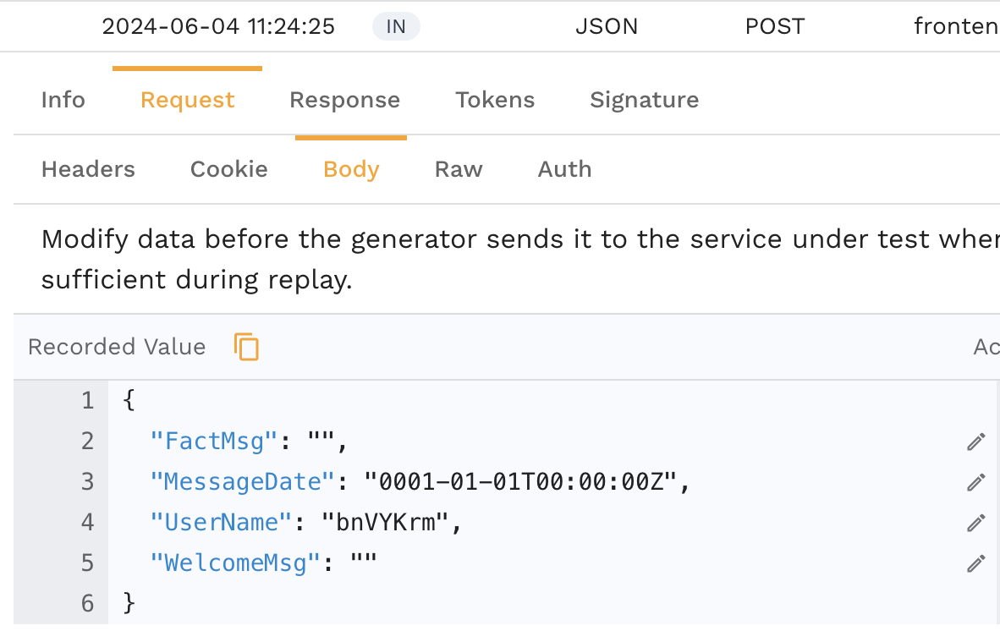
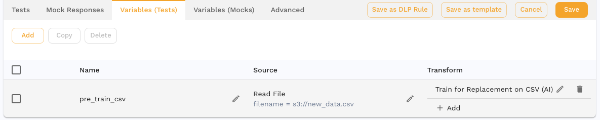
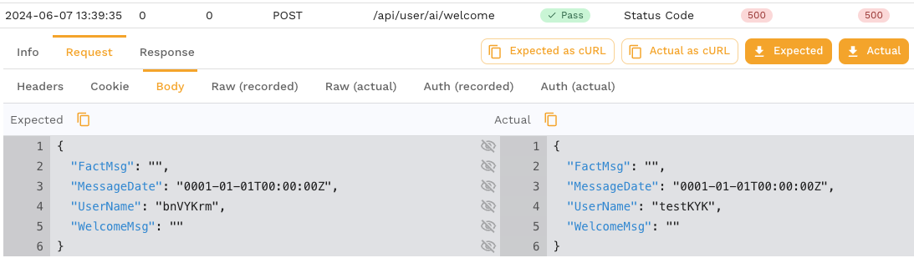

# Smart Replace

## Overview

Smart Replace is a powerful tool designed to streamline the process of updating hidden data fields within recorded API traffic. By using an existing snapshot and a set of mappings (like a CSV), Smart Replace efficiently finds and replaces the specified data within your recorded API and Database traffic. Note that Smart Replace works even with encoded fields like JWT claims, XML payloads and HTTP query parameters. Think of this feature like an AI powered find/replace that lets you avoid scripting.

In this guide we'll work through a use case of replacing each user ID in a snapshot with a new test user ID. This is a common use case when user names or other IDs need to be replaced with test IDs to work in lower environments. Keep in mind that if you need to alter your data in other ways, you can use the [transform](../reference/transform-traffic/README.md) system.

:::note
Remember, Speedscale Enterprise ensures data separation for AI models. Speedscale's shared models are not built by training on your private Enterprise customer data.
:::

## Features

This guide will show you how to use the following features:

- **Automated Data Replacement:** Automatically locate and replace old values with new values in your recorded API traffic.
- **CSV Integration:** Easily manage replacements using a simple CSV file format.
- **Comprehensive Unpacking:** Unpacks all API traffic within the snapshot for thorough data management, including JWT claims, compressed fields, etc.

:::note
Smart Replace can cause the Speedscale load generator to use more resources. The impact depends on your workload and exact usage. This is typically not an issue but please contact support if you need optimization help.
:::

## Requirements

- A snapshot containing recorded API traffic. Learn more about snapshot recording in the [tutorial](../tutorial.md)
- A CSV file listing the old values and their corresponding new values.

## CSV File Format

The CSV file should contain two columns:
1. **Existing Value**
2. **Replacement Value**

Note that Speedscale can automatically extract the existing values using the UI or the `speedctl extract data` command. See the `man` page for more information.

### Example CSV

Let's take a simple case where we have the following list of old and new replacement values in a CSV file:

```csv
Existing,Replacement
bnVYKrm,testKYK
sophia.nguyen@aol.com,test.user@aol.com
helen.kim@outlook.com,test.user@outlook.com
```

The values in the first column should represent IDs we see in our API traffic snapshot. Values that are encoded within the traffic will be decoded before replacement so there is no need to include different variations of existing values. For example, if an email is encoded within the base64 encoded portion of a JWT, it will be found and replaced regardless.

## How to Use Smart Replace

### Step 1: Identify Existing IDs

1. Navigate to the snapshot summary Transform Editor. If you don't already have a snapshot you can create one as part of the [tutorial](../tutorial.md)
2. Identify the ID that you would like to replace. For this example, we'll replace the set of values in the CSV above. They are found scattered throughout the traffic in HTTP Headers and request bodies.
3. Here is an example of such an ID in the RRPair viewer:



### Step 2: Upload CSV File

Next upload your replacement data to Speedscale cloud as `user data`. This can be done in the UI or by using the CLI.

```bash
speedctl push userdata new_data.csv
```

### Step 3: Add Transform

Smart Replace works using the Speedscale transform system but you don't need to understand the broader system to use this feature. Many tasks you would have normally accomplished with scripting can be accomplished with Smart Replace and for everything more complicated there are [transforms](../reference/transform-traffic/README.md).

Before executing our replay, we want to train the system to perform our replacement. To do that, we add a `train_csv` transform to our snapshot in the Variables (Tests) sectionn. From the snapshot transform editor, add this chain `empty <-> train_csv()`. It should look something like this in the UI



`s3://` tells Speedscale to pull the data from Speedscale cloud. This should match the name of the CSV uploaded in thte previous step. This transform chain tells the Load Generator to read a file (Read File) from Speedsdcale cloud and then train Smart Replace on each row in the CSV (train_csv). The name of the variable is not important for this use case.

### Step 4: Run Replay and View Report

1. Start a replay using the snapshot you just edited. It's best to start by running a simple regression to make sure values are replaced before running a more complex scenario.
2. Review the changes to ensure all specified values have been replaced correctly. You will see these types of changes in your report results:



## Support

For additional assistance, please refer to our [Support Page](#) or contact our support team at support@example.com.

## FAQ

### Can Smart Replace handle large snapshot files?

Yes, Smart Replace is designed to efficiently process large snapshot files.

### Will Smart Replaace work when I create a new snapshot?

Yes, although your new snapshot will need the same transform rules applies. This system is designed to be part of Speedscale's automatic traffic refresh system.

### Is there a limit to the number of replacements that can be specified in the CSV file?

There is no hard limit, but performance may vary based on the size and complexity of the snapshot file and the number of replacements.

### What file formats are supported for data entry?

Smart Replace currently supports CSV but other file formats can be added upon request.

### What is the scope of replacement?

Smart Replace uses the same mappings for all vUsers within the same load generator. Mappings are not currently shared across generators and service mocking engines.

### What if my mappings change as the snapshot is replayed?

This situation usually arises when you record one user flow and want to multiply it. In that situation, you want a new ID to be replaced in the traffic during that flow and then replaced as the next flow starts. This is handled by the `train` transform with `overwrite=true`. This guide is designed fro persistent replacement.
