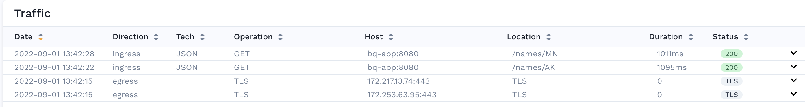
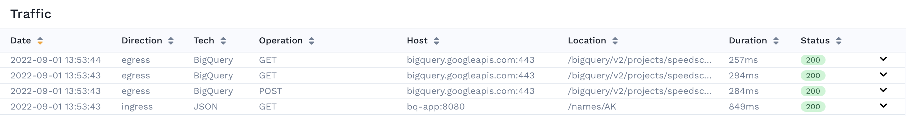

## Prerequisites
1. [The Operator is installed](../quick-start.md).
2. [A sidecar has been installed and traffic is being captured](../setup/sidecar/README.md)

## Our app
For this guide, we are using an app called `bq-app` that has an endpoint `/name/{state}` and makes calls out to Google's BigQuery on every inbound request.

## Viewing traffic



In the traffic viewer for our service, we can see individual requests and their headers, bodies, etc. However for a subset of the traffic captured, we see that it is marked as TLS. We know that this traffic is our outbound calls to Google BigQuery and we want to be able to inspect these requests as well. In order to capture and decode this traffic we need to enable TLS traffic capture.

## Enable TLS

We add the `tls-out` setting to our deployment via `kubectl edit deploy/{deployment_name}`. The `inject` setting was already present when we started capturing data in the first place.

```yaml
apiVersion: apps/v1
kind: Deployment
metadata:
  annotations:
    sidecar.speedscale.com/inject: "true"
    sidecar.speedscale.com/tls-out: "true"
```

:::danger
TLS configuration depends heavily on the programming language your app uses. See [how to configure your app](../setup/sidecar/sidecar-trust.md).
:::

This will change the sidecar settings on the deployment and cycle the pods to apply them.



Now we can see that the previously opaque requests with an IP address and TLS tech are now being successfully captured by Speedscale. We can see that our app makes 3 requests to BigQuery on every inbound request. On further inspection, we can actually see that it makes 1 POST for the query itself and 2 GET requests to paginate through the results. Previously we would have to inspect the source code of the Google SDK we are using to figure out its paging behavior but now we can observe all the requests it's making through Speedscale.
