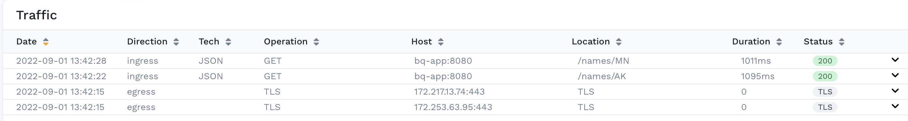
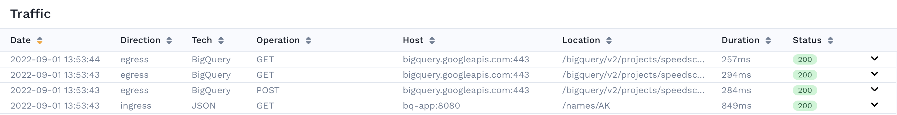

## Prerequisites

1. [Install the Operator](../getting-started/quick-start.md).
2. [Enable the eBPF collector](/reference/ebpf-traffic-collection#installation) and target your workload.
3. Confirm that your language and TLS library are listed under [TLS Traffic Visibility](/reference/ebpf-traffic-collection#tls-traffic-visibility).

## Our app
For this guide, we are using an app called `bq-app` that has an endpoint `/name/{state}` and makes calls out to Google's BigQuery on every inbound request.

## Viewing traffic



In the traffic viewer for our service, we can see individual requests and their headers and bodies. If a request is marked as TLS, Speedscale observed the connection but could not read the plaintext payload.

## Enable TLS capture

The eBPF collector reads plaintext at supported TLS library boundaries. It does not require a Speedscale certificate, a proxy, or the `sidecar.speedscale.com/tls-out` annotation.

Enable capture for the deployment:

```bash
kubectl annotate deployment bq-app -n YOUR_NAMESPACE \
  capture.speedscale.com/enabled="true" --overwrite
```

Java workloads also require the Operator-managed JVMTI agent. Enable it before restarting the workload:

```bash
kubectl annotate deployment bq-app -n YOUR_NAMESPACE \
  capture.speedscale.com/java-agent="true" --overwrite
```

The Java agent changes the pod template so it can load inside the JVM. See [Java eBPF capture](/reference/languages/java#ebpf-java-agent) for details.

Restart long-lived workloads after enabling capture so the collector sees new TLS connections from the beginning:

```bash
kubectl rollout restart deployment bq-app -n YOUR_NAMESPACE
```



The previously opaque requests are now decoded. In this example, the application makes one POST request for the BigQuery query and two GET requests to paginate through the results.

## If traffic remains encrypted

Check the collector requirements before changing your application:

- Go applications require Go 1.18 or newer and an unstripped binary built without `-ldflags="-s"`.
- OpenSSL capture requires OpenSSL 3.x. BoringSSL, LibreSSL, and older OpenSSL releases are not supported by the eBPF TLS probes.
- Java applications use the Speedscale JVMTI agent, which the Operator manages with the eBPF collector.
- Connections established before the probes attach can remain opaque until the application opens a new connection.

See [eBPF limitations](/reference/ebpf-traffic-collection#limitations) for the complete list. Existing sidecar deployments can continue to use the legacy [sidecar TLS configuration](/getting-started/installation/sidecar/tls/).
