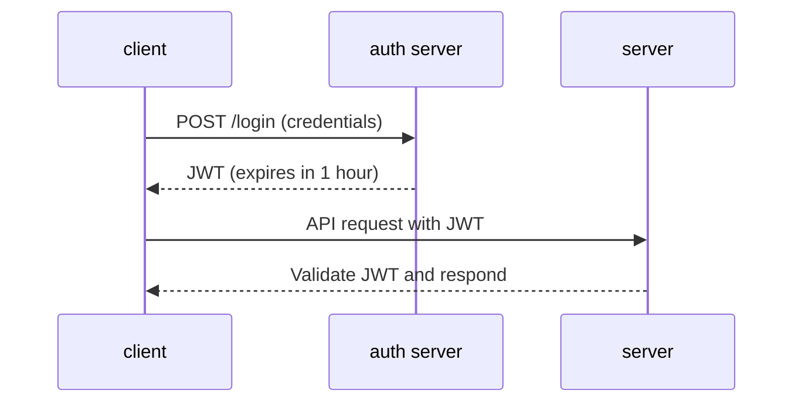
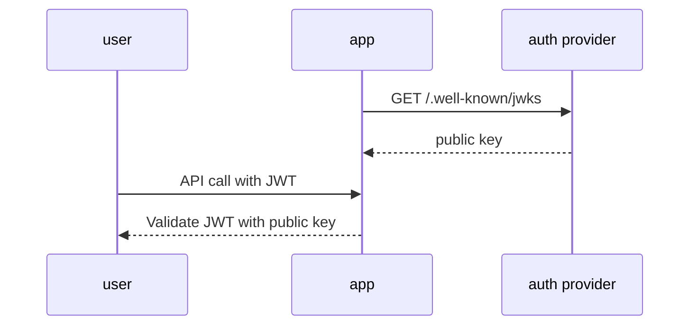
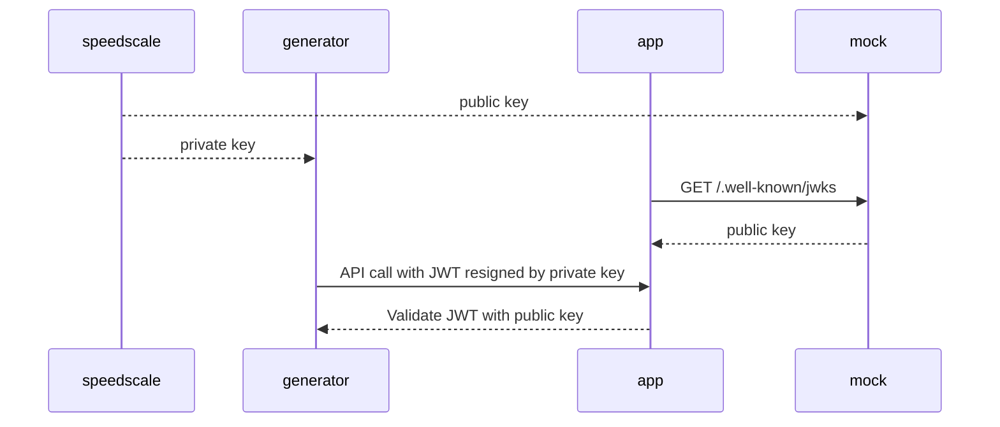

# Replaying JWTs

## What are JWTs?

JSON Web Tokens (JWTs) are a compact, URL-safe means of representing claims to be transferred between two parties. JWTs are commonly used for authentication and authorization in modern web applications. A JWT consists of three parts: a header, a payload (containing claims), and a signature that verifies the token's authenticity.

For more information about JWTs, see:
- [Introduction to JSON Web Tokens (jwt.io)](https://jwt.io/introduction)
- [RFC 7519 - JSON Web Token (JWT)](https://datatracker.ietf.org/doc/html/rfc7519)
- [OAuth 2.0 Framework](https://oauth.net/2/)

## The Challenge: JWT Expiration During Replay

JWTs typically include an expiration time (`exp` claim) to limit their validity window for security purposes. When Speedscale captures a snapshot of traffic, the JWTs included in that traffic will eventually expire. During replay, these expired tokens will cause authentication failures as the service under test (SUT) rejects requests with invalid or expired credentials.

In a typical flow, the client authenticates with an auth server and receives a JWT with an expiration time. The client then uses this JWT to make authenticated requests to the server. However, when Speedscale captures this traffic and replays it later, the JWT will have expired, causing the server to reject the requests.

To successfully replay traffic, Speedscale needs to handle JWTs in a way that appears authentic to the SUT. This requires either resigning the tokens or obtaining new valid tokens that the SUT will accept.

## Categories of JWT Handling

When replaying traffic, there are three major categories of JWT challenges:

1. **JWTs produced by the SUT**: When your application generates JWTs that are sent to downstream dependencies, these need to be handled during replay.

2. **JWTs from external auth services**: When your application requires JWTs from an external authentication provider (like Auth0, Okta, Keycloak), you need a way to obtain fresh, valid tokens during replay.

3. **JWTs in Speedscale responder responses**: When the Speedscale responder (mock) returns responses containing JWTs to your application.

Note: The Speedscale responder generally does not authenticate JWTs, so category 3 can typically be ignored. **This document focuses on categories 1 and 2**: handling JWTs produced by the SUT and requesting new JWTs from external services.

## Using the Replay Wizard

Speedscale provides a replay wizard that simplifies the process of configuring JWT handling for your replays. The wizard automatically detects OAuth handshakes in your captured traffic and identifies JWTs that may be expired.

### JWT Detection

When you open the replay wizard, Speedscale analyzes your snapshot and displays all detected JWTs along with their status:

### JWT Details

Clicking on any JWT in the list reveals detailed information including:
- Token claims (issuer, subject, audience, expiration time, etc.)
- Token header information
- Expiration status
- Where the token appears in the traffic

## JWT Handling Options

The replay wizard offers multiple options for handling JWTs during replay. Choose the option that best fits your testing environment and available resources:

### 1. Do Not Resign JWTs

**When to use**: Only recommended if your JWTs are not expired or your SUT doesn't validate token expiration during testing.

**How it works**: Speedscale replays the traffic with the original JWTs unchanged. This is the simplest option but will fail if your application properly validates token expiration.

**Configuration**: No additional configuration required.

**Limitations**: Only works if your tokens are not expired.

### 2. Replace JWT with Constant

**When to use**: Recommended when you can manually obtain a valid access token using curl, Postman, or another manual process.

**How it works**: You provide a valid JWT that Speedscale will use to replace all expired JWTs in the replayed traffic. The constant should be in standard base64-encoded JWT format.

**Configuration**:
1. Manually request a fresh access token from your auth provider
2. Paste the token value into the replay wizard
3. All expired JWTs will be replaced with this constant value

**Limitations**: The token you provide will eventually expire, requiring you to update it periodically.

### 3. Request Token Using Postman Collection

**When to use**: Recommended when you have a reproducible way to request access tokens via API calls, especially if you already have Postman collections for authentication.

**How it works**: You upload a Postman collection that contains the API call(s) needed to obtain a fresh access token. Before replay begins, Speedscale executes your Postman collection, extracts the access_token from the response, and uses it to replace all JWTs in the traffic.

**Configuration**:
1. Create or export a Postman collection that requests an access token
2. Upload the collection in the replay wizard
3. Speedscale will execute the collection and extract the access_token from the response

**Requirements**:
- Your Postman collection must successfully return a response containing an `access_token` field
- The auth endpoint must be accessible from the replay environment

### 4. Automated JWKS Resigning

**When to use**: Recommended when your application follows the JSON Web Key Set (JWKS) pattern for JWT validation, commonly used with auth providers like Auth0, Keycloak, and Okta.

**How it works**: This is the most powerful option but only works with Speedscale because Speedscale controls both the client (traffic generator) and the downstream dependencies (responder/mock). Speedscale generates a keypair, provides the public key to the mock and the private key to the generator, allowing it to sign both sides of the conversation without any external configuration.

#### What is JWKS?

JSON Web Key Set (JWKS) is a standardized format for publishing public cryptographic keys used to verify JSON Web Tokens (JWTs). It provides a way for applications to discover and retrieve the public keys needed to validate JWT signatures without hardcoding them. This is a common pattern with auth providers and you can read more about this pattern [here](https://auth0.com/docs/secure/tokens/json-web-tokens/json-web-key-sets).

#### Normal Flow

1. Your app asks your auth provider for the JWKS
2. The app stores this public key information from the JWKS
3. Any requests coming into your app must have a JWT that is signed with the corresponding private key for the JWKS

#### With Speedscale

When using the JWKS discovery option, at replay time Speedscale can intercept both sides of the conversation to ensure JWTs are resigned and verified by the app:

1. Speedscale generates a keypair and gives the mock the public key and the generator the private key
2. When your app requests the auth provider for the JWKS, our mock returns the public key
3. When the generator sends a request to the app, it finds any JWTs in the request and resigns them with the private key

**Configuration**: Minimal configuration required. Speedscale automatically detects JWKS endpoints (typically `/.well-known/jwks.json` or similar) in your captured traffic.

**Advantages**:
- No need for access to actual private keys
- No manual token management
- Works seamlessly with standard JWKS patterns

**Limitations**: Only works with applications that use JWKS for JWT validation. Does not work with traditional testing tools that can't control both sides of the conversation.

### 5. Use Login Request from Snapshot

**When to use**: Recommended when your captured snapshot contains the actual login/authentication request that obtains an access token from the auth provider.

**How it works**: If your snapshot includes the login flow where your application requests and receives an access_token, Speedscale can replay that login request during replay to obtain a fresh token. The new token is then used to replace expired JWTs in subsequent requests.

**Configuration**:
1. Verify your snapshot contains the login request
2. Select this option in the replay wizard
3. Speedscale will identify the login endpoint and replay it to obtain fresh tokens

**How to verify your snapshot contains a login request**:
- Look for authentication endpoints in your captured traffic (e.g., `/oauth/token`, `/auth/login`, `/token`)
- Check for requests with credentials (username/password, client credentials, etc.)
- Verify the response contains an `access_token` field
- Common OAuth 2.0 grant types include: authorization code, client credentials, resource owner password credentials

Learn more about OAuth 2.0 flows:
- [OAuth 2.0 Grant Types](https://oauth.net/2/grant-types/)
- [OAuth 2.0 Token Endpoint](https://www.oauth.com/oauth2-servers/access-tokens/)

**Advantages**:
- Automatically obtains fresh tokens during replay
- No manual intervention required
- Uses your actual authentication flow

**Limitations**:
- Only works if the login request is present in the snapshot
- Credentials in the snapshot must still be valid

### 6. Use a Kubernetes Secret

**When to use**: Recommended for Kubernetes deployments when you have a signing secret available and need fine-grained control over JWT resigning, including the ability to customize claims.

**How it works**: The [jwt_resign transform](./transforms/jwt_resign.md) re-signs existing JWT tokens using a secret key stored in Kubernetes. The transform honors the original JWT algorithm and allows you to override specific claims like `iss`, `aud`, `sub`, and custom claims. The transform automatically updates time-based claims (`exp`, `iat`, `nbf`) to ensure the token is valid during replay.

**Configuration**: This option is not supported in the replay wizard and must be configured manually using the transform editor. See the [jwt_resign transform documentation](./transforms/jwt_resign.md) for detailed configuration instructions and examples.

**Key capabilities**:
- Works with Kubernetes secrets using the `${{secret:secret_name/key}}` syntax
- Supports custom claim overrides
- Handles both request tokens (generator created) and response tokens (responder created)
- Automatically updates time-based claims to ensure validity

**Requirements**:
- Kubernetes environment with access to secrets
- Signing secret must be mounted to the generator
- Manual configuration via transform editor

## Next Steps

After configuring JWT handling in the replay wizard, you can proceed with running your replay. Speedscale will automatically apply your chosen JWT strategy during traffic generation.

For more information on related topics, see:
- [Sessions](./sessions.md) - Learn about session tracking and management
- [Smart Replace](./smart-replace.md) - Understand how Speedscale handles dynamic values during replay
