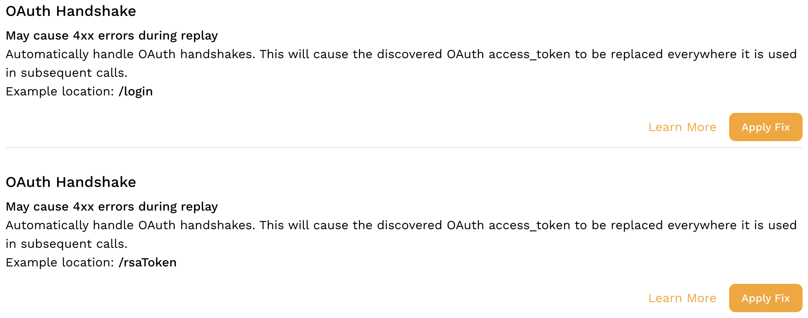

# Recommendations

Speedscale detects common patterns like OAuth handshakes and recommends remedies. You can find these recommendations in the snapshot summary view. This is a good place to start if you're trying to figure out how to increase your accuracy.

These recommendations are also used automatically by the upcoming plan-and-solve agent to increase accuracy in a snapshot. Usually they fix deterministic problems like 4xx HTTP errors.

## Applying Fixes

At present, fixes must be applied by the user to ensure they are correct. In the future and with the upcoming plan-and-solve agent this limitation may be removed or modified. Once a recommendation is applied, it will appear in the transform editor for the snapshot as if it was entered by a user. You are free to modify the transforms that are created by this process and they will not be reset by Speedscale.

Once you apply a fix the recommendation does not disappear and can be applied a second time. This allows you to re-apply the recommendation if you modify the snapshot and want to start over.

:::tip
Recommendations are constantly being added to the list of known patterns. If you see one that is broadly applicable and not currently discovered please let us know in the [community Slack](https://slack.speedscale.com).
:::
