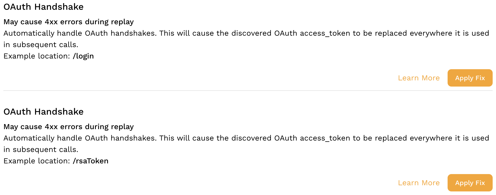

# Recommendations

Speedscale detects common patterns like OAuth handshakes and recommends remedies. This is a good place to start if you're trying to figure out how to increase your accuracy.

Every snapshot has two places to work with them:

| Where | What it's for |
|---|---|
| **Tuning** tab | Working through recommendations one at a time, seeing the request each one is about before you decide |
| **Recommendations** tab | Browsing and searching the full list, and applying several at once |

The **Summary** tab shows a *Tuned* readiness card with the number still outstanding; its link takes you to the Tuning tab.

## Working through recommendations in the Tuning tab

The Tuning tab is a review queue. It shows one recommendation at a time, the transform chain that recommendation would add, and — this is the part that saves the hunting — the actual request the recommendation is about, opened to the exact field it acts on.

The queue is ordered by blast radius, so the recommendation touching the most traffic is the first one you see.

### Stepping through the queue

The toolbar at the top drives the review:

- **‹ ›** move the cursor. The counter reads `2 of 7`, and where a recommendation names more than one request, a second line reads `request 3 of 10`.
- **Accept** applies the recommendation's transform chain to the snapshot.
- **Ignore** dismisses it. It stops appearing in the queue and in the outstanding count.
- **Skip** leaves it undecided and moves past the whole recommendation, not just to its next request.

Keyboard shortcuts match proxymock's, so the two products behave the same way:

| Key | Action |
|---|---|
| `J` or `→` | Next |
| `K` or `←` | Previous |
| `Y` | Accept |
| `N` | Ignore |
| `S` | Skip |

:::tip
Next walks the requests inside a recommendation before moving to the next recommendation, so you can hold `J` and read the whole review without stopping at each boundary.
:::

### Seeing where a recommendation applies

A recommendation usually touches many requests, and the analyzer records up to ten of them as examples. The **Where it applies** list shows those, and selecting one moves the viewer beside it to that request — the right half of the pair, the right sub-tab, and the field itself scrolled into view and marked.

This is how you check that a fix generalizes. One example tells you the recommendation found *something*; stepping through several tells you it found the right thing everywhere.

Some recommendations name no request at all — `X-Request-Id` and SASL authentication are detected from traffic patterns rather than from specific requests. Those say so, and their chain still applies to the traffic its filters match.

A recommendation can also target a whole body rather than one field, which the pane states rather than leaving you to wonder why no line is highlighted.

### Sharing what you're looking at

The cursor lives in the URL, so a link to a snapshot's Tuning tab carries the recommendation and the request you were on. Paste it to a colleague and they land where you are. Browser back and forward step the cursor.

## Browsing the full list in the Recommendations tab

The Recommendations tab lists every recommendation with search and filtering, split into **Transform Recommendations** (fixes Speedscale can apply) and **Traffic Recommendations** (findings about the application under test, which you fix in your own code).

Each card shows the traffic filter it matches and the transform chain it would add. **Apply Fix** applies it; **Ignore** dismisses it. **Apply All on This Page** applies every supported recommendation currently listed.

## After you apply

An applied recommendation appears in the transform editor for the snapshot as if you had entered it by hand. You are free to modify the transforms it created, and Speedscale will not reset them.

Applying is recorded on the snapshot, so a recommendation already applied shows as **Applied** and cannot be applied a second time. To back one out, remove its chain in the transform editor.

Recommendations are also used automatically by the upcoming plan-and-solve agent to increase accuracy in a snapshot. Usually they fix deterministic problems like 4xx HTTP errors.

:::tip
Recommendations are constantly being added to the list of known patterns. If you see one that is broadly applicable and not currently discovered please let us know in the [community Slack](https://slack.speedscale.com).
:::
