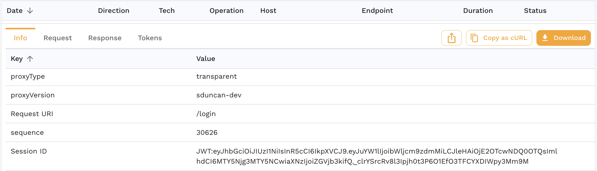

# Sessions

Front end applications and APIs typically have back and forth conversations that can be grouped into sessions. Speedscale automatically tracks sessions for common patterns like OAuth2. If Speedscale detects a session it will assign a session ID to each RRPair involved in the conversation during capture for easy sorting/filtering. During replay, sessions are handled automatically.

## Automatic Detection

In many cases, sessions are automatically detected and given a unique identifier matching some aspect of the traffic. As an example, consider an OAuth2 login. In the RRPair viewer you will see a JSON response from the server like this:


Now click on the `Info` tab on that same RRPair. You can tell that Speedscale detected this token because it populates the JWT as the session ID.



When a snapshot is created data about the sessions will be aggregated into a summary. The list of detected tokens/sessions can be viewed in the snapshot summary page under `Tokens`:


One of the most common uses for sessions during replay is [smart_replace](./smart-replace.md). When a session is tagged by smart_replace, Speedscale will detect and re-use that token wherever it is used in subsequent calls.

## User Identified

If Speedscale does not automatically detect sessions in your traffic, you can manually identify them using a transform chain like the following:

```
req_body() <-> json_path(path="customer") <-> tag_session()
```

This will extract the request body, find the `customer` root key and then tell Speedscale to treat that as the session identifier for this RRPair. Any session IDs assigned by you will take precedence over Speedscale's automated discoveries.
