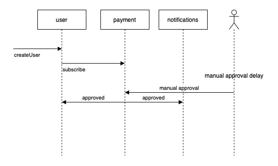
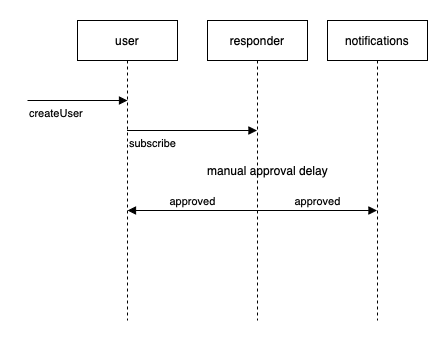

# Adding a response trigger

## Overview

Speedscale's [**Responder Triggers**](../concepts/triggers.md) feature allows you to initiate workflows in response to specific requests, ensuring faster and more accurate environment replication. This guide walks you through setting up and using Responder Triggers within the Speedscale UI for an asynchronous application. This guide assumes normal HTTP REST API calls for simplicity but the same process should be used to simulate asynchronous requests for message buses like Kafka. The central question answered in this guide is how to initiate seemingly asynchronous messages from a message broker. We will do that by allowing the client to login and then instructing the Speedscale Responder to send some data after a period of time. From the client's perspective this will appear to be an asynchronous message sent by the server.

## Prerequisites

- [speedctl](../setup/install/cli.md) is installed
- You have captured traffic and created snapshots before, [see this guide](./creating-a-snapshot.md)

## Step-by-Step Guide to Using Responder Triggers

### Step 1: Create Snapshots

In this example, we have three microservices and a manual approval process.

- A `createUser` request comes into the `user` service.
- The `user` service sends a `subscribe` request to the `payment` service.
- After some time a human approves the subscription and the `payment` service sends out `approved` webhooks to the `user` and `notifications` services.



During environment replication, Speedscale will mock the **payment** service with a **responder** as shown in the new sequence diagram:



We will capture two snapshots, one for each of the requests.

1. Capture containing the traffic from the `user` service that contains the inbound `createUser` request and the outbound `subscribe` request, we'll call this the **request snapshot**.
2. Capture a snapshot containing the inbound `approved` requests to `user` and `notifications`, we'll call this the **trigger snapshot**

### Step 2: Define a Trigger

The Responder Trigger is activated by a specific request signature which we captured in the **request signature**. The Responder will still reply normally but it will also initiate the desired trigger workflow. Once we receive the request, we want the Responder to wait roughly 30 seconds to simulate human think time before sending the **trigger snapshot**.

Configure this behavior by following these steps:

1. Find the signature of the request that will trigger the **trigger snapshot**
1. Pull the snapshot locally by running `speedctl pull <snapshot request-snapshot-id>`.
1. Create a file in the snapshot called `triggers.jsonl`, the contents of which are shown below.
1. Push the snapshot to include our defined triggers with `speedctl push snapshot <request-snapshot-id>`

**Note:** In order to be valid a `jsonl` file, the json needs to be on a single line, it's expanded here for clarity.

```json
{
  "signature": {
    "http:host": "payment.service.cluster.local",
    "http:method": "POST",
    "http:queryparams": "",
    "http:url": "/subscribe"
  },
  "delay": "30s",
  "snapshot_id": "<trigger snapshot id>"
}
```

## Conclusion

Using Responder Triggers in Speedscale, you can easily automate the response process for specific requests, making environment replication more efficient and realistic. Follow these steps to configure triggers based on your application’s needs, ensuring fast and reliable service responses. For more advanced configurations, please reach out on the Speedscale Slack [community](https://slack.speedscale.com).
