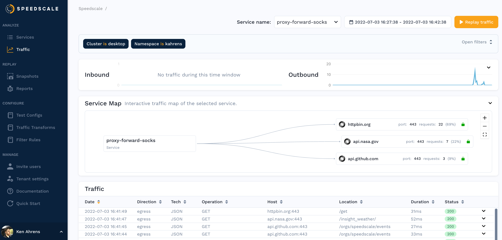

## Prerequisites
1. [Speedctl is installed](../setup/install/cli.md)
1. [Docker is installed](https://docs.docker.com/engine/install/)

## Setting up local capture

Run `speedctl install`, select the `Traditional server / VM` flow and subsequently the `Capture traffic and forward to Speedscale Cloud` option. This will output a manifest file and a command on how to run it with something similar to `docker compose --file speedscale-docker-capture.yaml up -d` .

Now you have to configure your application to use the socks
[proxy](../reference/glossary.md#proxy) running on `*:4140` on your server, and
configure it to [trust the local
certificates](/setup/sidecar/tls/#trusting-tls-certificates).

To test out the capture mechanism, you can make requests as you normally would but using `localhost:4143` instead of the port your app is serving on.

## Setting up global capture

The steps above setup an inbound proxy on port `4143` that forwards requests to your app but so far we've only captured request explicitly going to that port. To capture all existing traffic going into your app, you'll need to edit your load balancer. For this guide, we'll use AWS's ALB but the same steps translate to other types of load balancers and cloud environments.

### Create a new target group/backend

We have an existing target group going to our app which serves on port `8080`. We're going to create a new one with identical settings, the only difference will be the port `4143`.

### Modify the listener

We have an existing listener where HTTP traffic is forwarded to our listener called `user` that hit our app directly. We're going to edit this so that the load balancer forwards traffic to our new target group.

That's it! Now all traffic will be forwarded to the Speedscale proxy and be available for analysis

## Analyze Traffic

You should be able to see traffic in the Speedscale UI after a few minutes and
now you can using this traffic to [create a snapshot](./creating-a-snapshot.md).

## Replaying Traffic

Replaying traffic starts by creating manifests similar to the capture step
above.  Run `speedctl install` and choose the `Traditional server/VM` flow again that allows you to
replay recorded traffic.  When prompted, enter the ID of the snapshot you
created.

This will generate a [report](../reference/glossary.md#report) which you can find on the [reports page](./reports/README.md).

:::note
The `speedctl install` command is just a helper and environment variables like
`SNAPSHOT_ID` and `TEST_CONFIG_ID` can be modified in the manifest file without
regenerating it every time.
:::
