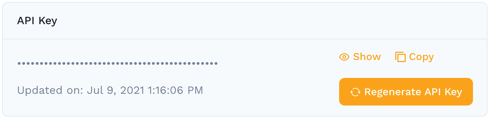

# CLI speedctl

The speedctl command line tool is used to interact with Speedscale from your own terminal. `speedctl` is the Speedscale
programmable API and the primary way to perform setup actions like installing the Speedscale Operator, generating manifests, etc.

### Install

Install or upgrade `speedctl`:

```
sh -c "$(curl -Lfs https://downloads.speedscale.com/speedctl/install)"
```

### Initialization <a href="#part-ii-run-speedctl-initialization" id="part-ii-run-speedctl-initialization"></a>

If this is your first time downloading `speedctl` initialization may happen automatically.  Otherwise bootstrap your local environment:

```
speedctl init
```

You will need to get your API key from your [Profile Page](https://app.speedscale.com/profile). Copy the API key and paste when prompted.



### Verify Installation

Verify your installation:

```
speedctl check
```

