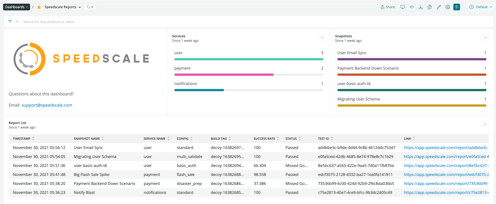

# Export to New Relic

Export data from your Speedscale environment to New Relic One

### Prerequisites

In order to utilize the integration you need to capture the following from New Relic:

* [Account Id](https://docs.newrelic.com/docs/accounts/accounts-billing/account-structure/account-id/) - where you will publish the data
* [Insights Insert Key](https://docs.newrelic.com/docs/apis/intro-apis/new-relic-api-keys/#insights-insert-key) - API key with permissions to insert data to New Relic Insights

A best practice is to save these keys into environment variables like so:

```
export NR_ACCOUNT_ID=0
export NR_INSIGHTS_KEY=0
```

### Quickstart Documentation

Add these Speedscale dashboards into your New Relic account by installing the quickstart as part of the Instant Observability integration:

* [New Relic Quickstart](https://developer.newrelic.com/instant-observability/speedscale/c4512294-8f81-4efa-8f28-6c1db28d288c)


### Exporting Data

Now you can select a specific report and export it using `speedctl`:

```
export SPD_REPORT_ID=0
speedctl export newrelic ${SPD_REPORT_ID} --accountId ${NR_ACCOUNT_ID} --insightsKey ${NR_INSIGHTS_KEY}
✔ done
```

After you have exported the report, you should see it in the New Relic Dashboard.



### Questions?

Feel free to ask questions in the New Relic Explorer's Hub:

* [Discussion Forum](https://discuss.newrelic.com/t/how-to-integrate-with-speedscale/171099)

