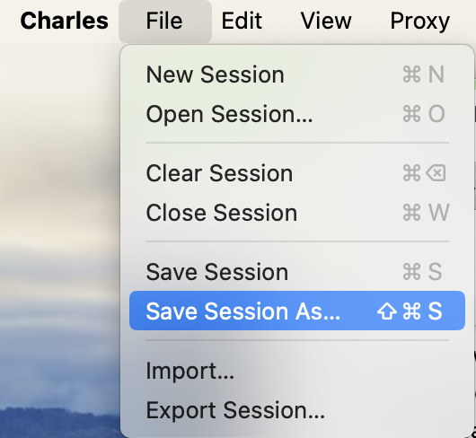

In this guide we will walk through importing traffic from a [Charles Proxy Session](https://www.charlesproxy.com/). These files generally have the `.chlz` file extension and represent request/response pairs recorded by the proxy.

We'll take the following steps:

1. Export a Charles Proxy session file (.chlz)
2. Convert the `.chlz` file to `.har`
3. Import into Speedscale

## Export a Charles Proxy Session

Charles Proxy makes it very easy to save proxy results. Open your desired set of traffic and find the `Save Session As` option or equivalent:



Note the location of the newly created `.chlz` file.

## Convert to HAR Format

Charles Proxy conveniently provides the ability to convert from its proprietary format into the standard HAR file format used to store browser requests. From the Charles Proxy [documentation](https://www.charlesproxy.com/documentation/tools/command-line-tools/) we want to run a command like the following:

```
Charles session.chlz ready_for_speedscale.har
```

Note the location of the newly created `.har` file.

## Replay

It's now time to import the HAR file into Speedscale. Remember to select whether you want tests or mocks to be generated. Speedscale has the ability to reverse incoming traffic so that it forms the basis for a service mock. Practically speaking that means you can record traffic from your browser to a backend using Charles Proxy and then have Speedscale mock out the back end services the browser is talking to.

Continue importing the HAR file by following the import from HAR [guide](./import-har.md).