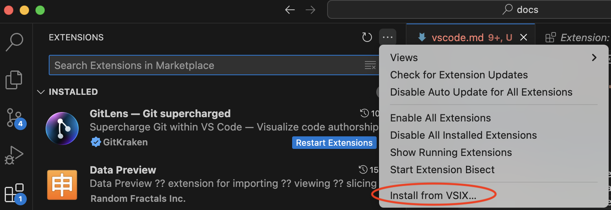
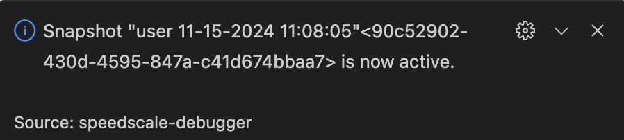
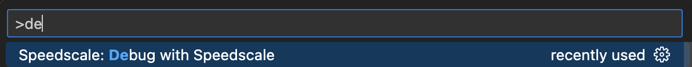

# Speedscale Visual Studio Code Extension

The Speedscale VS Code Extension brings the power of Speedscale’s cloud-based environment-replication platform directly into your Visual Studio Code environment. With this extension, developers can seamlessly connect to Speedscale’s cloud service and replicate remote environments locally for faster, more accurate development, debugging, and testing.

By mirroring your production or staging environments, this extension ensures your local development setup is as close to the real thing as possible, reducing surprises in deployment and speeding up your development cycles. With this extension, you simulate back end dependencies seamlessly simply running your existing debugger.

## Features

* Environment Replication - Connect to Speedscale’s cloud service and mirror your production or staging environment locally.
* Traffic Replay - Replay real production traffic in your local development environment to debug issues or validate new code.
* API Mocking - Automatically generate mocks based on real API behavior captured in Speedscale for consistent and predictable testing.
* Performance Testing - Run local performance tests using real-world traffic patterns to ensure your code meets SLAs.
* Seamless Setup - One-click integration with your Speedscale account to get started quickly.

## Requirements

* Visual Studio Code 1.95.2 or later
* Speedscale cloud account (sign up at speedscale.com)

## Installation

1. Download and install the speedctl [cli](../setup/install/cli.md).
2. Open Visual Studio Code on your local machine.
3. Go to the Extensions Marketplace.
4. Click on the three dot menu and select "Install from VSIX..."

5. Select the Speedscale extension from your local filesystem. You can obtain this file from the Speedscale UI or reach out to [support](mailto:support@speedscale.com).

## Usage

:::caution
This extension is under active development but only Golang is fully supported. Please reach out to Speedscale to put in a vote for the next language to be added.
:::

1. Select an environment you want to replicate. Follow the Speedscale [tutorial](../tutorial.md) for guidance on creating a snapshot.
2. Open the snapshot and click on the link to open in VSCode. This link can be found under the "How to replay" section in Desktop.
3. VSCode should open on your desktop with a message saying the snapshot is queued for replay:

4. Open the VSCode command palette (Cmd-Shift-P on MacOS) and select "Debug with Speedscale"

This will start a normal debugger session except Speedscale will simulate backend dependencies. This is accomplished by redirecting outbound network traffic using environment variables. These environment variables will be added automatically after the mock server has started.

## Feedback

We’re constantly improving! Submit feedback via our [community Slack](https://slack.speedscale.com).
