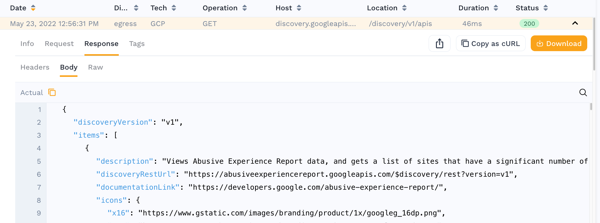
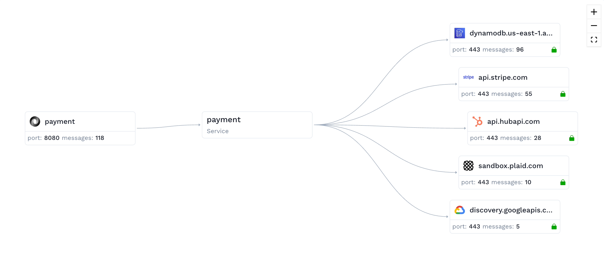

# Introduction

You've got to start somewhere. Why not here?

For the first time in the space, Speedscale provides a modern way to develop, execute and scale API quality automation as fast as
releases take place. The old days of manually generating and maintaining tests one-by-one are gone.

Speedscale combines observability technology with cloud data warehouses to make test maintenance obsolete. The cost to generate
regression and performance validation suites is so low, you no longer edit/modify old tests -- you simply generate a new one.

Speedscale is a 3 part process: **Observe**, **Analyze**, and **Replay**.

### Observe 

In **Observe**, the Speedscale proxy (goproxy) picks up traffic in a late stage environment (eg. UAT, Staging, or even Production). The
environment is instrumented via Kubernetes sidecars or proxy servers, depending on your platform.

The proxy is picking up 2 things -- inbound traffic into your API, as well as outbound traffic to its dependencies and the resulting responses.
We do this so we can transform inbound transactions into replayable test cases, and the backend requests/responses into mocked services to
stand in for the real systems during traffic replay.

The data we observe is being sent to Speedscale’s cloud data warehouse for storage and analysis.

### Analyze 

In the **Analyze** step, you peruse the historical data collected on a per-API basis. Users can explore this data and learn how a system really works.
The traffic is broken down into understandable components like requests and responses.

There are a variety of ways to filter and subset the data to find the really interesting traffic. If you want to eventually replay this traffic,
then create a snapshot. The snapshot helps you see what inbound traffic can be replayed into your application as well as the downstream
dependencies. A responder can be used to stand in for those dependencies if this helps the traffic replay with less errors.

### Replay 

Once you have created a snapshot, instructions will be generated for how to replay this traffic in your own environment. Speedscale can orchestrate
the replay environment including to deploy the correct **Snapshot**, and **Generator/Responder** containers.
