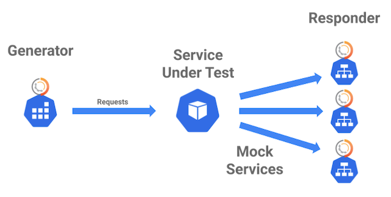

# Generator and Responder Combo

Deploy an Isolation Snapshot

The components should be deployed from right-to-left. This will ensure the environment is up and running before trying to publish traffic.



### Pre-Requisites <a href="#pre-requisites" id="pre-requisites"></a>

In order to run the isolation scenario you will need: * The ID of the Snapshot you want to replay. * Kubernetes cluster and kubectl command. * Your favorite terminal window.

### Create namespace <a href="#create-namespace" id="create-namespace"></a>

Create a namespace to run the snapshot, we will use the default **sstest**.

```
kubectl create namespace sstest
```

Output should look like the usual:

```
namespace/sstest created
```

### Deploy the Responder and Mock Services <a href="#deploy-the-responder-and-mock-services" id="deploy-the-responder-and-mock-services"></a>

Use the **speedctl** command to deploy the responder with the following command:

```
speedctl responder -s <scenarioid> | kubectl -n sstest apply -f -
```

The output should look similar to this. Note that the mock services at the end will depend upon your specific snapshot and the names of your dependencies.

```
secret/gcrcred created
secret/awscreds created
service/redis created
deployment.apps/redis created
configmap/responder created
service/responder created
deployment.apps/responder created
service/catalogue created
service/user created
service/carts created
service/orders created
```

In our snapshot we are validating the **front-end** component. The scenario captured calls to the services named **catalogue**, **user**, **carts** and **orders**. It is to be expected that your list is unique to your environment.

### Deploy the System Under Test <a href="#deploy-the-system-under-test" id="deploy-the-system-under-test"></a>

This one is on you. Create the deployment for what you are testing as well as a service to attach to it. Note that it will go into **sstest** so you cannot have a namespace declaration in your yaml.

```
kubectl -n sstest apply -f front-end.yaml
```

Here is the output from our environment:

```
service/front-end created
deployment.apps/front-end created
```

### Double Checking <a href="#double-checking" id="double-checking"></a>

If you want to check that things are working properly, take a look at the pods and the services. Here are the values for the demo app of **sock-shop** and remember that of course the unique ids will be different.&#x20;

```
kubectl -n sstest get pods
```

Expected output should be similar to this (note: **responder** and **redis** are from speedscale, **front-end** is from you):

```
NAME                         READY   STATUS    RESTARTS   AGE
front-end-..........-.....   1/1     Running   0          66s
redis-..........-.....       1/1     Running   0          3m28s
responder-..........-.....   1/1     Running   0          3m27s
```

Time to check on the services:

```
kubectl -n sstest get services
```

Note that we have the extra mock services for backend dependencies. And of course every service will have a different ip address.

```
NAME        TYPE        CLUSTER-IP       EXTERNAL-IP   PORT(S)        AGE
carts       ClusterIP   a.b.c.d          <none>        80/TCP         5m42s
catalogue   ClusterIP   a.b.c.d          <none>        80/TCP         5m42s
front-end   NodePort    a.b.c.d          <none>        80:32603/TCP   3m21s
orders      ClusterIP   a.b.c.d          <none>        80/TCP         5m42s
redis       ClusterIP   a.b.c.d          <none>        6379/TCP       5m43s
responder   ClusterIP   a.b.c.d          <none>        80/TCP         5m42s
user        ClusterIP   a.b.c.d          <none>        80/TCP         5m42s
```

### Deploy the Generator <a href="#deploy-the-generator" id="deploy-the-generator"></a>

Finally, time to deploy the generator job. Here is the command to do so:

```
speedctl generator -s <scenarioid> | kubectl -n sstest apply -f -
```

The expected output should look like so:

```
secret/gcrcred unchanged
secret/awscreds configured
service/redis unchanged
deployment.apps/redis unchanged
configmap/generator created
job.batch/generator-gixh711hu3 created
```

Your isolation scenario should be running now, time to check the Report page.
