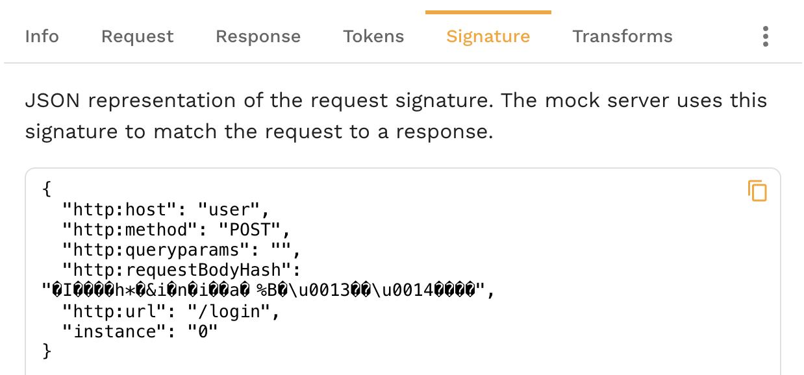

# Modifying a Signature

Signatures are hashmaps of `key=value` pairs that uniquely identify a request. The Speedscale 
responder picks out key information from each inbound request and assembles a signature. It then 
looks that signature up to see if it already knows a matching response. If It does not recognize the 
signature then it initiates a passthrough request or a 404. Obtaining a good response from the
Speedscale responder usually means tweaking the signature of the inbound request to match
the signature of a request recorded in your snapshot.

All requests contained in the `Mocks` section of the RRPair transform editor will be used for service 
virtualization. Whatever transformations you apply to these requests will affect their signature. 
Also, incoming requests will have the same transforms applied before signature matching. You can see 
the signature in the RRPair viewer.



As you change the signature you will see it update after the UI refreshes.

Below are some common patterns you may find helpful.

## Removing a Signature Key

You can see the default signature values populated by Speedscale in the `signature` tab in the 
RRPair viewer.
```json
{
  "instance": "0",
  "http:host": "api.openai.com",
  "http:method": "POST",
  "http:queryparams": "",
  "http:requestBodyJSON": "{\"messages\":[{\"content\":\"You are a helpful assistant.\",\"role\":\"system\"},{\"content\":\"What is a random interesting fact about technology?\",\"role\":\"user\"}],\"model\":\"gpt-3.5-turbo\"}",
  "http:url": "/v1/chat/completions"
}
```
This signature will match incoming requests with a host of `api.openapi.com`, a method of `POST`, etc. 
Let's imagine that you want the same response to be returned for all command types 
and not only for `POST`. To affect this change we would apply a `json_delete` transform
to the signature. Here is an example transform chain:

`All Traffic<->req_body()<-delete_sig("http:method")`


You can see the signature above update to no longer include the `http:method`.

```json
{
  "instance": "0",
  "http:host": "api.openai.com",
  "http:queryparams": "",
  "http:requestBodyJSON": "{\"messages\":[{\"content\":\"You are a helpful assistant.\",\"role\":\"system\"},{\"content\":\"What is a random interesting fact about technology?\",\"role\":\"user\"}],\"model\":\"gpt-3.5-turbo\"}",
  "http:url": "/v1/chat/completions"
}
```

## Wildcard a URL/Endpoint Segment

It's not unusual to embed a unique identifier into the request URI. For example:

```
/v1/abcde0123/balance
```

Sometimes you may want to simply ignore that UID `abcde0123` for signature match. This allows the 
mock to cover all requests of a particular type without writing special rules. To accomplish this 
we want to "bank out" the UID during signature match using the following transform chain:

```
All Traffic<->HTTP URL<->Split("/", 2)<->constant(".*")
```

This will cause the original recording and the requests sent by your app to turn this URL into 
`/v1/.*/balance`. All incoming requests in that pattern should now match the same string. Keep 
in mind that you will need to set appropriate traffic filters so all URLs are not modified. You can 
make sure the modification is correct by looking at the `http:url` key in the signature.

```json
{
  "http:method": "POST",
  "http:queryparams": "",
  "http:requestBodyJSON": "{\"messages\":[{\"content\":\"You are a helpful assistant.\",\"role\":\"system\"},{\"content\":\"What is a random interesting fact about technology?\",\"role\":\"user\"}],\"model\":\"gpt-3.5-turbo\"}",
  "http:url": "/v1/.*/balance",
  "instance": "0",
  "http:host": "api.openai.com"
}
```

:::tip
String split transform indexes from zero. That means the first `/` counts. In this example 
that means telling `split` to modify index 2 (abcde0123) instead of index 1 (v1). Index
0 would be blank because it's the characters before the first `/`.
:::

## Match on Request Body JSON

By default, HTTP requests will check the JSON body as part of the match. To modify that behavior
you can either delete the `http:requestBodyJSON` key or modify it with a chain like the following:

```
All Traffic<->json_path("http:requestBodyJSON")<->constant("new body to match on")
```

To remove this match component altogether, follow the key deletion instructions in the previous examples.

## Match on an HTTP Header or Query Param

HTTP Query Parameters are added to the signature by default. To match on a specific HTTP Header you 
can use the following chain:

```
All Traffic<->HTTP Header("name")<->store_sig
```

The [store_sig](../reference/transform-traffic/transforms/store_sig.md) transform tells Speedscale to 
add the current data token to the signature match. For example, the above chain might cause this 
signature to be created if the HTTP header `name` contains the value `nate`:

```json
{
  "5": "nate",
  "http:method": "POST",
  "http:queryparams": "",
  "http:requestBodyJSON": "{\"messages\":[{\"content\":\"You are a helpful assistant.\",\"role\":\"system\"},{\"content\":\"What is a random interesting fact about technology?\",\"role\":\"user\"}],\"model\":\"gpt-3.5-turbo\"}",
  "http:url": "/v1/.*/balance",
  "instance": "0",
  "http:host": "api.openai.com"
}
```

The key assigned to the signature is a semi-random number, in this case 5. You can specify your own key for readability by
passing a parameter to `store_sig`. The number/key itself is not important for signature matching 
and is added only to ensure uniqueness.