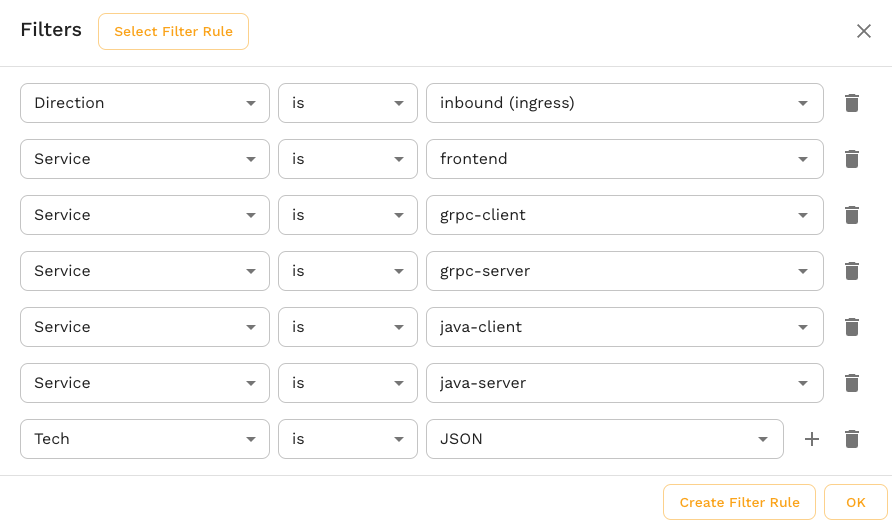
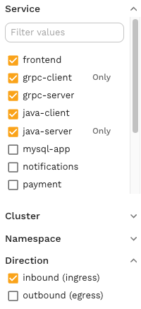

import ViewTagsImg from './filter/snapshot-tags.png'
import RawSizeImg from './filter/raw-size.png'

# Traffic View

Speedscale replicates environments by replicating traffic. Selecting what traffic to replicate allows you to select which databases and endpoints will be included in the environment snapshot. By filtering the traffic viewer, you are selecting which set of inbound and outbound peers will be present when Speedscale replicates the environment. For instance, if Speedscale sees even one Postgres SELECT statement in traffic viewer then it will stand up a Postgres mock with that query loaded. The Speedscale traffic viewer allows you to inspect inbound and outbound transactions. The amount of data can become overwhelming and so you will want to filter down the window of visibility. When creating snapshots, the filter will also determine what parts of the environment are replicated.

Keep in mind that the Traffic Viewer continually refreshes. In logging tools this is called a "live tail" and means by default new traffic will appear at the top of the list. Traffic Viewer is not perfectly real time but generally observed requests show in the UI within a minute or less.

:::tip
A filter query string determines which traffic is included in a view (or snapshot). The filter query string follows a fairly straightforward filter syntax that you can learn about in the [guide](../guides/creating-filters.md). As the traffic viewer view changes, the underlying filter query string also changes.
:::

### Request Response (RRPair) Details 

Clicking on any individual row reveals a Request / Response Pair. This could be for an inbound transaction to the service, or even a call from the service to a downstream system, even if it uses TLS. The following information is shown in the view:

* **Info** section includes high level details like response code, duration, URL, etc.
* **Request** section includes the Headers and Body that were sent
* **Response** section includes the Headers and Body that were received

Now that you understand how to view an individual request, you will want to start working with groups of traffic and that means filters.

:::tip
Additional tabs may appear with analysis or potential actions for the specified RRPair. For example, Speedscale automatically decodes JWT headers and displays details in the `Auth` tab.
:::

## Simple Filters 

When getting started with the traffic viewer, you'll want to select three key filter criteria:
* Time range - Speedscale defaults to 15 minutes but this can stretch for days or even weeks.
* Services - Define the services to be replicated. Services are the containers you will be performance testing, etc. There can be more than one in a single snapshot
* Inbound and outbound dependencies - If you'd like to view/replicate a frontend and backend service, that's ok. But you don't need to include things like monitoring systems and heartbeats.

As you use cases get more advanced you can explore more complex filters, but these are the most important to get started with.

Editing simple filters can be accomplished in different three ways:

1. *Filter selector dialog* - To initiate this workflow click on the Search bar at the top. From there, you can add and remove filter criteria with autocomplete.

2. *Left sidebar* - Common filter criteria can be modified using left sidebar checkboxes.

3. *Shortcuts* - Some data can be quickly filtered on. Look for the small magnifying glasses next to some fields.

## Complex Filters 

Certain complex filter criteria are permitted when creating a snapshot but not in the Speedscale UI. Generally this involves deep payload filtering like `requestBodyJson` or nested conditional statements. These filters are not editable in the UI but can be edited directly as the filter query string. You may also notice complex JSON representations of filters hidden in the UI. This is the internal Speedscale filter presentation and is not typically edited by users. If you're curious about complex filters you can learn more in this [guide](../guides/advanced-filters.md).

## Saving Traffic 

Clicking the Save button at the top of the Traffic Viewer will cause the current view to be stored for future use. That could mean it's a section of traffic you want to replay or simply view later. Saving a snapshot does not cause additional ingest usage on your account. You should feel free to save snapshots without concern.

Traffic filters can also be saved for use as forwarder filters or snapshot criteria by clicking the save button inside the filter editor dialog. The Traffic Viewer also employs URL deep links which means you can copy/paste the URL bar in your browser to share a view.

## Managing Snapshot Size

:::tip
Snapshots do not have a fixed size limit but extremely large snapshots can time out because they take too much time to process. Beyond warnings in the UI, you'll know this is happening because your snapshot will process for a number of hours and suddenly stop with an error.
:::

Speedscale cloud is designed to horizontally scale analysis jobs but all systems have configuration limits. If your snapshot creation is timing out, follow the procedure below to chop it down to a more manageable size. Generally speaking, snapshot size has no limit but practically speaking snapshots over a few gigabytes become unmanageable simply because files that large take time to move. To handle snapshot creation timeouts you can follow the following procedure:

1. Save a snapshot for a minimal amount of time like 15 minutes (the default)
2. Once this is complete, open the snapshot tags and look for the raw file size.

3. Let's assume we want a 1 Gig snapshot since that is fairly easy to work with. We can do some basic multiplication to see that the existing file is roughly 10M and so if we captured 100x as much traffic that would be roughly 1GB. This assumes traffic size is fairly uniform which may or may not be reasonable for your application. Some apps have mid-day spikes so your mileage may vary.
4. Run the same snapshot with 10x the timeframe (150 minutes or roughly 2.5 hours)
5. Repeat step 2.
6. If the snapshot is still too big then apply filters for repetitive or common issues as explained in this [guide](../guides/advanced-filters.md). Eliminating repetitive and useless heartbeats often times is all that is necessary.
7. Repeat until snapshot runs in a reasonable time or fits in your infrastructure expectations.