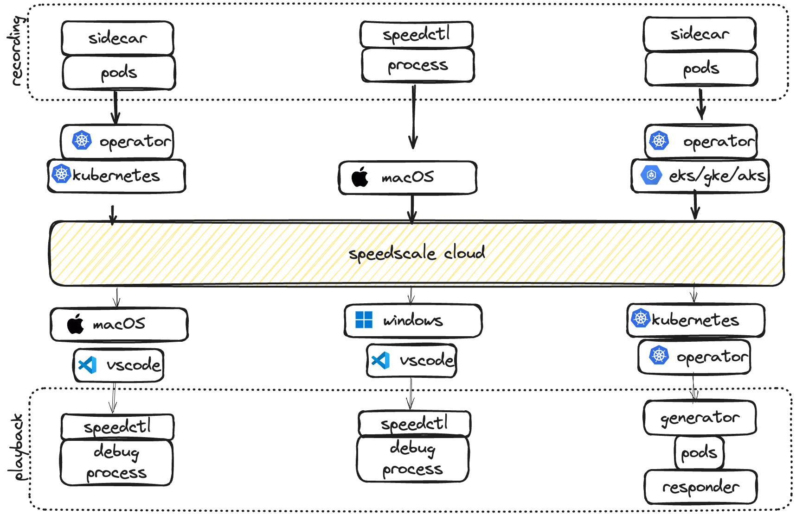
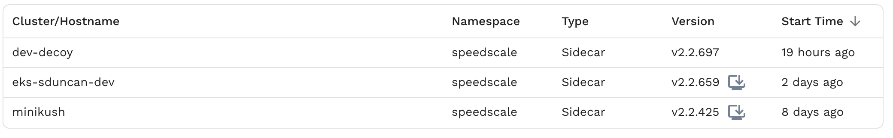
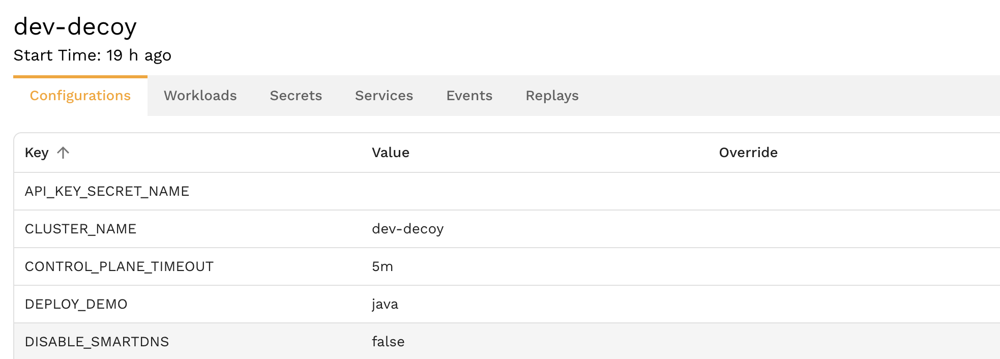
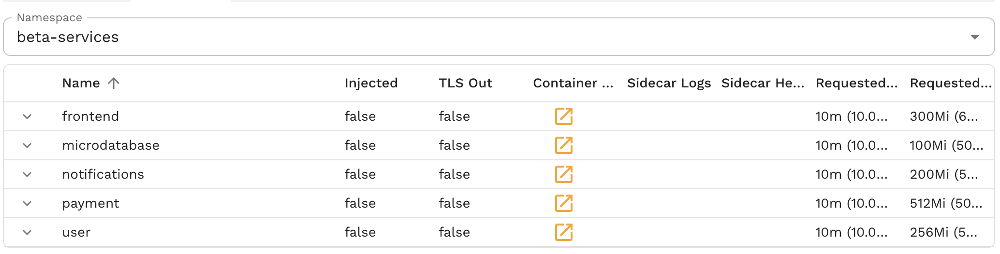
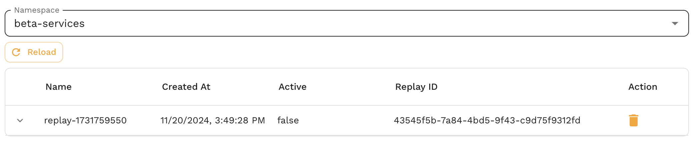

# Infrastructure View

Speedscale is a cloud SaaS offering that provides both observability and replay of remote environments.  The system is designed to record traffic from a remote environment, the local desktop or through data import. Replay works in a similar way on a similar set of platforms. When working remotely, Speedscale provides a point and click interface for starting and stopping replays. 

To learn how to configure a sidecar or import a collection in our [tutorial](../tutorial.md)

## Remote Replay and Data Collection

Speedscale provides the ability to remotely inspect and control Kubernetes clusters similar to [k9s](https://k9scli.io/) or [lens](https://k8slens.dev/). Unlike these inspection tools, Speedscale also allows clusters to be used for *remote replay*. Clusters assigned to Speedscale in this way can run replays on demand and can be treated as a shared resource for engineers or testers.

:::note
Clusters assigned to Speedscale can be used for other purposes. Speedscale consumes resources "just in time" to reduce cloud costs and does not lock down or otherwise monopolize a cluster when not in use.
:::

To enable remote data collection, please follow one of the installation [guides](../setup/install/kubernetes-operator.md). To enable remote replay, follow the same installation guide but ensure that the inspector is enabled (default).

## Clusters

Navigate to the  page to view remote collectors. In most cases this will be a list of Kubernetes operators.

*Cluster/hostname* - name assigned during operator installation
*namespace* - the Kubernetes namespace the operator is running in (usually speedscale)
*version* - the operator version and an upgrade indicator

If you click on an operator you will see a list of tabs with different cluster attributes.

# Configurations

This tab shows the configuration of the operator itself. The operator provides a deprecated mechanism for altering remote configuration that will show up in the *overrides* column. When populate, the override value is used over the main value. This feature will be removed at later date.

Operator configuration is explained in greater detail in the  guides.

# Workloads

The Workloads tab shows all workloads present in a namespace, and the status of any sidecars attached to those workloads.

*Name* - Kubernetes name label for the workload
*Injected* - true if the Speedscale sidecar is attached. Note that flipping this toggle will cause a sidecar to be injected.
*TLS Out* - true if TLS Out unwrapping is enabled (highly desirable for mocking)
*Container Logs* - click to view the logs of the main workload container
*Sidecar Logs* - click to view the logs of the Speedscale sidecar
*Sidecar Health* - a simple alert/caution indicator for the sidecar configuration and recording health
*Request CPU/Memory* - indicate how many resources are requested by the workload

# Secrets

The Secrets tab shows the name and key value of secrets in the namespace. Note that unlike true Kubernetes management solutions, no secrets are transferred out of the cluster and cannot be remotely inspected.

# Services

The list of Kubernetes network services available in the namespace

# Events

Similar to watching the logs, you can also view events. Pay attention to this section to detect pod problems like CrashLoopBackoff

# Replays

Use this tab to view currently running replays. Speedscale utilizes a Custom Resource Definition called a `trafficreplay` to manage cluster replays. This view shows CRDs in the namespace, whether currently active or not. Use the trash can icon to delete any running replays.