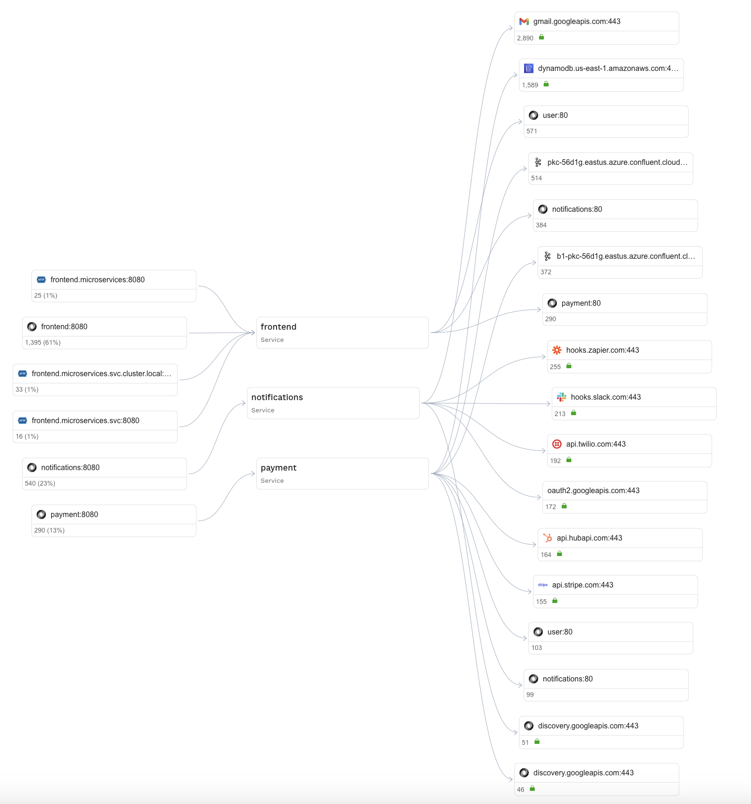

# Overview

# Introduction to Speedscale Traffic Viewer

The Speedscale Traffic Viewer is a powerful tool designed to provide developers and operations teams with deep insights into API traffic and service behavior. By visualizing traffic flows in real-time, the Traffic Viewer simplifies the process of analyzing requests, responses, and performance metrics, enabling teams to optimize and troubleshoot their systems effectively.

Key Features:

* Detailed Traffic Inspection: Examine API request and response payloads, headers, and metadata for comprehensive debugging and analysis.
* Real-Time Monitoring: Visualize traffic as it flows through your application, helping to quickly identify anomalies or bottlenecks.
* Filter and Search: Easily locate specific traffic patterns or anomalies with powerful filtering and search capabilities.
* Performance Metrics: Gain visibility into latency, error rates, and throughput, enabling proactive performance management.
* Environment Compatibility: Works seamlessly across staging, testing, and production environments for consistent observability.

The Speedscale Traffic Viewer is an essential tool for teams aiming to achieve faster debugging cycles, reliable APIs, and improved performance across their microservices architecture. The Speedscale Traffic Viewer is designed to provide the depth of visibility that normal observability tools do not. It is a complement to a monitoring solution with metrics, alerts, etc and not a replacement.

## Service Map from Real Traffic

The Speedscale Traffic Viewer includes a dynamic Graphical Service Map that visualizes the interactions between services based on actual traffic. This real-time mapping provides a clear and intuitive representation of how components within your application communicate, making it easier to understand dependencies, bottlenecks, and data flow.

* Real-Time Traffic Visualization: See live interactions between services, complete with request volumes, response times, and error rates.
* Dependency Mapping: Identify upstream and downstream dependencies between services, helping to pinpoint potential failure points or performance bottlenecks.
* Dynamic Filtering: Highlight specific services or interactions using filters to focus on critical areas of your system.

The Graphical Service Map transforms raw traffic data into actionable insights, empowering teams to optimize architecture, troubleshoot faster, and maintain resilient systems in production.

## Request and Response Payload Inspection

The Speedscale Traffic Viewer provides in-depth inspection of request and response payloads, giving teams unparalleled visibility into the data exchanged between APIs. This capability is essential for debugging, validation, and ensuring compliance with API contracts.

Features of Payload Inspection:

* Full Payload Visibility: Examine the complete structure of request and response payloads, including nested JSON, XML, Postgres, Kafka or other supported formats.
* Error and Anomaly Detection: Spot issues like missing fields, unexpected values, or schema mismatches directly within the payload.
* Customizable Views: Toggle between raw and formatted views to analyze payloads in the most suitable format for your needs.
* Sensitive Data Masking: Protect sensitive information with masking options while still enabling debugging and analysis.

By providing detailed access to API payloads, the Traffic Viewer ensures that teams can confidently understand and optimize the interactions driving their services.

## API Filtering Capabilities

The Speedscale Traffic Viewer offers advanced API filtering capabilities, allowing teams to pinpoint specific traffic flows and focus on critical interactions within their systems. This feature is particularly useful for debugging, testing, and performance tuning in complex microservices environments.

Highlights of API Filtering:

* Request and Response Matching: Filter traffic based on request or response parameters such as HTTP methods, status codes, or specific fields within payloads.
* Header and Metadata Filtering: Isolate API calls by custom headers, authentication tokens, or other metadata to focus on targeted traffic flows.
* Error Identification: Quickly locate traffic associated with failed requests or error codes, streamlining root cause analysis.
* Environment-Specific Filters: Apply filters for traffic from specific environments (e.g., staging, production) to analyze behavior under varying conditions.
* Pattern Matching: Use regex or wildcards to filter traffic for advanced debugging and testing scenarios.

These filtering capabilities enable teams to analyze API interactions with precision, saving time and effort when diagnosing issues, validating performance, or reproducing specific scenarios.