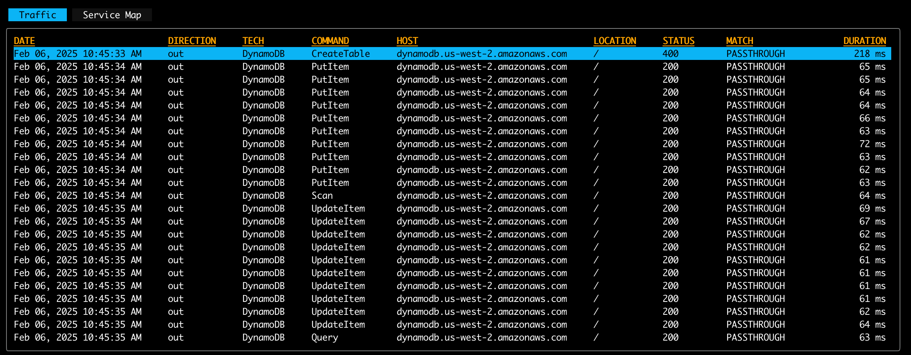

# DynamoDB

## DynamoDB Mock

As a convenience, we provide a pre-made mock to get you started quickly with AWS DynamoDB. You can find the pre-made mock recording [here](https://github.com/speedscale/demo/blob/master/aws/service/dynamodb/go/snapshots/default.jsonl). The parent directory contains the code for the demo app that was used to generate the mock.

## Importing and Inspecting the Mock

To import the mock, you can use the following command (point to the file in your local directory):

```bash
proxymock import --file default.jsonl
```

Take note of the snapshot ID that is returned. Run the following command to view the mock:

```bash
proxymock inspect snapshot <snapshot-id>
```



## Request Format

For general information about AWS APIs, please see our [notes](./index.md). Speedscale's AWS DynamoDB default mock has recordings for the following operations:

- CreateTable
- GetItem
- PutItem
- UpdateItem
- DeleteItem
- Scan
- Query
- DeleteTable
- BatchGetItem
- BatchWriteItem

Open the request body of one of the Query operations:
```json
{
  "ExpressionAttributeValues": {
    ":id": {
      "S": "1"
    }
  },
  "KeyConditionExpression": "ID = :id",
  "TableName": "DemoTable"
}
```

You can learn more about this format from the AWS [documentation](http://docs.aws.amazon.com/amazondynamodb/latest/developerguide/Expressions.ConditionExpressions.html). To modify the query, you need to modify the request body. Unless you change the command type you don't need to edit query parameters or headers to mock this protocol.

## Response Format

```json
{
  "Count": 1,
  "Items": [
    {
      "value": {
        "S": "Value1"
      },
      "ID": {
        "S": "1"
      },
      "name": {
        "S": "Item1"
      },
      "Value": {
        "S": "UpdatedValue1"
      }
    }
  ],
  "ScannedCount": 1
}
```

To modify the response returned by the mock, change the payload in the recording. The exact format of DynamoDB responses can be observed using the AWS CLI. The pattern is fairly straightforward with the key names and IDs outlined in the JSON.