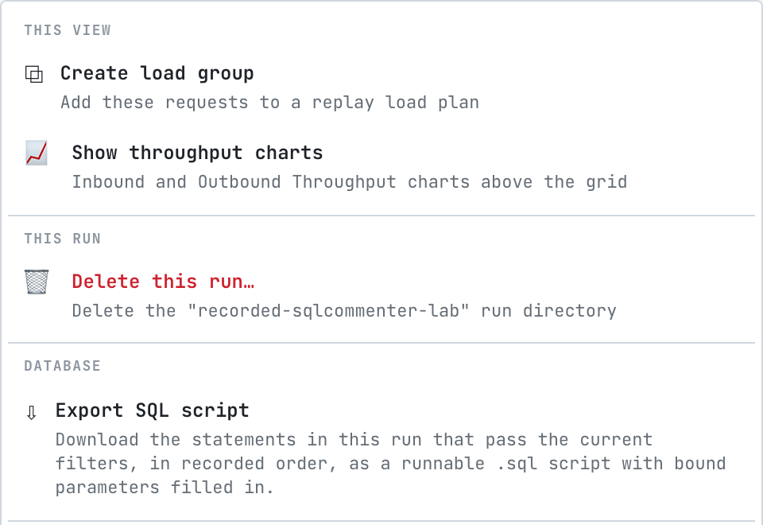

# Export a SQL script

proxymock can write the statements your app ran as a plain `.sql` file: every executed statement in the order it ran, with the values of prepared statements filled in as literals, so a statement reads like the SQL the database actually executed. Run the file with `psql` or `mysql` to reproduce a bug on a scratch database, hand it to a DBA, attach it to a ticket, or diff two of them.

It is the database counterpart of exporting a trace as a script in SQL Server Profiler, and it needs proxymock 2.5.1152 or later.

## What the script holds

- One statement per execution. In the extended protocol a statement also arrives as Parse, Bind and Describe messages, which carry the same SQL; only the execution is written, so nothing runs twice.
- Bound parameters filled in as literals, quoted and typed for the database.
- A comment before each statement with its time, duration and outcome: the rows it returned or changed, or the error.
- Logins, logouts and changes of connection as comments, so a script that covers several connections says which one ran what.
- A statement whose values were not captured, or whose SQL was prepared before recording started, written commented out with the reason. The script never runs SQL with unbound placeholders.

From the order transaction in the [sqlcommenter lab](https://github.com/speedscale/mock-lab/tree/main/labs/sqlcommenter) recording, with the SQL comments removed:

```sql
-- SQL script extracted by proxymock from recorded-sqlcommenter-lab
-- 32 statements in recorded order. Bound parameters are inlined as literals.
-- The statements come from 4 connections, interleaved by time; run on one connection, transactions and session state may not behave as recorded.

BEGIN;

-- 2026-10-07T17:55:33.516Z · 0.006 ms · 1 row
INSERT INTO orders (customer, total) VALUES ('grace@example.com', 0) RETURNING id;

-- 2026-10-07T17:55:33.517Z · 0.026 ms · 1 row
UPDATE products SET stock = stock - 1 WHERE id = 2 AND stock >= 1 RETURNING price::float8;

-- 2026-10-07T17:55:33.519Z · 0.047 ms · 1 row
INSERT INTO order_items (order_id, product_id, quantity, price) VALUES (2, 2, 1, 59);

-- 2026-10-07T17:55:33.520Z · 0.500 ms
COMMIT;
```

Replaying writes changes data, so run a script against a database you can throw away.

## From proxymock web

- **A whole run**: in **Requests**, choose **Actions** › **Export SQL script**. The script holds the statements in the run that pass the current filters, so filter first to narrow it to a service, a table, a time range or one session.
- **One connection**: on a database call's **Connection** tab, choose **Export as .sql**. The script holds every statement on that connection in order, which is the easiest way to reproduce what one session did. See [Inspect a statement](./inspect-a-statement.md#connection-everything-that-connection-did).
- **The rows on screen in Live SQL**: **Copy as SQL** copies the same kind of script to the clipboard. See [Watch live SQL](./watch-live-sql.md#keep-what-you-caught).



## From the CLI

```bash
# every statement in a recording
proxymock sql-script --in proxymock/recorded-2026-10-06_17-40-00.000000000Z > recording.sql

# one session, then run it against a scratch database
proxymock sql-script --in proxymock/recorded-2026-10-06_17-40-00.000000000Z --session 4007 --out session.sql
psql -d scratch -f session.sql

# a time window
proxymock sql-script --in proxymock/recorded-2026-10-06_17-40-00.000000000Z \
  --start 2026-10-06T17:42:00Z --end 2026-10-06T17:43:00Z
```

| Flag | What it does |
|---|---|
| `--in` | The recording, or several, to extract from |
| `--session` | Keep one server session: the Postgres backend pid or the MySQL connection id, as shown in the Session column |
| `--start`, `--end` | Keep the statements that started in this window (RFC 3339) |
| `--out` | Write the script to a file instead of standard output |

## Related

- [Inspect a statement](./inspect-a-statement.md)
- [Load and Regression Test a Database](./load-and-regression-testing.md), to replay the statements with many sessions instead of once
