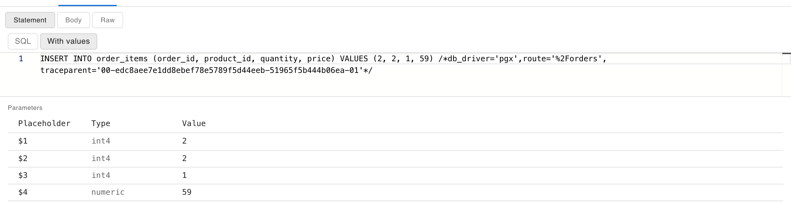

# Inspect a statement

Every database call proxymock records opens in a detail view that answers the questions you would otherwise ask the database: what exactly ran, with which values, for whom, how it ended, and what else that connection was doing. Select any Postgres or MySQL call in the Requests grid or the [Live SQL](./watch-live-sql.md) lens to open it.

## Info: who ran it and where it came from

The **Database** section at the top of the Info tab gathers what proxymock knows about the call:

- **caused by** names the inbound request that ran it, marked **by trace id** when the app wrote that request's trace id into the statement's SQL comment and **by time** when proxymock inferred it from timing. Select it to open that request. See [Link queries to the request that ran them](./link-queries-to-requests.md).
- **user**, **database** and **session** say who ran it on which connection. **Connection** opens the Connection tab.
- **transaction** says whether the statement ran inside a transaction, and whether that transaction had already failed.
- **event**, **operation**, **table**, **rows** and **statement** describe the call. The statement is its shape, with values masked, so it is the same for every execution of one statement.
- **route** and **trace** come from the SQL comment, when the app writes one.

Each fact has a filter and an exclude button, which add it to the Requests filters.

## Request: the SQL with its values

The **Statement** view of the Request tab shows the SQL the call ran. A prepared statement arrives with placeholders and its values separately, so proxymock shows both:

- **SQL** shows the statement as the app sent it, with `$1` or `?` placeholders.
- **With values** fills the bound values in as literals, so you can copy the statement into `psql` or `mysql` and run it.
- **Parameters** lists each placeholder with its type and value.

A value proxymock could not decode, or a statement that was prepared before recording started, is marked as such rather than guessed.

## Response: how it ended

The top of the Response tab says how the call ended:

- A successful call shows what it did, such as `INSERT 0 1` or the rows it returned. Writes return no rows, so this is where an `UPDATE` or `DELETE` says how many rows it changed.
- A failed call shows an error card with the message, the SQLSTATE or MySQL error number and its name, the objects the server named, and the line of SQL the server pointed at with a caret under the position.
- A call that was cancelled, timed out, deadlocked, waited too long for a lock or was terminated shows why, and lists what other sessions were running at the same time, which is usually where the cause is.
- A login shows who connected to which database, the client application, the authentication method and the server version.

The **Result sets** view shows each table the query returned as a grid.

## Connection: everything that connection did

The **Connection** tab lists every call on the same database connection in order, from the login to the logout, with the selected one highlighted. Calls inside a transaction are grouped with a colored bar and a number, and a chip above the list says how each transaction ended (committed, rolled back, failed, ended or still open), how long it took and how long the client held it open without running anything.

Use it to see what led up to a failed or slow statement, whether a transaction held locks while the app did something else, and in what order a request's statements really ran. **Export as .sql** downloads the connection's statements as a script; see [Export a SQL script](./export-sql-script.md).

## Related

- [Watch live SQL](./watch-live-sql.md)
- [Database traffic](../../concepts/database-traffic.md)
- [Inspect a statement in the Speedscale dashboard](../../guides/databases/inspect-a-statement.md)
