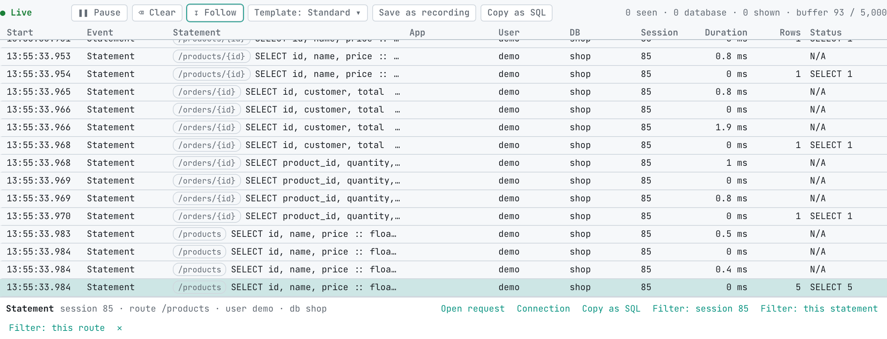

# Watch live SQL

The **Live SQL** lens in proxymock web streams your app's database calls as they are recorded, the way SQL Server Profiler streams a trace. Run a request in your app and its statements appear a moment later, with who ran them, how long they took and how they ended. It works on a local `proxymock record` in progress and on a live tap of a Kubernetes workload, and it needs proxymock 2.5.1149 or later.

Use it when you want to see what a change does to the database while you click through the app: which statements a page runs, whether a loop fires one query per row, which call is slow, or which one fails.

## Open the lens

1. Start recording your app with its database mapped, as described in [Record your database](./record/postgresql.md).
2. Run `proxymock web` and open **Requests**.
3. Pick the run that is recording from the **Run** list and choose **Live SQL** next to **Grid**, **Report** and **Trace**.

The lens shows the most recent 5,000 calls. The line at the top right counts every call that arrived since you opened it (**seen**), the database calls among them (**database**), the ones that pass your filters (**shown**), and how many older rows were dropped to stay within the buffer.

## Columns

| Column | What it shows |
|---|---|
| Start | When the call started |
| Event | Statement, Login, Logout or Error, or why the call needs attention, such as a deadlock |
| Statement | The statement with values masked, after the route the app tagged it with when it did |
| App, User, DB, Session | Who ran it: the client application name, the database user, the database, and the server's session id |
| Duration, Rows | How long it took and how many rows it returned or changed |
| Status | The command tag, or the error code |

Protocol chatter such as SSL negotiation and describe-only messages counts as database traffic in the line at the top but is never listed.

## Templates

A template narrows the lens to one kind of call, like Profiler's trace templates:

| Template | Shows |
|---|---|
| Standard | Every database call |
| Slow statements | Duration of 100 ms or more |
| Errors | Calls that returned a database error |
| Cancels and disconnects | Cancelled, timed out and terminated calls, cancel requests and dropped connections |
| Logins and logouts | Login and logout events |
| Locks | Deadlocks and lock timeouts |
| Big results | More than 1,000 rows |

A template sets the Duration and Database rows of the Requests filters and keeps the rest of your filters, so you can combine **Slow statements** with a service or a table. Edit the filters afterwards to make it your own; the template menu then reads **Custom**.

## Follow, pause and clear

- **Follow** keeps the newest row in sight. Scrolling up turns it off, and scrolling back to the bottom turns it on again.
- **Pause** freezes the view while recording continues; the state shows how many calls are waiting. **Resume** shows them.
- **Clear** empties the view and keeps listening, so you can start a fresh look before you click the next button in your app.

## Look at one call

Select a row to see a strip with its event, session, route, user and database, and links to act on it:

- **Open request** opens the call in the Requests grid. **Connection** opens it on the Connection tab, with every call on the same database connection. See [Inspect a statement](./inspect-a-statement.md).
- **Copy as SQL** copies the statement as runnable SQL, with its bound values filled in. It is offered on the row that ran the statement; in the extended protocol a statement also arrives as Parse and Bind rows, which have nothing to run on their own.
- **Filter: session**, **Filter: this statement** and **Filter: this route** narrow the lens to calls like this one.

## Keep what you caught

- **Save as recording** writes the calls in the lens to a new recorded run named `recorded-live-sql-<time>`, which you can mock, replay or compare like any other recording. Protocol chatter is left out, so the run holds statements, logins and logouts.
- **Copy as SQL** in the toolbar copies the rows on screen, in recorded order, as one script that `psql` or `mysql` can run, with bound values filled in. Statements whose values were not captured are written commented out. When the clipboard is not available the script downloads instead. It needs proxymock 2.5.1154 or later. See [Export a SQL script](./export-sql-script.md) for the whole run.

## Watch a cluster workload

For a workload in Kubernetes, start a live tap on it from **Observability** in proxymock web. The tap writes the workload's traffic into a run on your machine as it arrives, and the Live SQL lens follows that run the same way it follows a local recording.

## Related

- [Inspect a statement](./inspect-a-statement.md)
- [SQL inventory and sql-report](./sql-inventory.md)
- [Watch live SQL in the Speedscale dashboard](../../guides/databases/watch-live-sql.md)
