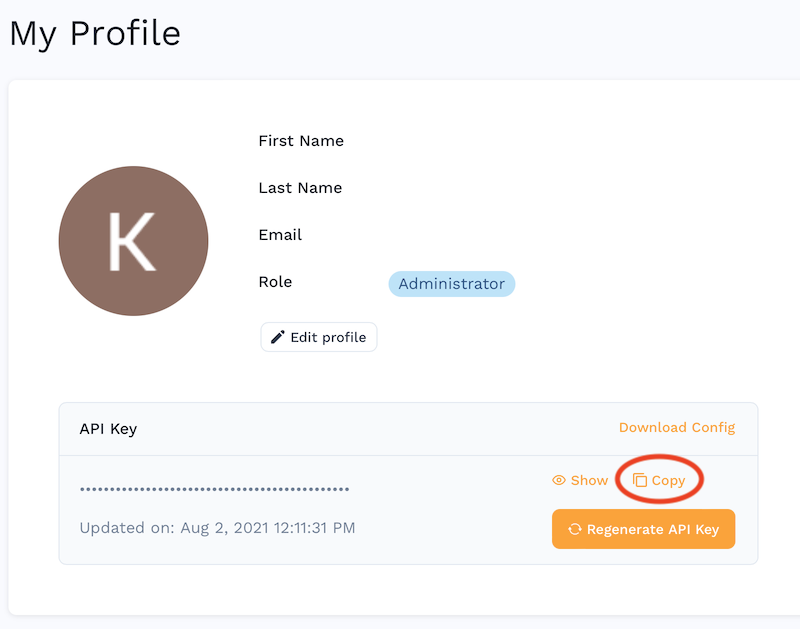

# API Key

Using **proxymock** requires generating an API key. Existing Enterprise customers should skip ahead to [Enterprise Customers](#enterprise-customers).

Free users should run this command:
```bash
proxymock init --email <your-email>
```

That's all you need to do. You can view or modify your API key by editing the `~/.speedscale/config.yaml` file.

Speedscale does not share or sell your email address, although we might send you updates or announcements if we can ever figure out this marketing thing. Engineering is more our wheelhouse.

:::warning
* Don't put your API key in source control. Use a secret manager.
* Don't share your API Key.
* Non-interactive mode (like as part of a CI pipeline) requires Speedscale Enterprise. 
* If your API key is compromised, you can rotate it using the proxymock `rotate` command (run `proxymock rotate -h` for instructions)
:::

:::tip
proxymock does not send your recorded data to any third party. All data is stored on your local desktop unless you connect to Speedscale Enterprise. Don't worry, that won't happen unless you explicitly start a trial or buy a license.
:::

## Enterprise Customers

Does your organization already have a Speedscale tenant? If so, you can skip ahead to [Automatic Tenant Assignment](#automatic-tenant-assignment).

If you want to sign up for Speedscale Enterprise and your organization does not already have a Speedscale tenant, you can create one by visiting [Speedscale Enterprise](https://speedscale.com) and clicking "Free Trial".

### Automatic Tenant Assignment

For most tenants, you can automatically join the tenant doing **one** of the following:

1. Log into https://app.speedscale.com using your corporate email address. You will automatically be added to the tenant after some validation.
1. Dial a friend. Have your friend click the "Invite" button in the Speedscale UI and enter your email address. Check your email and sign in.

### Initialize the CLI

You will need to get your personal API key from your [Profile Page](https://app.speedscale.com/profile). Copy the API key to your clipboard..



Run the following command:
```bash
proxymock init --api-key <your-api-key>
```

That's all you need to do. You can view or modify your API key by editing the `~/.speedscale/config.yaml` file.

If you get stuck you can always reach us on [slack](https://slack.speedscale.com).

:::tip
Did you log into your tenant but it looks empty? This usually happens because your organization's email domain is not configured. Speedscale Support can fix this if you ping us on [slack](https://slack.speedscale.com) or at [support@speedscale.com](mailto:support@speedscale.com).
:::