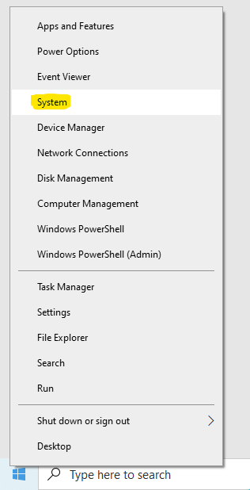
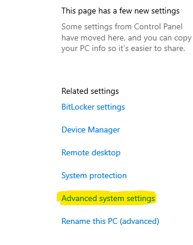
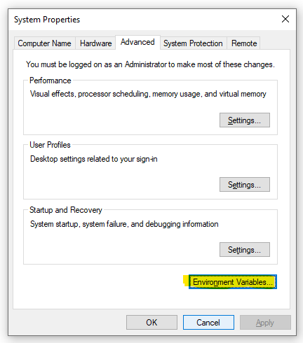
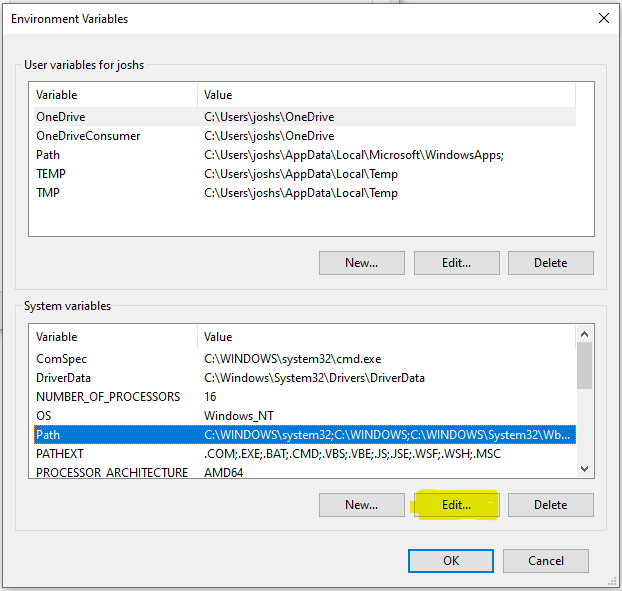
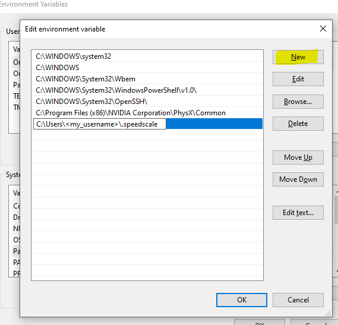

Open PowerShell and create a Speedscale directory.

```
mkdir -f $env:userprofile\.speedscale
```

Download `proxymock` into the Speedscale directory.

```
curl.exe -L "https://downloads.speedscale.com/proxymock/proxymock.exe" -o $env:userprofile\.speedscale\proxymock.exe
```

If this is your first time using `proxymock` you may need to add the Speedscale
directory to your Path environment variable so it is accessible without knowing
the full path.

To add the Speedscale directory to your path, right click on the Windows button and click **System**.



Click **Advanced system settings** on the right.



Click **Environment Variables**.



Under **System variables** select **Path** and click **Edit**.



Create a **New** entry in the list with the Speedscale directory.  If you are
unsure of the exact path run this command from PowerShell.

```
echo $env:userprofile\.speedscale
```



Click **OK** and restart PowerShell.

