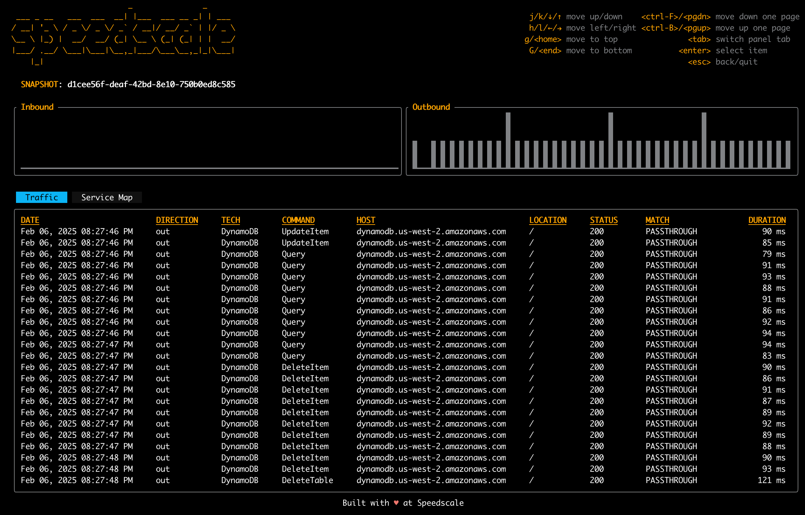
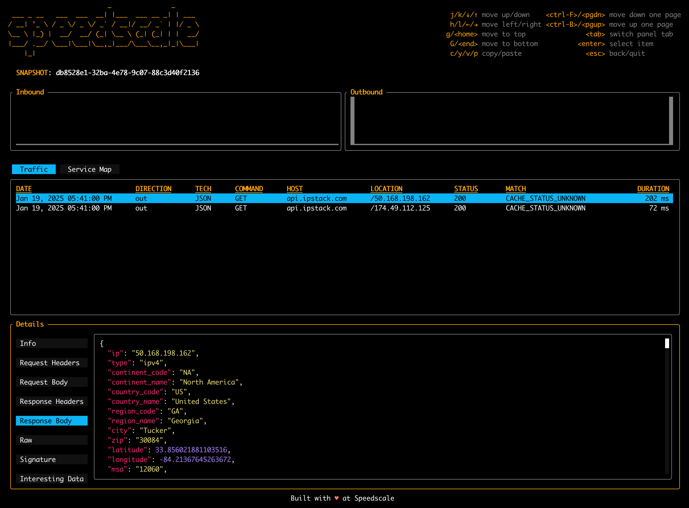

# Quickstart (CLI)

This guide provides a step by step guide to creating a mock server and tests for a simple Go application using only the **proxymock** CLI.

## Introduction


This demo app is written in go and makes calls to IPStack and (optionally) AWS DynamoDB.

The purpose of this app is to accept two IP addresses, look up their geographic locations using [IP Stack](https://ipstack.com/) and calculate the distance between them.

## Prerequisites

You must install the **proxymock** CLI and have a valid API key.

* [proxymock CLI](./installation.md#install-cli)
* [API Key](./api-key.md)
## How-to Steps {#how-to-steps}

This guide will show you how to:
1. Use a pre-packaged recording (aka [snapshot](reference/glossary.md#snapshot)) to create a [mock](reference/glossary.md#mock) server
1. Record the application's outbound [traffic](reference/glossary.md#traffic) while it runs in a terminal to make your own custom mock server

You do not need to have an IP Stack API key or AWS DynamoDB instance to complete step one of this guide.

### Clone the Demo

Clone the demo repository:

```bash
git clone https://github.com/speedscale/demo
```

### Launch using Mocks {#launch-using-mocks}

:::note
This demo does not require an IPStack API key nor AWS DynamoDB instance. Instructions for using the pre-made mocks are presented first so you don't have to sign up for anything until you're ready to learn about recording.
:::

To avoid having to get an IP Stack API key or access to a live AWS DynamoDB, you can use the pre-made mocks in the repository under `demo/go/snapshots/ip-lookup-demo.json`.  You can think of this JSON file as a set of mocks provided by another engineer.

1. Import the pre-made snapshot into your local [repository](../reference/repo.md).
```bash
proxymock import --file snapshots/ip-lookup-demo.json
...
Snapshot 749e2d23-94fd-4e6d-86c2-5dd8ba18f908 imported successfully
```

Your snapshot is now located in your local repository at the location specified by the CLI output. In this example, it is `~/.speedscale/data/snapshots/749e2d23-94fd-4e6d-86c2-5dd8ba18f908.json`.
Take note of the snapshot ID, you will need it in the next step.

2. Start your mock server using this command:
```bash
proxymock run --snapshot-id <snapshot-id>
```

The CLI will output a set of environment variables that you can use to route your traffic through the proxymock "smart proxy" server. Copy these directly from the CLI output and paste them into step 2.

3. Open a **new** terminal and paste the environment variables from the CLI output in step 1. Then start the demo app.
```bash
export http_proxy=http://localhost:4140
export https_proxy=http://localhost:4140
go run main.go 0123456789
```

The mock has been pre-configured to accept the super-secret 0123456789 IPStack API key.

:::tip
By default, DynamoDB is not used by the demo app. If you want to use DynamoDB, you can add the `--cache` flag. Remember though that you will need AWS credentials configured in your environment.
:::

4.  Then run the following command to make a request to the demo app in another terminal:
```bash
curl "localhost:8080/get-ip-info?ip1=50.168.198.162&ip2=174.49.112.125"
```

You should see the following response to your curl from the app running in the debugger:

```json
{"distance":30.042060297133386,"request1":{"city":"Tucker","connection_type":"cable","continent_code":"NA","continent_name":"North America","country_code":"US","country_name":"United States","dma":"524","ip":"50.168.198.162","ip_routing_type":"fixed","latitude":33.856021881103516,"location":{"calling_code":"1","capital":"Washington D.C.","country_flag":"https://assets.ipstack.com/flags/us.svg","country_flag_emoji":"🇺🇸","country_flag_emoji_unicode":"U+1F1FA U+1F1F8","geoname_id":4227213,"is_eu":false,"languages":[{"code":"en","name":"English","native":"English"}]},"longitude":-84.21367645263672,"msa":"12060","radius":"46.20358","region_code":"GA","region_name":"Georgia","type":"ipv4","zip":"30084"},"request2":{"city":"Alpharetta","connection_type":"cable","continent_code":"NA","continent_name":"North America","country_code":"US","country_name":"United States","dma":"524","ip":"174.49.112.125","ip_routing_type":"fixed","latitude":34.11735916137695,"location":{"calling_code":"1","capital":"Washington D.C.","country_flag":"https://assets.ipstack.com/flags/us.svg","country_flag_emoji":"🇺🇸","country_flag_emoji_unicode":"U+1F1FA U+1F1F8","geoname_id":4179574,"is_eu":false,"languages":[{"code":"en","name":"English","native":"English"}]},"longitude":-84.29633331298828,"msa":"12060","radius":"44.94584","region_code":"GA","region_name":"Georgia","type":"ipv4","zip":"30004"}}
```

At this point, the demo app is running with the mock server. You can make requests to it as normal. Note that unknown IP addresses will require changes to the mocks.

Check the console log for information about the requests and responses. New responses are stored in the `raw.jsonl` file inside the `snapshots` directory in your local [repository](../reference/repo.md). To update the mock, you can re-run the analysis stage:

```bash
proxymock analyze <snapshot-id>
```

### Record with Live Systems {#record-with-live-systems}

Let's say you're trailblazing and there are no existing mocks. No problem, we'll just record some!

:::note
Now is the time to sign up for an IP Stack API key and make sure you have an AWS DynamoDB instance. Alternatively, use your own app and follow these instructions.
:::

1. Start the proxymock capture system using this command:
```bash
proxymock run
```
You will see output like so:
```bash
...
export http_proxy=http://127.0.0.1:4140
export https_proxy=http://127.0.0.1:4140
...
proxymock is capturing and mocking snapshot <snapshot-id>
...
```
You'll notice that the CLI will output a set of environment variables that you can use to route your traffic through the proxymock "smart proxy" server. Copy paste these directly from the CLI output and paste them into step 2.

2. Open a **new** terminal and export the environment variables from the CLI output in step 1.
These variables will re-route the outbound network in Golang to point at the proxymock "smart proxy" server.

3. Run the following command to make a request to the demo app:
```bash
curl "localhost:8080/get-ip-info?ip1=52.94.236.248&ip2=74.6.143.25"
```

Look for the location of your snapshot in the local [repository](../reference/repo.md). You can see your requests appear in the `raw.jsonl` file as it updates (or after completing your recording).
You can press Ctrl+C in the proxymock terminal to stop the recording.

4. Take a look at your traffic using the `inspect` command.
```bash
proxymock inspect snapshot <snapshot-id>
```

This will open a state of the art (for 1997) terminal UI that allows you to navigate and inspect your traffic using arrow keys and tab.



Press Enter to view details about each request. Keep in mind that your list of requests will be different than the screenshot but it will be similar. If you have the `--cache` option enabled in the demo app (and have AWS credentials), you will notice that proxymock has automatically exposed the DynamoDB command. Other protocols like gRPC and Postgres will also be converted into human readable JSON payloads with SQL statements exposed (and more).

5. Teach your mock these new responses by re-analyzing the snapshot.

```bash
proxymock analyze <snapshot-id>
```

Your snapshot now contains the new requests and responses. You can now restart your mock server and make requests to it by following the instructions in [Launch using Mocks](#launch-using-mocks) and passing in your snapshot ID.

### Capturing Inbound Traffic

Up to this point we have only seen outbound requests, the requests from the demo app to external resources, but we can capture inbound requests as well.

1. Start proxymock like before, but with the additional `--app-port` flag.  We'll use `8080` because that's the port the demo app listens on:

```bash
proxymock run \
  --snapshot-id <snapshot-id> \
  --app-port 8080
```

2. If the demo app is not running already open a **new** terminal and start it like before:

```bash
export http_proxy=http://localhost:4140
export https_proxy=http://localhost:4140
go run main.go 0123456789
```

3. Then run the following command to make a request to the demo app in another terminal:

```bash
curl "localhost:4143/get-ip-info?ip1=50.168.198.162&ip2=174.49.112.125"
```

You will notice cURL is calling port `4143` instead of `8080` where the demo app is listening.  Since we specified `--app-port 8080` requests to proxymock on port `4143` will be captured and redirected to the demo app on port `8080`.

4. Like before you can see your traffic with the `inspect` command:
```bash
proxymock inspect snapshot <snapshot-id>
```

This will open the inspect UI.  You can navigate to the request you want to change and press `Enter` to open the request in the editor.

Inbound traffic in the inspect UI will show the DIRECTION as "in".

### Modifying Mocks

Let's imagine you want to make your IP Stack mock return a different location for one of the requests. No problem, open `inspect` on your snapshot and navigate to the request you want to change.

```bash
proxymock inspect snapshot <snapshot-id>
```



1. Navigate to the Response Body panel using the tab key.
1. Press the `c` key to copy the contents to the clipboard.
1. Open a text editor and paste the contents.
1. Insert `10.12345678` into the `latitude` field.
1. Copy the entire body into the clipboard again.
1. Go back to the inspect UI and paste the new body back in by pressing `p`.
1. Press `a` to re-analyze the snapshot and update your mocks (this is the same as running `proxymock analyze <snapshot-id>` on the command line).

## Summary

Your local environment no longer requires the IP Stack API key or AWS DynamoDB. You can run the demo app simply by opening the Command Palette and run `proxymock: Start Debugging`.

The app will run normally - except that it will use the mock server you created in the previous step. If you need to update your mocks, just re-record the application's traffic.

That's it! You command the superpower of running your app without it's dependent APIs and microservices.

## Next Steps

This guide only scratches the surface of what you can do with the free **proxymock** CLI. Please give us feedback in our [slack](https://slack.speedscale.com)

Speedscale Enterprise can also record from a production Kubernetes application to generate local mocks and tests (including Postgres and other proprietary protocols). For more information on that workflow, check out [Speedscale Enterprise](../../intro.md).
