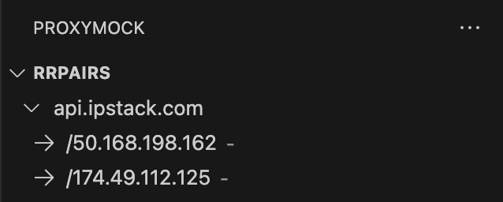
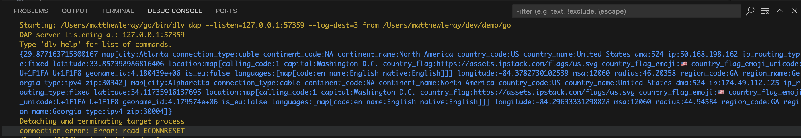
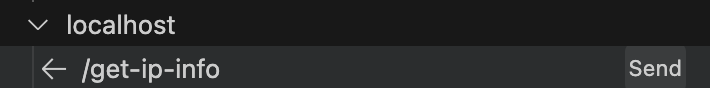

# Quickstart

This guide provides a high-level overview of how to get a simple demo app up and running to better understand how **proxymock** works.

## Introduction

This guide will show you how to create a realistic mock that sidesteps the rate limits of IP Stack and removes the need for a real DynamoDB instance. This is a simple app that uses the [IP Stack](https://ipstack.com/) API to get the location of an IP address and [AWS DynamoDB](https://aws.amazon.com/dynamodb/) to store and retrieve data. Once complete, you will know how to record a real application's behavior and generate a mock server and tests. Think of this like a very smart caching server so if you request new IPs you still need to use IPStack. This guide covers the following concepts:

* How to *observe* a real application's API calls in the debugger (inbound and outbound)
* How to generate a mock server and tests
* How to run your app in a simulation environment
* (optional) How to record from a production Kuberenetes application to generate local mocks and tests

Once complete, you will know how to decouple your application from external dependencies and run your app in a debugger as if it were in a live environment. Also keep in mind that everything done in this guide can be done without VSCode using the command line `speedctl` tool. For more information on that workflow, check out [Speedscale Enterprise](../../intro.md).

## Architecture Overview

For this example, we will be using a simple application that uses the [IP Stack](https://ipstack.com/) API to get the location of two IP addresses, calculate the distance between them, and then cache the result in [AWS DynamoDB](https://aws.amazon.com/dynamodb/). The screenshots of this example are written in Go, but you can also find other language examples in the same repository. Currently this fully automated workflow only works for Go but other languages are coming soon.


The client (curl) calls our demo application, which then checks the cache for the location of the IP address. If the location is not in the cache, it makes two calls to the IP Stack API to retrieve the location of two IP addresses. The app then calculates the distance the two locations using the Haversine formula. A call is them made to DynamoDB to store the result. This is not a very complex demo app, but it does demonstrate how to record and mock a real application's behavior.

## Prerequisites

* [Speedscale Proxymock Extension](./installation.md#install-proxymock-extension)
* [Speedscale API Key](./api-key.md)
* (optional) [IP Stack API Key](https://ipstack.com/) - skip to [Use Pre-Made Mocks](#use-pre-made-mocks) if you don't want to use the IP Stack API
* (optional) [AWS DynamoDB](https://aws.amazon.com/dynamodb/) - only needed for '--cache' option

Because of the awesomeness of local mocking, you can complete this guide without either API key - skip ahead to [Use Pre-Made Mocks](#use-pre-made-mocks) to use a pre-recorded mock.

## How-to Steps {#how-to-steps}

### Clone the Demo

Clone the demo repository and open VSCode in the demo directory:

```bash
git clone https://github.com/speedscale/demo
cd demo/go
code .
```

### Setup launch.json {#setup-launch-json}

**proxymock** allows you to observe the behavior of your application in the debugger. This is done by recording the application's outbound (and soon inbound) traffic. Under the covers, **proxymock** modifies environment variables and listens to the application's traffic using the debugger context. If you already have a debugger context in your `launch.json` you may want to add API keys (if you choose to run a real recording - see below). If you don't have a launch.json you can create a new one that looks like this:

```json
{
    "version": "0.2.0",
    "configurations": [
        {
            "name": "Launch Package",
            "type": "go",
            "request": "launch",
            "mode": "auto",
            "program": "${fileDirname}",
            "args": [
                "<insert your IP Stack API key here>"
            ],
            "env": {
                "AWS_ACCESS_KEY_ID": "<insert if you want to use the cache>",
                "AWS_SECRET_ACCESS_KEY": "<insert if you want to use the cache>",
                "AWS_SESSION_TOKEN": "<insert if you want to use the cache>"
            }
        }
    ]
}
```

This is where you get to choose your own adventure:
* If you want to just get started with pre-made mocks, you can use the pre-packaged snapshot in the repository under `demo/snapshots/ip-lookup-demo.json`. Go to [Use Pre-Made Mocks](#use-pre-made-mocks) to see how to use pre-made mocks instead of the real systems.
* If you are ok signing up for an IP Stack API key, you should insert it into the launch.json. Also, if you have access to an AWS DynamoDB instance, you can insert your credentials into the launch.json. Go to [Record with Real Systems](#record-with-live-systems) to start recording the application's traffic. One of the reasons `proxymock` exists is to make it so every developer doesn't need their own API keys or even test environments.

### Use Pre-Made Mocks {#use-pre-made-mocks}

If you don't want to go through the effort of getting an IP Stack API key or you don't have access to a live AWS DynamoDB, you can use the pre-made mocks in the repository under `demo/snapshots/ip-lookup-demo.json`.  You can think of these as pre-recorded mocks and tests provided by another engineer. This is how `proxymock` is designed to work - one engineer can create a mock and another engineer can use it. The process of updating snapshots across build pipelines and multiple developer desktops can be automated using [Speedscale Enterprise](../../intro.md).

1. Modify your launch.json to use the following IP Stack API key:

```json
"args": [
    "1234567890"
]
```

If you don't do this then your mocks won't match because the api key is part of the request.

2. Navigate to the `PROXYMOCK` pane and click the `Open existing recording` button. Select the `demo/snapshots/ip-lookup-demo.json` snapshot file.

At this point you should see the pre-recorded requests and responses in the `PROXYMOCK` pane.



### Record with Live Systems {#record-with-live-systems}

Skip this section if you are using pre-made mocks.

Let's say you're trailblazing and there are no existing mocks. No problem! Open the VSCode Command Palette (Command+Shift+P on Mac or Ctrl+Shift+P on Windows).  Run `proxymock: Start Recording`. This will run the app in the debugger and start recording the application's traffic. Your app will still be talking to live systems, but 

At this point you should see a new pane appear in the Primary Side Bar with the title `PROXYMOCK`. This is where you will see the application's traffic.

Open a new terminal and run the following command to make a request to the demo app:

```bash
curl "localhost:8080/get-ip-info?ip1=52.94.236.248&ip2=74.6.143.25"
```

You should see the request and response in the `PROXYMOCK` pane like this:


### Observe the Traffic

Take a look around and click on each request/response pair (RRPair) to see the details of the request and response. You should see the outbound calls in particular. These will form the basis of the service mock.

Click on the `Learn` action at the top right of the `PROXYMOCK` pane. This will add these requests to the running mock server. That's it, the mock server is now ready to use.

:::tip
Running your app in the debugger is now a powerful observability tool. You can see the application's traffic by clicking on each RRPair in the tree, including payloads.
:::

### Run

Start your app using the `proxymock: Debug with Proxymock` command. This will start your app in the debugger and use the mock server you created in the previous step. There's not a lot to say about this step. If you don't have mocks it won't work. If you do have mocks, it will use them.

## Summary

Your local environment no longer requires the IP Stack API key or AWS DynamoDB. You can run the demo app simply by opening the Command Palette and run `proxymock: Start Playback`.

The app will run normally - except that it will use the mock server you created in the previous step. If you need to update your mocks, just re-record the application's traffic.



That's it! You command the superpower of running your app without it's dependent APIs and microservices.

## Next Steps

This guide only scratches the surface of what you can do with **proxymock**. It is completely free for local desktop use.

Speedscale Enterprise can also record from a production Kubernetes application to generate local mocks and tests (including Postgres and other proprietary protocols). For more information on that workflow, check out [Speedscale Enterprise](../../intro.md).


# Coming soon!

We are readying a release with the following capability so we'll leave it in the docs since it is near release.

### Run a Test {#run-a-test}

Find the **Send** button by hovering over the request and response pair. Click it to instantly run a test.



Any new information will be updated in the RRPair viewer, including new responses. A new tab will open showing the new request and response. Save the request to update the RRPair for future playback.

:::tip
Inbound requests can also be turned into high quality regression and load tests using Speedscale Enterprise. You can also export these as Postman Collections or k6 scripts.
:::
