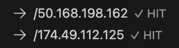

# VS Code Quickstart (beta)

This guide provides a step by step guide to creating a mock server and tests for a simple Go application.

## Introduction


This demo app is written in go and makes calls to IPStack and (optionally) AWS DynamoDB.

The purpose of this app is to accept two IP addresses, look up their geographic locations using [IP Stack](https://ipstack.com/) and calculate the distance between them.

## Prerequisites

You must install either the **proxymock** VSCode extension or the CLI. Most users should install the VSCode extension because it will install the CLI for you.

* [Speedscale Proxymock Extension](./installation.md)

## How-to Steps {#how-to-steps}

This guide will show you how to:
1. Use a pre-packaged recording (aka snapshot) to create a mock server
1. Record the application's outbound traffic while it runs in the debugger to make your own custom mock server

You do not need to have an IP Stack API key or AWS DynamoDB instance to complete step one of this guide. Instructions will be provided for both the VSCode UI and the CLI

### Clone the Demo

Clone the demo repository and open VSCode in the demo directory:

```bash
git clone https://github.com/speedscale/demo
cd demo/go
code .
```

### Inspect or modify launch.json {#modify-launch-json}

The demo repository contains a `launch.json` file that you can modify or use as is. If you open the file you'll notice there are two go debugger contexts:

1. `Launch using Mocks` - this will use the pre-packaged recording to create a mock server using a mock API key
1. `Launch with IPStack Key` - this will record the application's outbound traffic while it runs in the debugger to make your own custom mock server (but you need to provide an IP Stack API key)

### Launch using Mocks {#launch-using-mocks}

To avoid having to get an IP Stack API key or access to a live AWS DynamoDB, you can use the pre-made mocks in the repository under `demo/go/snapshots/ip-lookup-demo.json`.  You can think of this JSON file as a set of mocks provided by another engineer. 

1. Click on the **proxymock** icon in the left sidebar.
1. Click the "Import" button in the CONTROL PANEL (bottom left). You should now see some data in the **RRPAIRS** pane. Each entry in the tree represents a request. Try clicking on them to see what's inside.

1. Start the VSCode command palette (Command+Shift+P on Mac or Ctrl+Shift+P on Windows). Run `proxymock: Start Debugging`.
1. Select the `Launch using Mocks` context.
1. Open a terminal and run the following command to make a request to the demo app:
```bash
curl "localhost:8080/get-ip-info?ip1=50.168.198.162&ip2=174.49.112.125"
```

You should see the following response to your curl from the app running in the debugger:

```json
{"distance":30.042060297133386,"request1":{"city":"Tucker","connection_type":"cable","continent_code":"NA","continent_name":"North America","country_code":"US","country_name":"United States","dma":"524","ip":"50.168.198.162","ip_routing_type":"fixed","latitude":33.856021881103516,"location":{"calling_code":"1","capital":"Washington D.C.","country_flag":"https://assets.ipstack.com/flags/us.svg","country_flag_emoji":"🇺🇸","country_flag_emoji_unicode":"U+1F1FA U+1F1F8","geoname_id":4227213,"is_eu":false,"languages":[{"code":"en","name":"English","native":"English"}]},"longitude":-84.21367645263672,"msa":"12060","radius":"46.20358","region_code":"GA","region_name":"Georgia","type":"ipv4","zip":"30084"},"request2":{"city":"Alpharetta","connection_type":"cable","continent_code":"NA","continent_name":"North America","country_code":"US","country_name":"United States","dma":"524","ip":"174.49.112.125","ip_routing_type":"fixed","latitude":34.11735916137695,"location":{"calling_code":"1","capital":"Washington D.C.","country_flag":"https://assets.ipstack.com/flags/us.svg","country_flag_emoji":"🇺🇸","country_flag_emoji_unicode":"U+1F1FA U+1F1F8","geoname_id":4179574,"is_eu":false,"languages":[{"code":"en","name":"English","native":"English"}]},"longitude":-84.29633331298828,"msa":"12060","radius":"44.94584","region_code":"GA","region_name":"Georgia","type":"ipv4","zip":"30004"}}
```

Take a look at the **RRPAIRS** pane. You should see new requests and responses in the tree. The `HIT` indicates that the mock received the request and returned the response. You can now develop locally without the need for an IP Stack API key or AWS DynamoDB.



### Record with Live Systems {#record-with-live-systems}

Let's say you're trailblazing and there are no existing mocks. No problem, we'll just record some!

1. Open the **proxymock** pane by clicking on the icon in the left sidebar.
2. Open the **CONTROL PANEL** (bottom left) and click "Record Responses (Debugger)"
3. Enter in your own IPStack API key and AWS DynamoDB credentials (if needed) when prompted by VSCode.
4. Open a new terminal and run the following command to make a request to the demo app:
```bash
curl "localhost:8080/get-ip-info?ip1=52.94.236.248&ip2=74.6.143.25"
```
You should see the request and response in the `PROXYMOCK` pane like this:

5. Teach your mock these new responses by clicking `Learn (Add Recorded to Mocks)` command in the **CONTROL PANEL**.

The next time you run the same request, the mock will return the response you just recorded.

:::tip
You can also record from the command line using the following commands. This is only necessary if you intend to run proxymock from the command line without using the VSCode extension.

```bash
# run in the same terminal as your app
export http_proxy=http://127.0.0.1:4140
export https_proxy=http://127.0.0.1:4140

# run in a separate terminal for local storage
speedctl capture localhost 8080 --local-capture
```

This will not directly interact with the VSCode extension and you will need to manually view the .jsonl file in your `~/.speedscale/data/snapshots` directory.
:::

## Summary

Your local environment no longer requires the IP Stack API key or AWS DynamoDB. You can run the demo app simply by opening the Command Palette and run `proxymock: Start Debugging`.

The app will run normally - except that it will use the mock server you created in the previous step. If you need to update your mocks, just re-record the application's traffic. You can still run the debugger normally without **proxymock**.


That's it! You command the superpower of running your app without it's dependent APIs and microservices.

## Next Steps

This guide only scratches the surface of what you can do with the free **proxymock** extension. Please give us feedback in our [slack](https://slack.speedscale.com)

Speedscale Enterprise can also record from a production Kubernetes application to generate local mocks and tests (including Postgres and other proprietary protocols). For more information on that workflow, check out [Speedscale Enterprise](../../intro.md).
