import Tabs from '@theme/Tabs';
import TabItem from '@theme/TabItem';
import Admonition from '@theme/Admonition';
import MacCLIInstall from '../../../index/_cli_macos_minified.mdx'
import LinuxCLIInstall from '../../../index/_cli_linux_minified.mdx'

# In-Cluster (Web)

Use proxymock web to work directly against your Kubernetes cluster. You can:
- Enable eBPF capture on a workload to record real in-cluster traffic
- Run an in-cluster replay of your local recordings (“Run in cluster”) and stream results live

This path is best when you want realistic in-environment behavior or to validate changes inside the cluster.

## Prerequisites
- Kubernetes cluster access (`kubectl` working, correct context)
- Authorized (if you plan to run in-cluster replay): `proxymock init` (browser sign-in)

## 1) Install the proxymock CLI (if not installed)

Install proxymock locally — this gives you both the CLI and `proxymock web`.

<Tabs>
  <TabItem value="mac" label="macOS">
    <MacCLIInstall />
  </TabItem>
  <TabItem value="linux" label="Linux">
    <LinuxCLIInstall />
  </TabItem>
  <TabItem value="other" label="Other / Detailed">
    See: [/proxymock/getting-started/installation](/proxymock/getting-started/installation)
  </TabItem>
</Tabs>

After install, initialize once (browser sign-in by default):

```bash
proxymock init
```

## 2) Install the Speedscale Operator (if not installed)

If your cluster doesn’t have the Speedscale Operator and Forwarder yet, install them first. Full instructions live here: [/getting-started/installation/install/kubernetes-operator/](/getting-started/installation/install/kubernetes-operator/)

Quick Helm example:

```bash
helm repo add speedscale https://speedscale.github.io/operator-helm/
helm repo update
helm install speedscale-operator speedscale/speedscale-operator \
  -n speedscale \
  --create-namespace \
  --set apiKey=<YOUR-SPEEDSCALE-API-KEY> \
  --set clusterName=<YOUR-CLUSTER-NAME>
```

Once installed and reachable, proxymock web will detect the Forwarder and enable Observability and live features via Kubernetes port-forwarding.

<Admonition type="caution" title="Kubernetes Permissions Required">
  To use <b>proxymock web</b> with your cluster, you must have Kubernetes RBAC permissions that allow <b>port forwarding</b>.  
  If you cannot port-forward (e.g., on restricted clusters), use the <b>cloud-based replay</b> feature in Speedscale instead.
</Admonition>

## 3) Start proxymock web and connect to your cluster

```bash
proxymock web
# Open the printed http://127.0.0.1:XXXX URL
```

- Open Observability → Topology.
- If not connected, use the Retry control (proxymock web auto port-forwards to the Forwarder when possible).
- Optionally switch kube context from the toolbar.

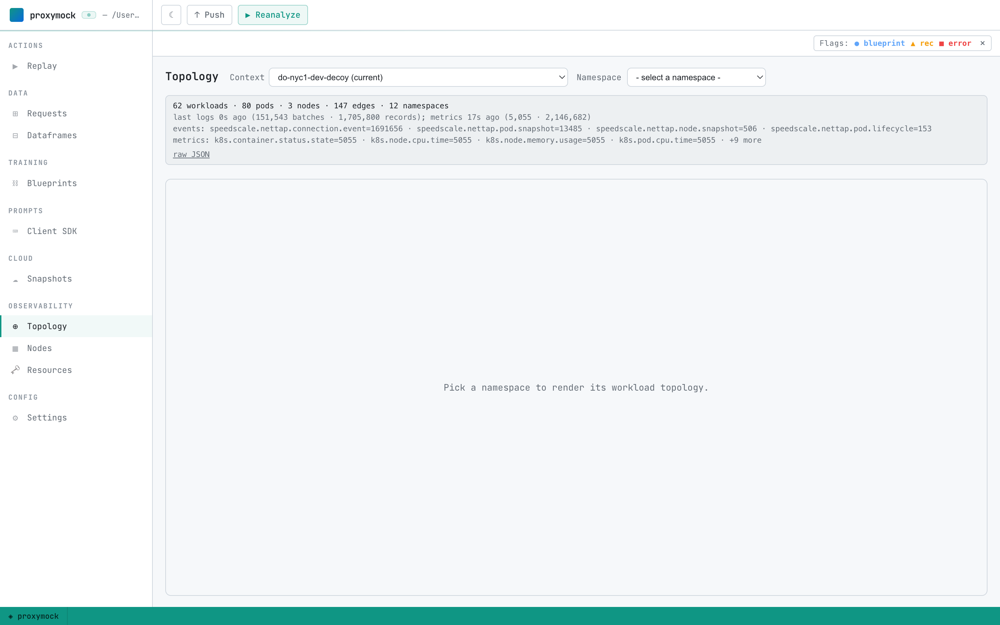

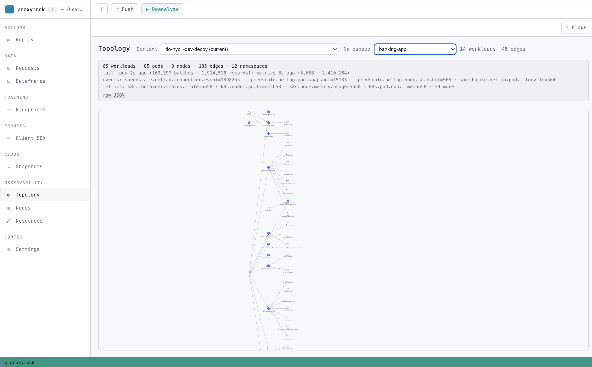

## 4) Record traffic from a workload (eBPF capture)

From Observability → Topology:
1) Pick a namespace and select a workload (Deployment/StatefulSet/etc.)
2) Open the workload pane and enable Capture (eBPF)
3) Generate traffic (e.g., hit your service from a client)

Requests will stream back and appear in the Requests tab. The persistent live-tap card shows active sessions and counters.

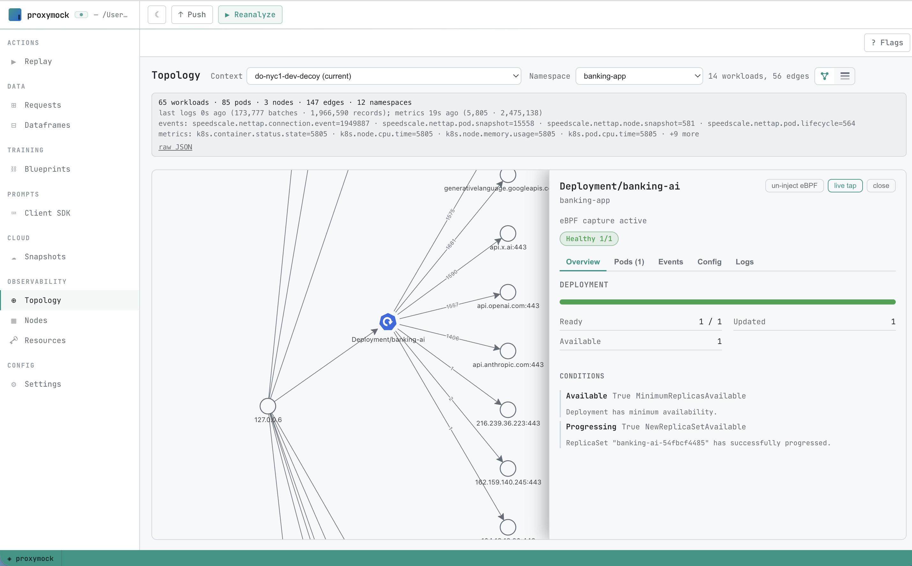

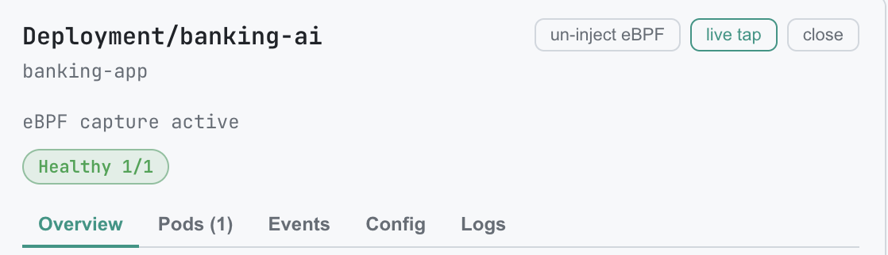

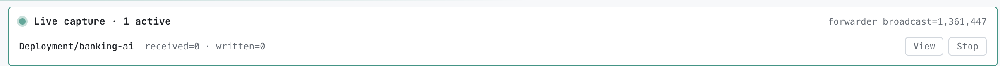

Tips:
- Java services: enable the Java agent checkbox when prompted
- Ports: set custom capture ports when your service listens on non-default ports

## 5) Inspect captured traffic

Go to Requests → pick the active run from the Run selector. Inspect inbound/outbound RRPairs, filter by host, method, path, and drill into details.

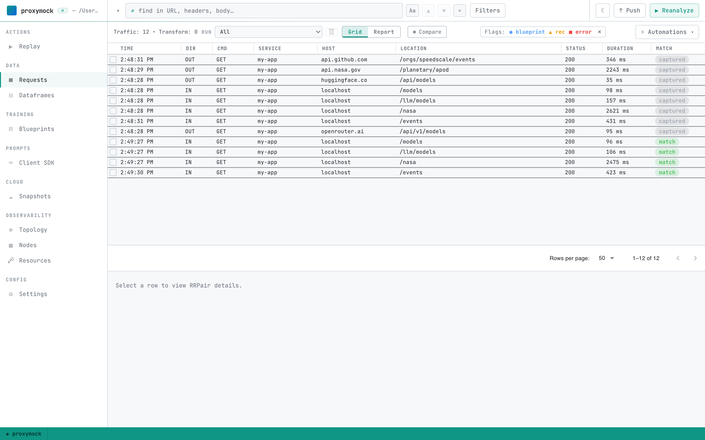

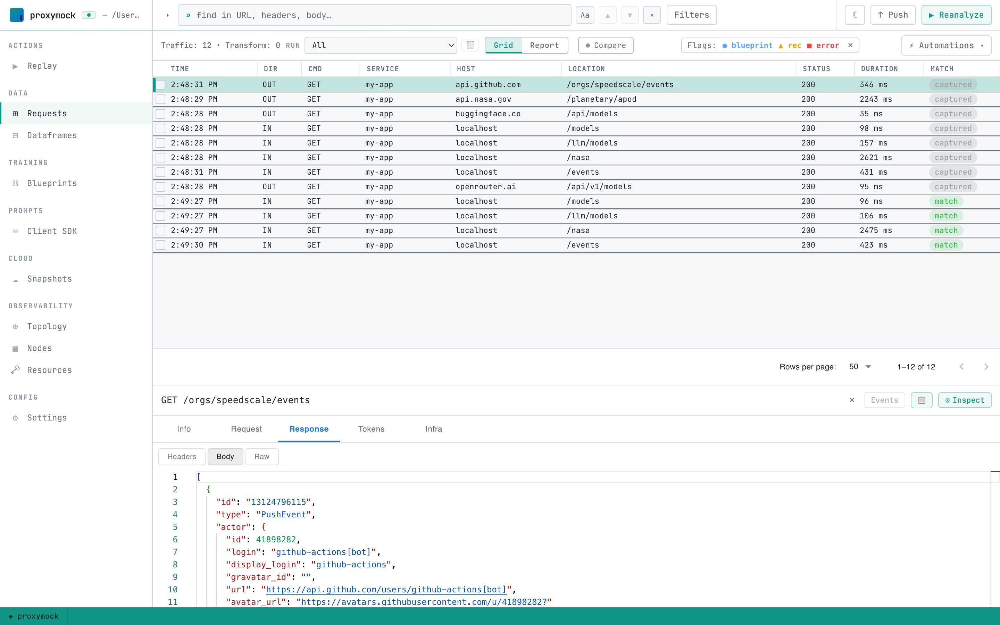

## 6) Optional — Run in cluster (replay recordings inside your cluster)

You can take any local recordings (`./proxymock/recorded-*`) and run them against a target in your connected cluster. Results stream back live over the Forwarder tap.

Steps (Replay tab):
1) Pick one or more recordings (left side)
2) Source & Target → choose a destination:
   - URL (custom) or
   - Cluster Workload / Service (preferred)
3) Optional: enable Mock dependencies, click Rescan to load outbound dependencies, and keep the ones to mock
4) Click “Run in cluster”

While running:
- A stepper shows progress (build, push, run)
- A bottom drawer streams live generator/responder/SUT logs
- The persistent live-tap card shows ‘Live replay’ with counters

On completion, proxymock web opens the report and scopes the Requests tab to the run output directory.

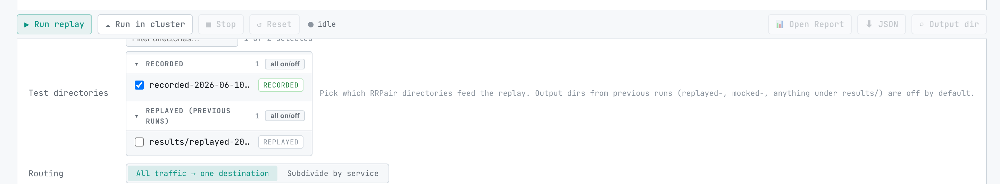

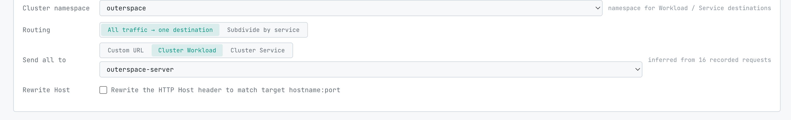

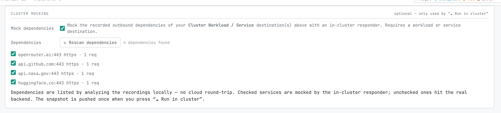

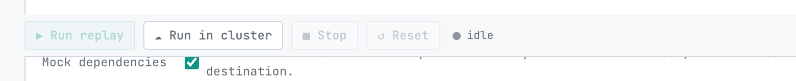

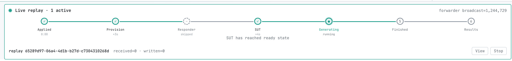

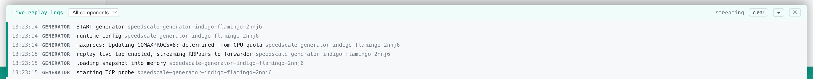

Troubleshooting:
- If “Run in cluster” is unavailable, ensure you’ve run `proxymock init` (browser sign-in) and that Observability shows a connected cluster
- Mocking requires a Workload/Service destination (not just a URL)

## Next steps
- [Local quickstart](/proxymock/getting-started/quickstart/local/) — record and replay traffic against an app on your machine, no cluster required
- [Live Tail (Web)](/proxymock/getting-started/quickstart/live-tail/) — point proxymock web at a running app and watch RRPairs stream in
- [Observability guide](/proxymock/guides/observability) — go deeper on topology, eBPF capture, and live-tap workflows
- [How it works](/proxymock/how-it-works/architecture) — architecture, lifecycle, and the RRPair format
- [Guides index](/proxymock/guides/) — credentials swap, CI/CD, OpenAPI, gRPC, databases, and more
