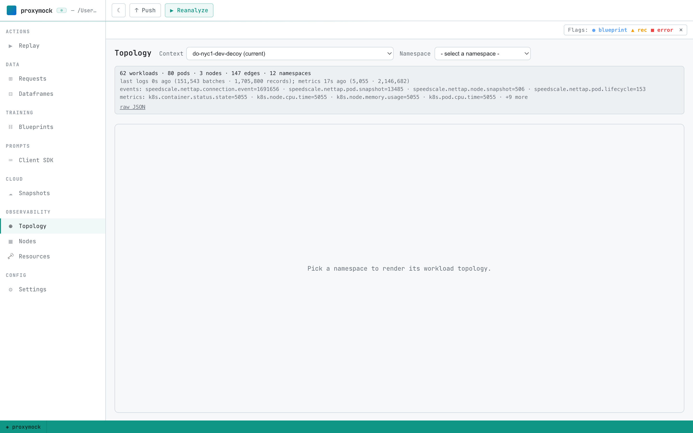
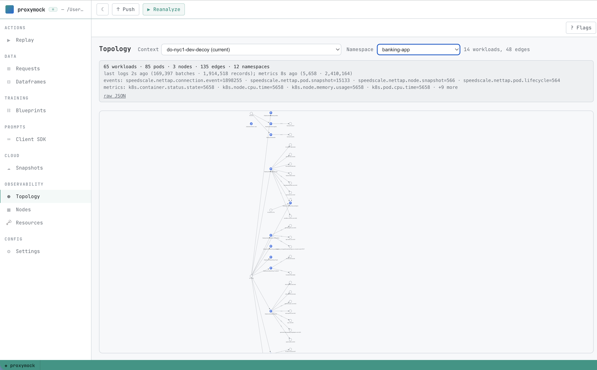
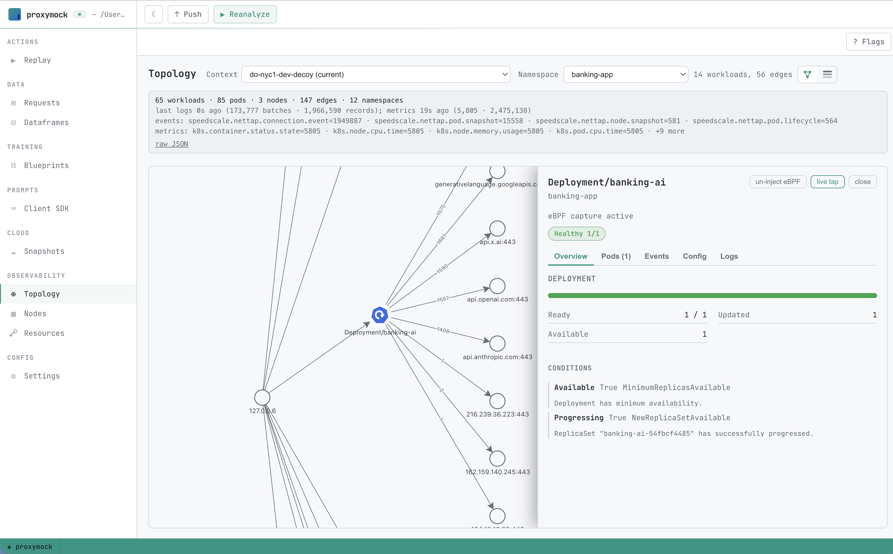
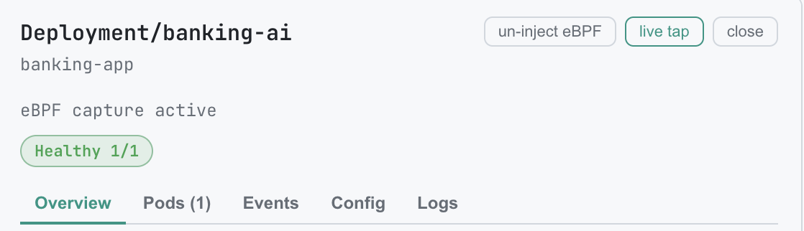
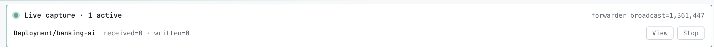
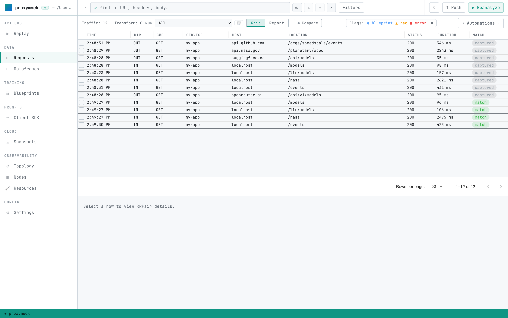
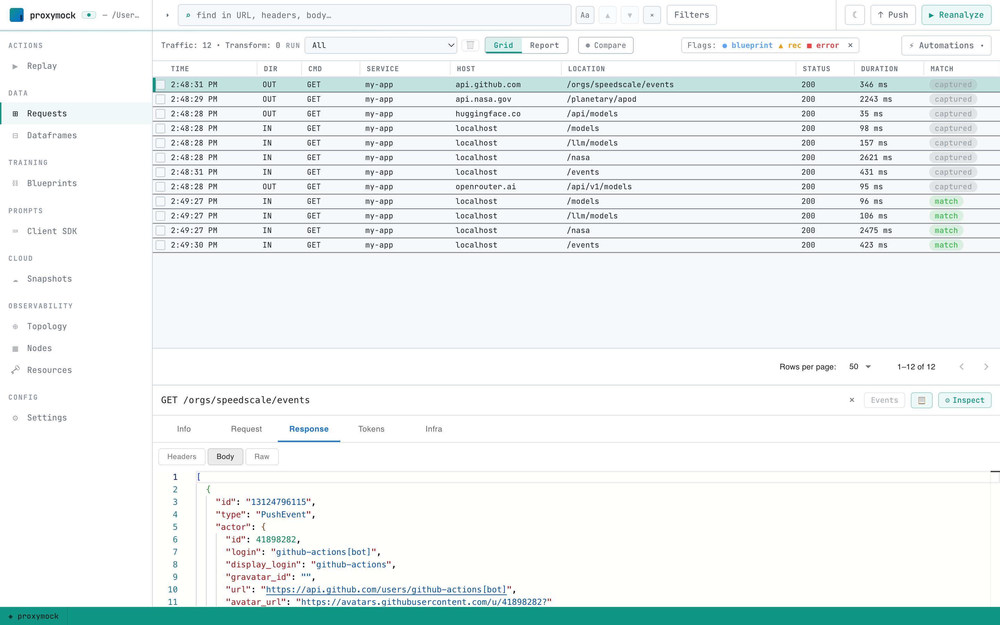
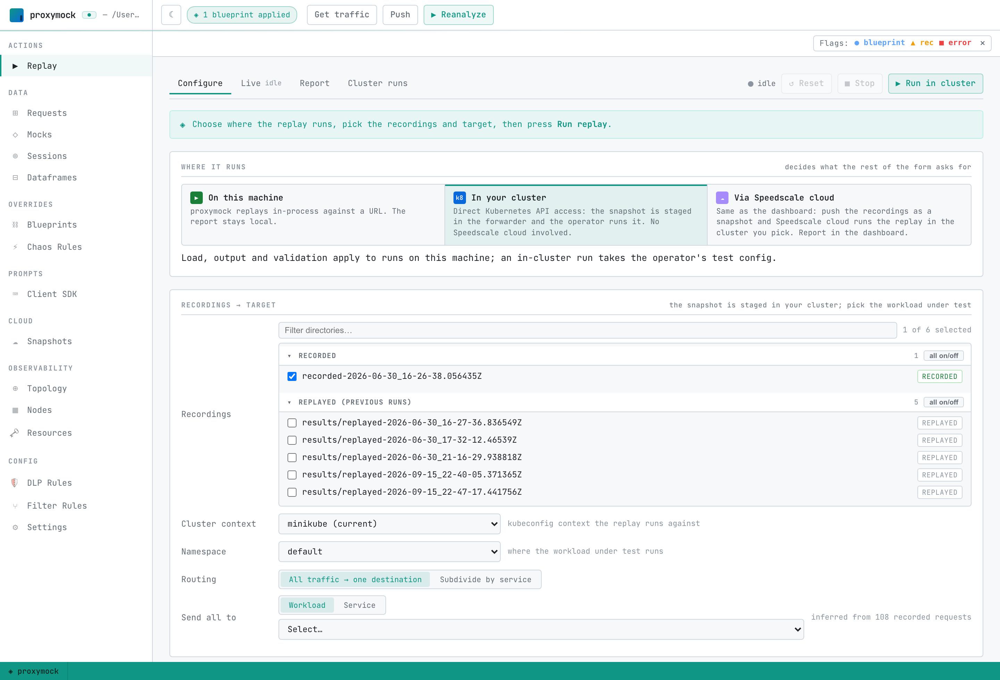

import Tabs from '@theme/Tabs';
import TabItem from '@theme/TabItem';
import Admonition from '@theme/Admonition';
import MacCLIInstall from '../../../index/_cli_macos_minified.mdx'
import LinuxCLIInstall from '../../../index/_cli_linux_minified.mdx'

# In-Cluster (Web)

Use proxymock web to work directly against your Kubernetes cluster. You can:
- Enable eBPF capture on a workload to record real in-cluster traffic
- Run an in-cluster replay of your local recordings (“Run in cluster”) and stream results live

This path is best when you want realistic in-environment behavior or to validate changes inside the cluster.

## Prerequisites
- Kubernetes cluster access (`kubectl` working, correct context)
- Authorized (if you plan to run in-cluster replay): `proxymock init` (browser sign-in)

:::tip Let your coding agent do steps 1 and 2
Paste the prompt from [Install with your coding agent](/getting-started/quick-start#install-with-ai-agent) into Claude Code, Cursor, Codex, or any agent that can run commands. It installs proxymock, signs you in, and installs the Speedscale Operator into your cluster, asking before it touches the cluster. Prefer to install manually? Follow steps 1 and 2 below.
:::

## 1) Install the proxymock CLI (if not installed)

Install proxymock locally — this gives you both the CLI and `proxymock web`.

<Tabs>
  <TabItem value="mac" label="macOS">
    <MacCLIInstall />
  </TabItem>
  <TabItem value="linux" label="Linux">
    <LinuxCLIInstall />
  </TabItem>
  <TabItem value="other" label="Other / Detailed">
    See: [/proxymock/getting-started/installation](/proxymock/getting-started/installation)
  </TabItem>
</Tabs>

After install, initialize once (browser sign-in by default):

```bash
proxymock init
```

## 2) Install the Speedscale Operator (if not installed)

If your cluster doesn’t have the Speedscale Operator and Forwarder yet, install them first. Full instructions live here: [/getting-started/installation/install/kubernetes-operator/](/getting-started/installation/install/kubernetes-operator/)

Quick Helm example:

```bash
helm repo add speedscale https://speedscale.github.io/operator-helm/
helm repo update
helm install speedscale-operator speedscale/speedscale-operator \
  -n speedscale \
  --create-namespace \
  --set apiKey=<YOUR-SPEEDSCALE-API-KEY> \
  --set clusterName=<YOUR-CLUSTER-NAME>
```

Once installed and reachable, proxymock web will detect the Forwarder and enable Observability and live features via Kubernetes port-forwarding.

<Admonition type="caution" title="Kubernetes Permissions Required">
  To use <b>proxymock web</b> with your cluster, you must have Kubernetes RBAC permissions that allow <b>port forwarding</b>.  
  If you cannot port-forward (e.g., on restricted clusters), use the <b>cloud-based replay</b> feature in Speedscale instead.
</Admonition>

## 3) Start proxymock web and connect to your cluster

```bash
proxymock web
# Open the printed http://127.0.0.1:XXXX URL
```

- Open Observability → Topology.
- If not connected, use the Retry control (proxymock web auto port-forwards to the Forwarder when possible).
- Optionally switch kube context from the toolbar.





## 4) Record traffic from a workload (eBPF capture)

From Observability → Topology:
1) Pick a namespace and select a workload (Deployment/StatefulSet/etc.)
2) Open the workload pane and enable Capture (eBPF)
3) Generate traffic (e.g., hit your service from a client)

Requests will stream back and appear in the Requests tab. The persistent live-tap card shows active sessions and counters.







Tips:
- Java services: enable the Java agent checkbox when prompted
- Ports: set custom capture ports when your service listens on non-default ports

## 5) Inspect captured traffic

Go to Requests → pick the active run from the Run selector. Inspect inbound/outbound RRPairs, filter by host, method, path, and drill into details.





## 6) Optional - Run in cluster (replay recordings inside your cluster)

Any local recordings (`./proxymock/recorded-*`) can be replayed against a workload in your connected cluster.

This path runs entirely through the Kubernetes API. proxymock reaches the cluster with your kubeconfig, analyzes the recordings on this machine, and stages the snapshot directly in the in-cluster forwarder over a port-forward. **The snapshot is never sent to Speedscale cloud**, no cloud login is needed, and the report stays in the cluster. Results stream back live over the Forwarder tap.

Steps (Replay tab):
1) In **Where it runs**, pick **In your cluster**
2) Pick one or more recordings
3) Choose the **Cluster context** and the **Namespace** your workload runs in
4) Set **Send all to** to a **Workload** or **Service**. A plain URL is resolved inside the generator pod, not on your machine
5) Every recorded outbound dependency is mocked by default, so the workload answers from the recording instead of reaching the real thing. Open **Options** to mock only some, or none
6) Click **Run in cluster**

While running:
- The Live tab shows a stage stepper and streams generator, responder and SUT logs
- The persistent live-tap card shows 'Live replay' with counters

On completion, proxymock web opens the report and scopes the Requests tab to the run output directory. The report stays in the cluster, so there is no dashboard link; past runs are listed under the **Cluster runs** tab.



Troubleshooting:
- If **In your cluster** is disabled, proxymock web cannot reach the forwarder. Check that Observability shows a connected cluster and that you started proxymock web with the right `--kube-context`
- Mocking requires a Workload or Service destination, not a URL
- To run the same recordings through Speedscale cloud instead, pick **Via Speedscale cloud**. See [Choose Where a Replay Runs](../../../guides/replay-paths.md)

## Next steps
- [Local quickstart](/proxymock/getting-started/quickstart/local/) — record and replay traffic against an app on your machine, no cluster required
- [Live Tail (Web)](/proxymock/getting-started/quickstart/live-tail/) — point proxymock web at a running app and watch RRPairs stream in
- [Observability guide](/proxymock/guides/observability) — go deeper on topology, eBPF capture, and live-tap workflows
- [How it works](/proxymock/how-it-works/architecture) — architecture, lifecycle, and the RRPair format
- [Guides index](/proxymock/guides/) — credentials swap, CI/CD, OpenAPI, gRPC, databases, and more
