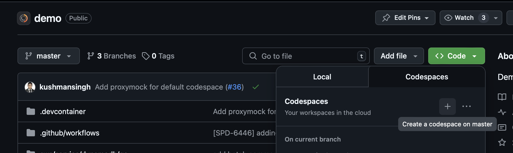
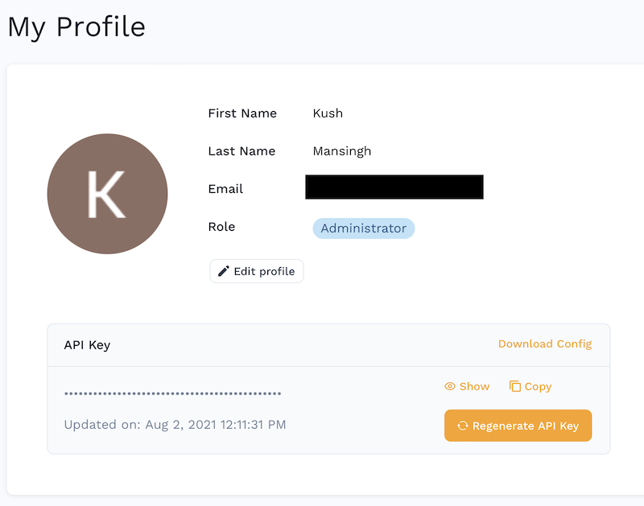

import ArchitectureOverview from './outerspace-go.png'
import Tabs from '@theme/Tabs';
import TabItem from '@theme/TabItem';
import MacCLIInstall from '../../index/\_cli_macos_minified.mdx'
import LinuxCLIInstall from '../../index/\_cli_linux_minified.mdx'
import { EditingTestsCard, CICDIntegrationCard, RemoteRecordersCard } from '@site/src/components/Cards';

# Quickstart (CLI)

This guide provides a step-by-step approach to creating a [mock server](/reference/glossary.md#mock-server) and tests for a simple Go application using only the **proxymock** CLI.

## Choose Your Environment

Select your environment below and all instructions will update accordingly. If you prefer to run everything locally pick your operating system. If you want to access a pre-built environment in the cloud check out [GitHub Codespaces](https://github.com/speedscale/outerspace-go).

<Tabs groupId="environment">
  <TabItem value="mac" label="🍎 macOS">
    You've selected **macOS**. All commands below are optimized for macOS systems.
  </TabItem>
  <TabItem value="linux" label="🐧 Linux">
    You've selected **Linux**. All commands below are optimized for Linux systems.
  </TabItem>
  <TabItem value="codespaces" label="☁️ Codespaces">
    

    You've selected **GitHub Codespaces**. All commands below are optimized for the Codespaces environment with special notes for port forwarding and authentication.

    ### Setting up Codespaces

    To get started with the outerspace-go Codespace:

    1. Go to [github.com/speedscale/outerspace-go](https://github.com/speedscale/outerspace-go)
    2. Click the green **"Code"** button
    3. Select the **"Codespaces"** tab
    4. Click **"Create codespace on main"**
    5. Wait for the environment to initialize (usually 1-2 minutes)
    6. Once ready, you'll have a VS Code environment in your browser with Go and ProxyMock pre-installed

  </TabItem>
  <TabItem value="binary" label="🔧 Other">
    You've selected **Other**. See our detailed installation guide for your specific system.
  </TabItem>
</Tabs>

## Before you begin

<Tabs groupId="environment">
  <TabItem value="mac" label="🍎 macOS">
    Make sure you have:
    - A terminal or command prompt open to run proxymock
    - A separate terminal or command prompt open to run the demo app
    - [go version 1.23.1](https://go.dev/doc/install) or newer installed
  </TabItem>
  <TabItem value="linux" label="🐧 Linux">
    Make sure you have:
    - A terminal or command prompt open to run proxymock
    - A separate terminal or command prompt open to run the demo app
    - [go version 1.23.1](https://go.dev/doc/install) or newer installed
  </TabItem>
  <TabItem value="codespaces" label="☁️ Codespaces">
    Make sure you have:
    - A GitHub account with access to Codespaces
    - The outerspace-go Codespace running (note that go and proxymock are pre-installed)
    - Two terminal windows open in your Codespace
  </TabItem>
  <TabItem value="binary" label="🔧 Other">
    Make sure you have:
    - A terminal or command prompt open to run proxymock
    - A separate terminal or command prompt open to run the demo app
    - [go version 1.23.1](https://go.dev/doc/install) or newer installed
  </TabItem>
</Tabs>


For this example we'll be using a simple demo app that accepts an API request, calls two downstream APIs and returns the results.

## Step 1: Install proxymock {#install}

<Tabs groupId="environment">
  <TabItem value="mac" label="🍎 macOS">
    <MacCLIInstall />
  </TabItem>
  <TabItem value="linux" label="🐧 Linux">
    <LinuxCLIInstall />
  </TabItem>
  <TabItem value="codespaces" label="☁️ Codespaces">
    No need to run any install scripts:

    :::note Codespaces Environment
    ProxyMock is automatically available in the outerspace-go Codespace.
    :::

  </TabItem>
  <TabItem value="binary" label="🔧 Other (Detailed)">
    For other operating systems and more detailed instructions, see the [installation](../installation.md) instructions.
  </TabItem>
</Tabs>

Need another OS like Windows or are you having issues? See advanced [installation](../installation.md).

## Step 2: Obtain an API Key {#api-key}

If you are an enterprise customer you can find your api key on the [Profile Page](https://app.speedscale.com/profile).



Otherwise you can [sign up for an API Key](https://app.speedscale.com/proxymock/signup). Don't worry, we don't sell marketing data or give your email address to any bot nets.

## Step 3: Initialize proxymock {#initializing}

Run the following command to obtain an API key:

```shell
proxymock init --api-key <your key>
```

## Step 4: Install the demo app and start recording {#recording}

<Tabs groupId="environment">
  <TabItem value="mac" label="🍎 macOS">
    ```shell
    git clone https://github.com/speedscale/outerspace-go && cd outerspace-go && proxymock record -- go run main.go
    ```
  </TabItem>
  <TabItem value="linux" label="🐧 Linux">
    ```shell
    git clone https://github.com/speedscale/outerspace-go && cd outerspace-go && proxymock record -- go run main.go
    ```
  </TabItem>
  <TabItem value="codespaces" label="☁️ Codespaces">
    If you're using the outerspace-go Codespace, the repository is already cloned. Navigate to it and start recording:

    ```shell
    export SSL_CERT_FILE="${HOME}/.speedscale/certs/tls.crt"
    proxymock record -- go run main.go
    ```

  </TabItem>
  <TabItem value="binary" label="🔧 Other (Detailed)">
    ```shell
    git clone https://github.com/speedscale/outerspace-go && cd outerspace-go && proxymock record -- go run main.go
    ```
  </TabItem>
</Tabs>

By running this you will start `proxymock` in recording mode while it runs the app as a child process. Now `proxymock` is now listening on port 4343 for incoming traffic. This traffic will be forwarded to the demo app running at 8080. You'll see first the `proxymock` logs then a line across the screen, then the logs for `outerspace-go`. It should look something like this:

```shell jsx title="Output"
$ proxymock record -- go run main.go
proxymock output will be redirected to proxymock/recorded-2025-07-30_15-19-11.417616Z/proxymock.log
Press ctrl-c to interrupt
━━━━━━━━━━━━━━━━━━━━━━━━━━━━━━━━━━━━━━━━━━━━━━━━━━━━━━━━━━━━━━━━━━━━━━━━━━━━━━━━━━━━━━━━━━━━━━━━━━━━━━━━━━━━━━━━━━━━━━━━━━━━━━━━━━━━━━━━━━━━━━━━━━━━━━━━━━━━━━━━━━━━━━━━━━━━━━━━━━━
2025/07/30 15:19:12 Starting HTTP server on :8080
2025/07/30 15:19:13 Starting gRPC server on :50053
```

## Step 4: Run test transactions {#run-tests}

Start a _new_ terminal and run the following command.

<Tabs groupId="environment">
  <TabItem value="mac" label="🍎 macOS">
    ```shell jsx title="Run in new terminal window"
    cd outerspace-go && ./tests/run_http_tests.sh --recording
    ```
  </TabItem>
  <TabItem value="linux" label="🐧 Linux">
    ```shell jsx title="Run in new terminal window"
    cd outerspace-go && ./tests/run_http_tests.sh --recording
    ```
  </TabItem>
  <TabItem value="codespaces" label="☁️ Codespaces">
    ```shell jsx title="Run in new terminal window"
    ./tests/run_http_tests.sh --recording
    ```

    :::note Codespaces Port Forwarding
    Make sure port 4343 is forwarded in your Codespace. You should see it automatically forwarded in the Ports tab.
    :::

  </TabItem>
  <TabItem value="binary" label="🔧 Other (Detailed)">
    ```shell jsx title="Run in new terminal window"
    cd outerspace-go && ./tests/run_http_tests.sh --recording
    ```
  </TabItem>
</Tabs>

You will now see a set of output from the tests:

```shell jsx title="Test output"
$ ./tests/run_http_tests.sh --recording
Recording mode enabled, using port 4143
Testing http://localhost:4143/... OK (200)
Testing http://localhost:4143/api/numbers... OK (200)
Testing http://localhost:4143/api/latest-launch... OK (200)
Testing http://localhost:4143/api/rockets... OK (200)
Testing http://localhost:4143/api/rocket?id=5e9d0d96eda699382d09d1ee... OK (200)
Http tests passed.
```

You can now press CTRL-C in the `proxymock record` terminal window to shut down recording.

You will also see some additional output in the original proxymock terminal window showing requests were handled by the demo app:

```shell jsx title="proxymock recording output"
2025-07-30T15:31:57-04:00 INF Inbound latency=0.080292 method=GET path=/ query=
2025-07-30T15:31:57-04:00 INF X-Header found header=X-Numbers-Api-Type values=["math"]
2025-07-30T15:31:57-04:00 INF X-Header found header=X-Powered-By values=["Express"]
2025-07-30T15:31:57-04:00 INF X-Header found header=X-Numbers-Api-Number values=["1804"]
2025-07-30T15:31:57-04:00 INF Outbound host=numbersapi.com latency=64.452875 method=GET status=200
...
```

## Step 5: View recording results {#view-recording}

There should be a new directory in the `proxymock` subdirectory inside `outerspace-go`.

```shell
ls proxymock
# Output shows recorded directories like:
# recorded-2025-07-30_15-31-43.701537Z
```

The traffic you just recorded is contained in the most recent directory. In this case that's `recorded-2025-07-30_15-31-43.701537Z` but it will change based on the date of recording. Each API request can be inspected as a markdown file:

```shell
$ cat proxymock/recorded-2025-07-30_15-31-43.701537Z/localhost/2025-07-30_19-56-08.410226Z.md

### REQUEST (TEST) ###
``
GET http://localhost:4143/ HTTP/1.1
Accept: */*
Host: localhost:4143
User-Agent: curl/8.7.1
...
```

## Step 6: Run mock server and tests {#run-mocks}

Go back to your original terminal (running `proxymock record`), stop proxymock by running CTRL-C and then start a mock server:

<Tabs groupId="environment">
  <TabItem value="mac" label="🍎 macOS">
    ```shell
    proxymock mock -- go run main.go
    ```
  </TabItem>
  <TabItem value="linux" label="🐧 Linux">
    ```shell
    proxymock mock -- go run main.go
    ```
  </TabItem>
  <TabItem value="codespaces" label="☁️ Codespaces">
    ```shell
    proxymock mock -- go run main.go
    ```
  </TabItem>
  <TabItem value="binary" label="🔧 Other (Detailed)">
    ```shell
    proxymock mock -- go run main.go
    ```
  </TabItem>
</Tabs>

Your demo app will now start using the local mock server.

:::note
When running `proxymock mock` your app no longer requires access to backend systems. The app will talk locally to proxymock instead of outside APIs.
:::

Now exercise your demo app by running the same tests we ran before - except using the recording instead of a script. proxymock takes the recorded inbound requests and re-uses them as tests.

Open your second terminal window and run the following:

<Tabs groupId="environment">
  <TabItem value="mac" label="🍎 macOS">
    ```shell
    proxymock replay --test-against http://localhost:8080
    ```
  </TabItem>
  <TabItem value="linux" label="🐧 Linux">
    ```shell
    proxymock replay --test-against http://localhost:8080
    ```
  </TabItem>
  <TabItem value="codespaces" label="☁️ Codespaces">
    ```shell
    proxymock replay --test-against http://localhost:8080
    ```
  </TabItem>
  <TabItem value="binary" label="🔧 Other (Detailed)">
    ```shell
    proxymock replay --test-against http://localhost:8080
    ```
  </TabItem>
</Tabs>

The `proxymock replay` command will now run the original inbound transactions directly against your demo app. The demo app no longer requires downstream systems for these tests as they are being simulated by proxymock. You should see a summary table like this:

```
LATENCY / THROUGHPUT
+--------------------+--------+-------+-------+-------+-------+-------+-------+-------+------------+
|      ENDPOINT      | METHOD |  AVG  |  P50  |  P90  |  P95  |  P99  | COUNT |  PCT  | PER-SECOND |
+--------------------+--------+-------+-------+-------+-------+-------+-------+-------+------------+
| /                  | GET    |  1.00 |  1.00 |  1.00 |  1.00 |  1.00 |     2 | 20.0% |       9.93 |
| /api/rockets       | GET    | 12.00 |  9.00 |  9.00 |  9.00 |  9.00 |     2 | 20.0% |       9.93 |
| /api/rocket        | GET    | 12.50 | 10.00 | 10.00 | 10.00 | 10.00 |     2 | 20.0% |       9.93 |
| /api/numbers       | GET    | 14.00 | 13.00 | 13.00 | 13.00 | 13.00 |     2 | 20.0% |       9.93 |
| /api/latest-launch | GET    | 53.50 | 14.00 | 14.00 | 14.00 | 14.00 |     2 | 20.0% |       9.93 |
+--------------------+--------+-------+-------+-------+-------+-------+-------+-------+------------+
```

This demonstrates how you can test your microservice in isolation.

- No need to write tests, you can replay the inbound traffic
- No need to build a test environment, you can mock the dependencies
- If you want to change the data, simply edit the markdown files

## Learn More

<div style={{ display: 'grid', gridTemplateColumns: 'repeat(auto-fit, minmax(300px, 1fr))', gap: '1rem', marginTop: '2rem' }}>
  <EditingTestsCard />
  <CICDIntegrationCard />
  <RemoteRecordersCard />
</div>
