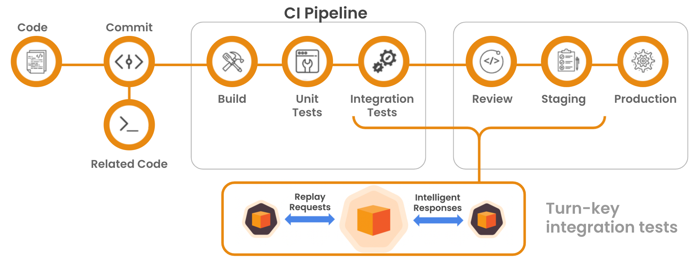

import Tabs from '@theme/Tabs';
import TabItem from '@theme/TabItem';

# CI/CD

Integrate **proxymock** into your CI/CD workflow to enable high-velocity
deployment with confidence.

Run **proxymock** after your build and unit tests, but before deploying to
production.



Adding anything to your CI/CD pipeline generally involves the same 3 steps:

1. Adding a step to your **pipeline** (see [#1. The Pipeline](#1-the-pipeline))
1. Executing the right **script** to perform a desired action (see [#2. The Script](#2-the-script))
1. Authentication (see [#3. The API Key](#3-the-api-key))

## Prerequisites

In order to integrate **proxymock** into your CI/CD you will need:

- Access to modify your CI/CD pipeline
- Your **proxymock** API key
- A paid **proxymock** account (see [proxymock.io](https://proxymock.io/pricing) for pricing details)
- Pre-recorded traffic files (see [recording](/proxymock/getting-started/quickstart/quickstart-cli.md#recording) to record from your app)

## 1. The Pipeline

These pipeline examples contain the minimal configuration needed to run
**proxymock** with your application.

Examples build a Go binary using `go build` using the golang container image.
Your image can be anything you choose as long as **proxymock** has access to
your application.

<Tabs>

<TabItem value="github" label="GitHub">

```yaml
name: CI with proxymock
on:
  push:
    branches:
      - main
  pull_request:
    branches:
      - main

jobs:
  test:
    runs-on: ubuntu-latest
    container: golang:1.25
    steps:
      - name: Checkout
        uses: actions/checkout@v4

      - name: Build and test with proxymock
        run: |
          go build -o myapp .
          ./proxymock.sh # <--- proxymock script - see below
```

</TabItem>

<TabItem value="gitlab" label="GitLab">

```yaml
stages:
  - build

# build Go application and test with proxymock
build:
  stage: build
  image: golang:1.25
  script:
    - go build -o myapp .
    - ./proxymock.sh # <--- proxymock script - see below
```

</TabItem>

<TabItem value="jenkins" label="Jenkins">

```groovy
#!groovy

pipeline {
  agent {
    docker { image 'golang:1.25' }
  }
  stages {
    stage('Build and Test') {
      steps {
        sh 'go build -o myapp .'
        sh './proxymock.sh' // <--- proxymock script - see below
      }
    }
  }
  post{
    success{
      echo "======== pipeline executed successfully ========"
    }
    failure{
      echo "======== pipeline execution failed ========"
    }
  }
}
```

</TabItem>

<TabItem value="azure" label="Azure DevOps">

```yaml
trigger:
  - main

pool:
  vmImage: "ubuntu-latest"

container: golang:1.25

steps:
  - script: |
      go build -o myapp .
      ./proxymock.sh # <--- proxymock script - see below
    displayName: 'Build and test with proxymock'
```

</TabItem>

<TabItem value="skaffold" label="Google Cloud Deploy with Skaffold">

Add the verify block to your existing Skaffold deploy.

```yaml
apiVersion: skaffold/v4beta13
kind: Config
manifests:
  rawYaml:
    - k8s-deploy.yaml
deploy:
  kubectl: {}
build:
  artifacts:
  - image: myapp
    docker:
      dockerfile: Dockerfile
verify:
  - name: speedscale
    container:
      name: speedscale
      image: golang:1.25
      command: ["/bin/sh"]
      args: ["-c", "go build -o myapp . && ./proxymock.sh"] # <--- proxymock script - see below
```

See https://skaffold.dev/docs/references/yaml/ for spec details.

</TabItem>

<TabItem value="aws" label="AWS CodeBuild">

```yaml
version: 0.2

phases:
  install:
    runtime-versions:
      golang: 1.25
  build:
    commands:
      - go build -o myapp .
      - ./proxymock.sh # <--- proxymock script - see below

artifacts:
  files:
    - myapp
```

</TabItem>

<TabItem value="bitbucket" label="Bitbucket Pipelines">

```yaml
image: golang:1.25

pipelines:
  default:
    - step:
        name: Build and test with proxymock
        script:
          - go build -o myapp .
          - ./proxymock.sh # <--- proxymock script - see below
```

</TabItem>

<TabItem value="teamcity" label="TeamCity">

```kotlin
import jetbrains.buildServer.configs.kotlin.*
import jetbrains.buildServer.configs.kotlin.buildSteps.script

object Build : BuildType({
    name = "Build and Test"
    
    requirements {
        contains("docker.server.version")
    }
    
    steps {
        script {
            name = "Build and test with proxymock"
            dockerImage = "golang:1.25"
            scriptContent = """
                go build -o myapp .
                ./proxymock.sh # <--- proxymock script - see below
            """.trimIndent()
        }
    }
})
```

</TabItem>

<TabItem value="circleci" label="CircleCI">

```yaml
version: 2.1

jobs:
  speedscale:
    docker:
      - image: "golang:1.25"
    steps:
      - checkout
      - run:
          name: Build Go application
          command: go build -o myapp .
      - run:
          name: Run proxymock tests
          command: ./proxymock.sh # <--- proxymock script - see below
```

See a full
[config.yml](https://github.com/kenahrens/spd-replay/blob/main/.circleci/config.yml)
for more context.

</TabItem>

</Tabs>

## 2. The Script

Let's fill in the **proxymock.sh** script shown above.  Be sure to customize the
user settings at the top of the script.

:::warning
The script expects the `SPEEDSCALE_API_KEY` environment variable to be set
(securely) for authentication. See [The API Key](#3-the-api-key).
:::


```sh
#!/usr/bin/env sh

# set the port your application will listen on, where traffic will be replayed
APP_PORT=8080
# set the command to run your application.  ensure this command has all of the
# correct flags and that the environment has all of the configuration needed to
# run your application properly
APP_COMMAND="./my-example-app --log-level debug" # CHANGE ME!

# the path to pre-recorded proxymock traffic
PROXYMOCK_IN_DIR="proxymock"
# optionally, run mock server
RUN_MOCK_SERVER=true

###########################
### USER SETTINGS ABOVE ###
###    SCRIPT BELOW     ###
###########################

set -ex
set -o pipefail 2>/dev/null || true

validate() {
  if [ -z "$SPEEDSCALE_API_KEY" ]; then
  	echo "ERROR: SPEEDSCALE_API_KEY environment variable is not set"
  	exit 1
  fi

  if [ ! -d "$PROXYMOCK_IN_DIR" ]; then
  	echo "ERROR: $PROXYMOCK_IN_DIR does not exist - make sure you have pre-recorded traffic to mock / replay"
  	exit 1
  fi
}

install_proxymock() {
  echo "Installing proxymock..."

  sh -c "$(curl -Lfs https://downloads.speedscale.com/proxymock/install-proxymock)"
  export PATH=${PATH}:${HOME}/.speedscale

  # initialize with API key
  proxymock init --api-key "$SPEEDSCALE_API_KEY"
}

run_mock_server() {
  echo "Starting mock server..."

  proxymock mock \
    --verbose \
    --in $PROXYMOCK_IN_DIR/ \
    --log-to proxymock_mock.log &
}

run_replay() {
  REPLAY_LOG_FILE="proxymock_replay.log"
  print_replay_log() {
    cat $REPLAY_LOG_FILE
  }
  trap print_replay_log EXIT

  # start proxymock replay, with your app, to run your app and replay test traffic
  # against it
  proxymock replay \
    --in "$PROXYMOCK_DIR" \
    --test-against localhost:$APP_PORT \
    --log-to $REPLAY_LOG_FILE \
    --fail-if "latency.max > 1500" \
    -- $APP_COMMAND
}

main() {
  validate
  install_proxymock

  if [ "$RUN_MOCK_SERVER" = "true" ]; then
    run_mock_server
  fi

  run_replay
}

main
```

## 3. The API Key

**proxymock** requires a valid API key to run.  Your API key is created when you
first run `proxymock init` and is stored in a config file, at
`$HOME/.speedscale/config.yaml` by default.

To make it easy, once [registered](/proxymock/guides/initialize.md) you can get your API key directly with some command line magic:

```sh
SPEEDSCALE_CONFIG_FILE=$(proxymock version | grep 'Config File' | awk '{print $3}')
SPEEDSCALE_API_KEY=$(cat $SPEEDSCALE_CONFIG_FILE | grep apikey | awk '{print $2}')
echo $SPEEDSCALE_API_KEY
```

:::info
If this does not produce an API key make sure you are registered first with `proxymock init`.
:::

Make `SPEEDSCALE_API_KEY` available to your pipeline as an environment variable
so **proxymock** can be initialized when the pipeline runs.

 <!-- FIXME: (JMT) complete -->

## Need Help?

Let us know on the [community Slack](https://slack.speedscale.com) if
instructions for your deploy system are not included here.
