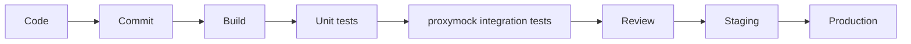

import Tabs from '@theme/Tabs';
import TabItem from '@theme/TabItem';

# CI/CD

Integrate **proxymock** into your CI/CD workflow to enable high-velocity
deployment with confidence.

Run **proxymock** after your build and unit tests, but before deploying to
production.


```mermaid
flowchart LR
    code["Code"] --> commit["Commit"]
    commit --> build["Build"]
    build --> unit["Unit tests"]
    unit --> replay["proxymock integration tests"]
    replay --> review["Review"]
    review --> staging["Staging"]
    staging --> production["Production"]
```

Adding anything to your CI/CD pipeline generally involves the same 3 steps:

1. Adding a step to your **pipeline** (see [#1. The Pipeline](#1-the-pipeline))
1. Executing the right **script** to perform a desired action (see [#2. The Script](#2-the-script))
1. Authentication (see [#3. The API Key](#3-the-api-key))

## Prerequisites

In order to integrate **proxymock** into your CI/CD you will need:

- Access to modify your CI/CD pipeline
- Your **proxymock** API key
- A paid **proxymock** account (see [proxymock.io](https://proxymock.io/pricing) for pricing details)
- Pre-recorded traffic files (see [recording](/proxymock/getting-started/quickstart/quickstart-cli.md#recording) to record from your app)

## 1. The Pipeline

These pipeline examples contain the minimal configuration needed to run
**proxymock** with your application.

Examples build a Go binary using `go build` using the golang container image.
Your image can be anything you choose as long as **proxymock** has access to
your application.

<Tabs>

<TabItem value="github" label="GitHub">

```yaml
name: CI with proxymock
on:
  push:
    branches:
      - main
  pull_request:
    branches:
      - main

jobs:
  test:
    runs-on: ubuntu-latest
    container: golang:1.25
    steps:
      - name: Checkout
        uses: actions/checkout@v4

      - name: Build and test with proxymock
        run: |
          go build -o myapp .
          ./proxymock.sh # <--- proxymock script - see below
```

</TabItem>

<TabItem value="gitlab" label="GitLab">

```yaml
stages:
  - build

# build Go application and test with proxymock
build:
  stage: build
  image: golang:1.25
  script:
    - go build -o myapp .
    - ./proxymock.sh # <--- proxymock script - see below
```

</TabItem>

<TabItem value="jenkins" label="Jenkins">

```groovy
#!groovy

pipeline {
  agent {
    docker { image 'golang:1.25' }
  }
  stages {
    stage('Build and Test') {
      steps {
        sh 'go build -o myapp .'
        sh './proxymock.sh' // <--- proxymock script - see below
      }
    }
  }
  post{
    success{
      echo "======== pipeline executed successfully ========"
    }
    failure{
      echo "======== pipeline execution failed ========"
    }
  }
}
```

</TabItem>

<TabItem value="azure" label="Azure DevOps">

```yaml
trigger:
  - main

pool:
  vmImage: "ubuntu-latest"

container: golang:1.25

steps:
  - script: |
      go build -o myapp .
      ./proxymock.sh # <--- proxymock script - see below
    displayName: 'Build and test with proxymock'
```

</TabItem>

<TabItem value="skaffold" label="Google Cloud Deploy with Skaffold">

Add the verify block to your existing Skaffold deploy.

```yaml
apiVersion: skaffold/v4beta13
kind: Config
manifests:
  rawYaml:
    - k8s-deploy.yaml
deploy:
  kubectl: {}
build:
  artifacts:
  - image: myapp
    docker:
      dockerfile: Dockerfile
verify:
  - name: speedscale
    container:
      name: speedscale
      image: golang:1.25
      command: ["/bin/bash"]
      args: ["-c", "go build -o myapp . && ./proxymock.sh"] # <--- proxymock script - see below
```

See https://skaffold.dev/docs/references/yaml/ for spec details.

</TabItem>

<TabItem value="aws" label="AWS CodeBuild">

```yaml
version: 0.2

phases:
  install:
    runtime-versions:
      golang: 1.25
  build:
    commands:
      - go build -o myapp .
      - ./proxymock.sh # <--- proxymock script - see below

artifacts:
  files:
    - myapp
```

</TabItem>

<TabItem value="bitbucket" label="Bitbucket Pipelines">

```yaml
image: golang:1.25

pipelines:
  default:
    - step:
        name: Build and test with proxymock
        script:
          - go build -o myapp .
          - ./proxymock.sh # <--- proxymock script - see below
```

</TabItem>

<TabItem value="teamcity" label="TeamCity">

```kotlin
import jetbrains.buildServer.configs.kotlin.*
import jetbrains.buildServer.configs.kotlin.buildSteps.script

object Build : BuildType({
    name = "Build and Test"
    
    requirements {
        contains("docker.server.version")
    }
    
    steps {
        script {
            name = "Build and test with proxymock"
            dockerImage = "golang:1.25"
            scriptContent = """
                go build -o myapp .
                ./proxymock.sh # <--- proxymock script - see below
            """.trimIndent()
        }
    }
})
```

</TabItem>

<TabItem value="circleci" label="CircleCI">

```yaml
version: 2.1

jobs:
  speedscale:
    docker:
      - image: "golang:1.25"
    steps:
      - checkout
      - run:
          name: Build Go application
          command: go build -o myapp .
      - run:
          name: Run proxymock tests
          command: ./proxymock.sh # <--- proxymock script - see below
```

See a full
[config.yml](https://github.com/kenahrens/spd-replay/blob/main/.circleci/config.yml)
for more context.

</TabItem>

</Tabs>

## 2. The Script

Let's fill in the **proxymock.sh** script shown above.  Be sure to customize the
user settings at the top of the script.

:::warning
The script expects the `SPEEDSCALE_API_KEY` environment variable to be set
(securely) for authentication. See [The API Key](#3-the-api-key).
:::


```sh
#!/usr/bin/env bash

# set the port your application will listen on, where traffic will be replayed
APP_PORT=8080
# set the command to run your application.  ensure this command has all of the
# correct flags and that the environment has all of the configuration needed to
# run your application properly
APP_COMMAND="./my-example-app --log-level debug" # CHANGE ME!

# the path to pre-recorded proxymock traffic
PROXYMOCK_IN_DIR="proxymock"
# optionally, run mock server
RUN_MOCK_SERVER=true

###########################
### USER SETTINGS ABOVE ###
###    SCRIPT BELOW     ###
###########################

# log file paths
REPLAY_LOG_FILE="proxymock_replay.log"
APP_LOG_FILE="proxymock_app.log"
MOCK_LOG_FILE="proxymock_mock.log"

set -e
set -o pipefail 2>/dev/null || true

validate() {
  if [ -z "$SPEEDSCALE_API_KEY" ]; then
  	echo "ERROR: SPEEDSCALE_API_KEY environment variable is not set"
  	exit 1
  fi

  if [ ! -d "$PROXYMOCK_IN_DIR" ]; then
  	echo "ERROR: $PROXYMOCK_IN_DIR does not exist - make sure you have pre-recorded traffic to mock / replay"
  	exit 1
  fi
}

install_proxymock() {
  echo "Installing proxymock..."

  sh -c "$(curl -Lfs https://downloads.speedscale.com/proxymock/install-proxymock)"
  export PATH=${PATH}:${HOME}/.speedscale

  # initialize with API key
  proxymock init --api-key "$SPEEDSCALE_API_KEY"
}

run_mock_server() {
  echo "Starting mock server..."

  proxymock mock \
    --verbose \
    --in "$PROXYMOCK_IN_DIR/" \
    --log-to "$MOCK_LOG_FILE" &
}

run_replay() {
  print_logs() {
    if [ -f "$MOCK_LOG_FILE" ]; then
      echo "=== proxymock mock server logs ==="
      cat $MOCK_LOG_FILE
    fi
    echo "=== proxymock replay logs ==="
    cat $REPLAY_LOG_FILE
    if [ -f "$APP_LOG_FILE" ]; then
      echo "=== application logs ==="
      cat $APP_LOG_FILE
    fi
  }
  trap print_logs EXIT

  # start proxymock replay, with your app, to run your app and replay test traffic
  # against it
  proxymock replay \
    --in "$PROXYMOCK_IN_DIR" \
    --test-against localhost:$APP_PORT \
    --log-to $REPLAY_LOG_FILE \
    --app-log-to $APP_LOG_FILE \
    --fail-if "latency.max > 1500" \
    -- $APP_COMMAND
}

main() {
  validate
  install_proxymock

  if [ "$RUN_MOCK_SERVER" = "true" ]; then
    run_mock_server
  fi

  run_replay
}

main
```

## 3. The API Key

**proxymock** requires a valid API key to run.  Your API key is created when you
first run `proxymock init` and is stored in a config file, at
`$HOME/.speedscale/config.yaml` by default.

To make it easy, once [registered](/proxymock/guides/initialize.md) you can get your API key directly with some command line magic:

```sh
SPEEDSCALE_CONFIG_FILE=$(proxymock version | grep 'Config File' | awk '{print $3}')
SPEEDSCALE_API_KEY=$(cat $SPEEDSCALE_CONFIG_FILE | grep apikey | awk '{print $2}')
echo $SPEEDSCALE_API_KEY
```

:::info
If this does not produce an API key make sure you are registered first with `proxymock init`.
:::

Make `SPEEDSCALE_API_KEY` available to your pipeline as an environment variable
so **proxymock** can be initialized when the pipeline runs.

## Need Help?

Let us know on the [community Slack](https://slack.speedscale.com) if
instructions for your deploy system are not included here.

## Gate on application results

Use [replay verdicts](./replay-verdicts.md) to distinguish request completion from correct application behavior. Save a baseline replay, then use `--baseline <directory> --fail-on-new-mismatch` to fail on new per-request regressions. For incident recordings, `--verify-fix` checks that recorded failures are fixed without collateral regressions.

Preserve the replay output directory as a CI artifact, including `replay-verdict.json`. These modes need response output and cannot be combined with `--no-out` or `--load-test`. Require essential [blueprints](./blueprints.md) with `--require-blueprint <name>`.

## Gate on a cloud replay

To run the replay in a Kubernetes cluster through Speedscale cloud instead of on the CI runner, start it and then wait on its report. The status command's exit code is the result:

```bash
REPORT_ID=$(proxymock cloud replay \
  --cluster "$CLUSTER" \
  --namespace "$NAMESPACE" \
  --workload "$WORKLOAD" \
  --snapshot-id "$SNAPSHOT_ID" \
  --output json | jq -r '.reportID')

proxymock cloud replay status "$REPORT_ID" --wait --timeout 30m
```

While it waits, the status command prints each status change and each replay event as it appears, including the operator's suggested fixes, then the goals with expected and actual values. Add `--output json` to get one JSON document on stdout instead.

Decide what each code means for your pipeline. A missed goal is a test result and should fail the build. A replay that could not produce a verdict is an environment problem you may want to retry or alert on instead:

```bash
proxymock cloud replay status "$REPORT_ID" --wait --timeout 30m
case $? in
  0) echo "replay passed" ;;
  1) echo "replay missed its goals"; exit 1 ;;
  4 | 5 | 124) echo "replay produced no verdict, see the report"; exit 1 ;;
  *) echo "proxymock failed"; exit 1 ;;
esac
```

## Exit codes

Exit codes are defined per command, so the same number can mean different things in different commands. Any code not listed for a command means a configuration or operational failure.

### `proxymock replay`

| Exit | Meaning |
| --- | --- |
| `0` | The replay ran and every gate passed |
| `1` | A test config goal missed, or a `--fail-if` condition was true |
| `2` | With `--verify-fix`: the fix was not confirmed |
| `3` | With `--fail-on-new-mismatch`: a pair failed differently than in `--baseline`. With `--verify-fix`: a collateral regression |

See [Replay Verdicts](./replay-verdicts.md) for how each gate decides.

### `proxymock cloud replay status`

| Exit | Meaning |
| --- | --- |
| `0` | The replay passed. Without `--wait`, also a replay that is still running |
| `1` | Missed Goals: the replay ran and failed its goals |
| `2` | Usage error: bad flags or arguments |
| `4` | The replay ended in Error or was Canceled, so there is no verdict |
| `5` | The report could not be read: not signed in, a network failure, an unknown report ID, or proxymock could not start because its config could not be loaded or it could not connect to Speedscale cloud |
| `124` | `--wait` stopped at `--timeout` while the replay was still running |

Code `3` is not used here. It stays reserved for the replay gates above, so a script that checks for `3` never mistakes a cloud replay result for a new mismatch.

### Always exit zero

The global `--exit-zero` flag makes any proxymock command exit `0`. Use it for informational steps only, never in a job that gates on the exit code.
