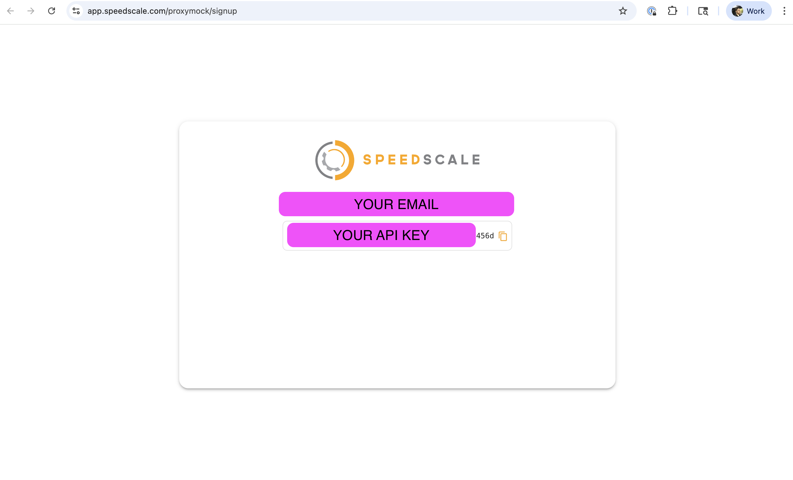

import Tabs from '@theme/Tabs';
import TabItem from '@theme/TabItem';
import ProxymockLanguageLinks from '@site/src/components/ProxymockLanguageLinks';

# Initialize API Key

For most developers, the easiest path is to run the following command and use the browser sign-in flow:

```bash
proxymock init
```

That is usually all you need. You can view or modify your configuration in `~/.speedscale/config.yaml`.

Speedscale does not share or sell your email address, although we might send you updates or announcements if we can ever figure out this marketing thing. Engineering is more our wheelhouse.

:::warning

- Don't put your API key in source control. Use a secret manager.
- Don't share your API Key.
- Non-interactive mode (like as part of a CI pipeline) requires proxymock Pro or Speedscale Enterprise.
  :::

:::tip
proxymock does not send your recorded data to any third party. All data is stored on your local desktop unless you connect to Speedscale Enterprise. Don't worry, that won't happen unless you explicitly start a trial or buy a license.
:::

## CI and other non interactive modes

If you're trying to initialize **proxymock** without any prompts, specify the API key on the command line:

```bash
proxymock init --api-key <Your API Key>
```

For the full workflow after initialization, see the [Quickstart](/proxymock/getting-started/quickstart). If you want a language-specific landing page instead, use one of these:

<ProxymockLanguageLinks className="space-y-1 mt-3" />

### Getting an API Key

<Tabs>
  <TabItem value="Existing Enterprise Customer">
If you already have a Speedscale account, get your personal API key from your [Profile page](https://app.speedscale.com/profile) (API Key section). Copy the key, then run `proxymock init --api-key <your key>`. If you are on a developer workstation, `proxymock init` with browser sign-in is usually simpler.
  </TabItem>

  <TabItem value="New User">
[Sign up for an API key](https://app.speedscale.com/proxymock/signup). For local workstation setup, it is usually faster to run `proxymock init` and complete the browser flow. If you need a manual or headless setup, copy your key from the page (see below) and run `proxymock init --api-key <your key>`.


  </TabItem>
</Tabs>

## Troubleshooting for Enterprise Customers

Does your organization already have a Speedscale tenant? If so, you can skip ahead to [Automatic Tenant Assignment](#automatic-tenant-assignment).

If you want to sign up for Speedscale Enterprise and your organization does not already have a Speedscale tenant, you can create one by visiting [Speedscale Enterprise](https://speedscale.com) and clicking "Free Trial".

### Automatic Tenant Assignment

For most tenants, you can automatically join the tenant doing **one** of the following:

1. Log into https://app.speedscale.com using your corporate email address. You will automatically be added to the tenant after some validation.
1. Dial a friend. Have your friend click the "Invite" button in the Speedscale UI and enter your email address. Check your email and sign in.

If you get stuck you can always reach us on [slack](https://slack.speedscale.com).

:::tip
Did you log into your tenant but it looks empty? This usually happens because your organization's email domain is not configured. Speedscale Support can fix this if you ping us on [slack](https://slack.speedscale.com) or at [support@speedscale.com](mailto:support@speedscale.com).
:::
