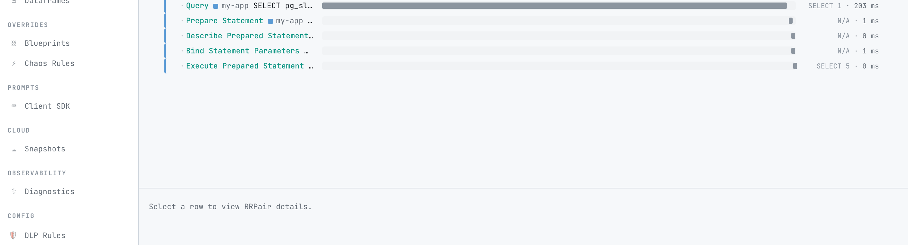

# Link queries to the request that ran them

When proxymock records a service, it captures the inbound requests and the SQL the service sends to Postgres or MySQL. To answer "which request ran this query?", it has to link the two.

Without help, proxymock links by time: a statement belongs to the request that was in flight when it ran. That is exact when requests arrive one at a time and a guess when they overlap, which is exactly when you most want to know.

If your application writes the request's trace context into a comment on each SQL statement, proxymock reads the comment and links the statement to that request exactly. Most frameworks can do this with a setting or an OpenTelemetry option, and this page shows how for each one.

## What you see

Open any Postgres or MySQL pair in proxymock web. The Database section of its **Info** tab says which request **caused** it, marked **by trace id** when the comment named that request and **by time** when proxymock inferred it. The route and trace id read from the comment appear alongside it.


Add the **Trace ID** filter (Filters, then the Trace ID field) with a trace id to narrow the Requests list to that request and the queries it ran. Switch to the **Trace** lens to see them as a waterfall. Its header counts how many queries were linked by trace ID and how many by timing.



`proxymock sql-report` and the `sql_report` MCP tool count the statements each endpoint ran per request. Their summary says how many statements were linked by the trace id in their SQL comment:

```text
Statements per inbound request (18 requests, 31 statements attributed, 20 of them by the trace id in their SQL comment, 1 outside any request):
```

In JSON output (`-o json`), `requestLoad.exactStatements` is that count, and `ambiguousStatements` counts the statements that were linked by time while several requests overlapped. A statement linked by its comment is never ambiguous.

## How the link works

The comment uses the [sqlcommenter](https://google.github.io/sqlcommenter/spec/) format, or the `key:value` format of Rails query log tags and marginalia. proxymock reads the `traceparent` key, a [W3C trace context](https://www.w3.org/TR/trace-context/) value, and the route (`route`, or `controller` and `action`):

```sql
SELECT * FROM orders WHERE id = $1 /*controller='orders',action='show',traceparent='00-4bf92f3577b34da6a3ce929d0e0e4736-00f067aa0ba902b7-01'*/
```

It then finds the inbound request in the same service whose W3C `traceparent` (or B3) header carries the same trace id. The trace id is the join: the span id in the comment usually belongs to the database client span, which no recorded request carries.

Two rules keep the link honest:

- The request must contain the statement in time. A statement whose comment names a request that has already finished falls back to timing. The [prepared statement caveat](#prepared-statements) is where this happens.
- The inbound request has to carry the trace. When a service starts the trace itself, because nothing upstream sent a `traceparent`, its inbound request has no trace id. proxymock then uses the service's outbound calls to other services, which carry the new trace, to find the request. When the service makes no such call, its statements link by time.

So the link is exact for a service behind a gateway, load balancer or caller that propagates trace context, and for a service that calls other services while it handles the request.

## Try it with the lab

The [sqlcommenter lab](https://github.com/speedscale/mock-lab/tree/main/labs/sqlcommenter) in mock-lab is a small Go service on Postgres that tags every statement. It ships a recording, so you can look at the links before running anything:

```bash
git clone https://github.com/speedscale/mock-lab && cd mock-lab/labs/sqlcommenter
make report
make web
```

`make report` runs `proxymock sql-report` on the committed recording and `make web` opens it in proxymock web. To record your own run, start Postgres with `make up` and run `make capture`. The load includes overlapping requests, an untagged query, a reused prepared statement, and requests without a `traceparent`, so the recording shows every kind of link.

## Turn on SQL comments in your framework

Each setup below adds a `traceparent` to the comment. Most of them need OpenTelemetry tracing set up in the service, since the trace context comes from the current span.

Google's original sqlcommenter libraries were donated to OpenTelemetry, and the [repository](https://github.com/google/sqlcommenter) is now archived. Prefer the sqlcommenter option built into the OpenTelemetry instrumentation for your language where one exists.

### Rails 7.1 and later

Rails [query log tags](https://api.rubyonrails.org/classes/ActiveRecord/QueryLogs.html) write the comment. Use the sqlcommenter format and add a `traceparent` tag that reads the current trace from the OpenTelemetry Ruby SDK:

```ruby
# config/application.rb
config.active_record.query_log_tags_enabled = true
config.active_record.query_log_tags_format = :sqlcommenter
config.active_record.query_log_tags = [
  :application, :controller, :action, :job,
  {
    traceparent: -> {
      carrier = {}
      OpenTelemetry.propagation.inject(carrier)
      carrier["traceparent"]
    }
  }
]
```

Leave `config.active_record.cache_query_log_tags` at its default of `false`, so the trace is read for every query. The [Rails configuration guide](https://guides.rubyonrails.org/configuring.html) notes that enabling query log tags disables prepared statements, which keeps each statement's comment current.

The OpenTelemetry `pg` and `mysql2` instrumentations for Ruby can also write the comment themselves, with `c.use 'OpenTelemetry::Instrumentation::PG', { propagator: 'tracecontext' }` (and the same option for `Mysql2`).

### Rails 6 and earlier (marginalia)

[marginalia](https://github.com/basecamp/marginalia) writes `/*application:Shop,controller:orders,action:show*/` comments. It became part of Rails 7 as query log tags. Add a component for the trace:

```ruby
# config/initializers/marginalia.rb
module Marginalia
  module Comment
    def self.traceparent
      carrier = {}
      OpenTelemetry.propagation.inject(carrier)
      carrier["traceparent"]
    end
  end
end

Marginalia::Comment.components = [:application, :controller, :action, :traceparent]
```

### Django

The OpenTelemetry [Django instrumentation](https://opentelemetry-python-contrib.readthedocs.io/en/latest/instrumentation/django/django.html) adds sqlcommenter comments when you turn it on. The trace context is included by default:

```python
from opentelemetry.instrumentation.django import DjangoInstrumentor

DjangoInstrumentor().instrument(is_sql_commentor_enabled=True)
```

The `SQLCOMMENTER_WITH_*` settings in `settings.py` choose the tags; `SQLCOMMENTER_WITH_OPENTELEMETRY` is the one that adds `traceparent`. Turn on the commenter in one place only: enabling it in a database driver instrumentation as well writes two comments.

The older `google-cloud-sqlcommenter` package does the same with its `google.cloud.sqlcommenter.django.middleware.SqlCommenter` middleware and `SQLCOMMENTER_WITH_OPENTELEMETRY = True`. It has not been released since 2021.

### Flask and SQLAlchemy

The OpenTelemetry [SQLAlchemy](https://opentelemetry-python-contrib.readthedocs.io/en/latest/instrumentation/sqlalchemy/sqlalchemy.html) and [psycopg2](https://opentelemetry-python-contrib.readthedocs.io/en/latest/instrumentation/psycopg2/psycopg2.html) instrumentations write the comment, `traceparent` included, when `enable_commenter` is on. The Flask instrumentation adds the route and controller to it:

```python
from opentelemetry.instrumentation.flask import FlaskInstrumentor
from opentelemetry.instrumentation.sqlalchemy import SQLAlchemyInstrumentor

FlaskInstrumentor().instrument(enable_commenter=True)
SQLAlchemyInstrumentor().instrument(engine=engine, enable_commenter=True, commenter_options={})
```

`commenter_options` turns tags off; `{"opentelemetry_values": False}` would drop the `traceparent`, so leave it empty. Use `Psycopg2Instrumentor().instrument(enable_commenter=True)` instead when the app talks to psycopg2 directly.

### Spring Boot and Hibernate

The [OpenTelemetry Java agent](https://github.com/open-telemetry/opentelemetry-java-instrumentation/tree/main/instrumentation/jdbc) adds the comment to every JDBC statement, which covers Hibernate, Spring Data and plain JDBC. It is experimental and needs agent 2.21.0 or later:

```bash
java -javaagent:opentelemetry-javaagent.jar \
  -Dotel.instrumentation.jdbc.experimental.sqlcommenter.enabled=true \
  -jar app.jar
```

The environment variable `OTEL_INSTRUMENTATION_JDBC_EXPERIMENTAL_SQLCOMMENTER_ENABLED=true` does the same. Hibernate's own `hibernate.use_sql_comments` setting describes the query and carries no trace context.

### Node.js

The OpenTelemetry [pg instrumentation](https://www.npmjs.com/package/@opentelemetry/instrumentation-pg) adds the comment to every query sent through `pg`, which includes queries from knex and Sequelize on Postgres:

```js
const { PgInstrumentation } = require('@opentelemetry/instrumentation-pg');

new PgInstrumentation({ addSqlCommenterCommentToQueries: true });
```

The [mysql2 instrumentation](https://www.npmjs.com/package/@opentelemetry/instrumentation-mysql2) has the same `addSqlCommenterCommentToQueries` option. Both skip a query that already contains `--` or `/*`, and the pg instrumentation skips named (prepared) queries, which would otherwise keep a stale trace.

The archived `@google-cloud/sqlcommenter-knex` and `@google-cloud/sqlcommenter-sequelize` packages wrap knex or Sequelize as Express middleware. Pass `{traceparent: true}` in their include options, since the trace is off by default.

### Go

For `database/sql`, [otelsql](https://github.com/XSAM/otelsql) adds the comment when you open the database with `WithSQLCommenter`. The option is experimental:

```go
db, err := otelsql.Open("pgx", dsn, otelsql.WithSQLCommenter(true))
```

The archived `github.com/google/sqlcommenter/go/database/sql` wrapper does the same with `core.CommenterConfig{EnableTraceparent: true, EnableRoute: true}`.

There is no official option for pgx used directly. Append the comment yourself, as the [sqlcommenter lab](https://github.com/speedscale/mock-lab/tree/main/labs/sqlcommenter) does in about a hundred lines: read the trace from the request context, URL-encode each value, and add `/*route='...',traceparent='...'*/` to the statement.

### Datadog Database Monitoring

Datadog tracers write the comment when [Database Monitoring and APM are connected](https://docs.datadoghq.com/database_monitoring/connect_dbm_and_apm/) in `full` mode, the only mode that includes `traceparent`:

```bash
DD_DBM_PROPAGATION_MODE=full
```

The comment also carries Datadog's own keys, such as `dddbs` and `ddps`, which proxymock ignores. Datadog lists the tracer versions and database libraries that support `full` mode for Postgres and MySQL.

The inbound request needs to carry the same trace in a W3C `traceparent` header, so make sure `tracecontext` is one of the tracer's propagation styles (`DD_TRACE_PROPAGATION_STYLE`) in the services that call this one.

Datadog downgrades some prepared statements to `service` mode, which drops the `traceparent`. The Java tracer before 1.44 does this for every prepared statement; see Datadog's page for the current rules.

## Prepared statements {#prepared-statements}

A prepared statement keeps the SQL text it was prepared with, comment included. When a driver or ORM prepares a statement once and reuses it across requests, every reuse carries the trace of the request that prepared it.

proxymock guards against this: a statement links by trace id only when the request with that trace id also contains it in time. A reuse by a later request names a request that has already finished, so it falls back to timing instead of linking to the wrong request.

To keep links exact, let the comment change with each request:

- Rails disables prepared statements when query log tags are on.
- The OpenTelemetry pg instrumentation for Node skips named (prepared) queries rather than write a stale trace, and Datadog's tracers downgrade some prepared statements to `service` mode.
- A statement cache keyed on the full SQL text, such as pgx's default cache in Go, prepares a new statement for each new comment, so the link stays exact.

A unique comment on every query also means the database cannot reuse a cached plan for it. The [OpenTelemetry semantic conventions](https://opentelemetry.io/docs/specs/semconv/db/database-spans/) call this out, and some databases are more sensitive to it than others, so check with whoever runs your database before you turn tagging on in production.

## Untagged traffic still links

Tagging is optional. Statements without a comment, or with a comment that has no `traceparent`, link to the request that was in flight when they ran, as they did before. A recording can mix both: the health check your tracing ignores links by time, and the tagged queries link exactly.

## Related

- [Compare SQL between runs](./sql-compare.md)
- [Trace a request without traces](./trace-without-traces.md)
- [PostgreSQL mocking](./postgres.md)
- [MySQL mocking](./mysql.md)
