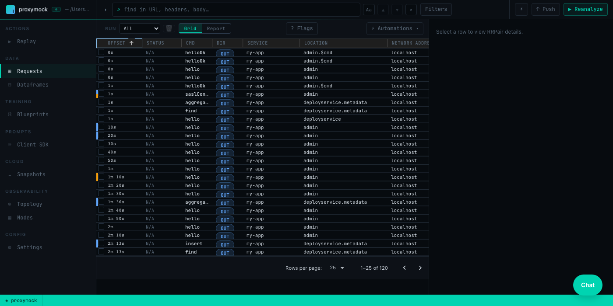

# MongoDB Mocking

This guide covers how to use proxymock to mock MongoDB database connections and queries for local development and testing.

## Introduction to MongoDB {#introduction}

MongoDB is one of the world's most popular NoSQL document databases, using a binary wire protocol (OP_MSG) for client-server communication. **proxymock** is able to record and mock MongoDB databases. This allows you to mock a MongoDB database, including real data, without running a MongoDB instance or populating it with data. To do this, we record your app talking to a MongoDB database and simulate the database in subsequent tests. To learn more about proxymock recording and architecture, check out the [quick start](../getting-started/quickstart/index.md).

## Why `--map` Is Required {#why-map}

Unlike HTTP-based services, MongoDB clients generally cannot be proxied using environment variables like `ALL_PROXY` or `http_proxy`. This is especially true for the **Java MongoDB driver**, which uses its own NIO/Netty-based transport layer that bypasses `java.net.Socket` entirely. JVM-level SOCKS flags (`-DsocksProxyHost`, `-DsocksProxyPort`) have no effect because the driver never goes through the standard socket path.

Python and Node.js MongoDB drivers may partially support SOCKS proxying, but behavior varies across versions and is fragile.

The `--map` flag is the reliable, language-agnostic approach for MongoDB. It tells proxymock to listen on a local port and forward traffic to the real MongoDB server, requiring only a port change in your application configuration.

## Recording MongoDB Traffic {#recording-intro}

The `proxymock record` command creates RRPair files from real MongoDB interactions. Each request will contain a MongoDB wire protocol command (like a `find` or `insert`) and the response will contain the corresponding documents or acknowledgment returned by the database.

### Start the Recorder {#start-recording}

Start a dedicated terminal window to run the proxymock recorder:

```bash
proxymock record --map 37017=localhost:27017
```

This tells the recorder to listen on port 37017 for MongoDB traffic and forward it to the real MongoDB server at 27017. Your can learn more about the how *proxymock* records on the [architecture page](../how-it-works/architecture.md).

### MongoDB Connection Configuration {#configure-mongodb-client}

For proxymock to capture MongoDB traffic, point your application at the mapped port. The exact mechanism depends on your language and framework.

**Java (Spring Boot / Micronaut)**

Externalize the MongoDB host and port so you can switch between the real and mapped ports without code changes. In `application.properties` or `application.yml`:

```yaml
# application.yml
spring:
  data:
    mongodb:
      host: ${MONGO_HOST:localhost}
      port: ${MONGO_PORT:27017}
      database: mydb
```

Then start your app pointing at the mapped port:

```bash
MONGO_HOST=localhost MONGO_PORT=37017 java -jar target/my-app.jar
```

**Node.js**

```bash
MONGO_URL=mongodb://localhost:37017/mydb node app.js
```

**Python**

```bash
MONGO_URL=mongodb://localhost:37017/mydb python app.py
```

The key ingredient is redirecting your application's MongoDB connection to `localhost:37017` so traffic flows through the proxymock recorder via `--map`.

### What Gets Recorded

You can inspect the recording using the inspect command:

```bash
proxymock inspect
```



proxymock captures MongoDB wire protocol traffic as RRPair files containing:

- **Request Data**: MongoDB commands — `hello`/`isMaster` handshake, SASL authentication (SCRAM-SHA-1/256), `find`, `insert`, `update`, `delete`, `aggregate`, `getMore`, and others
- **Response Data**: Document results, cursor data, write acknowledgments, error responses
- **Timing Information**: Command execution times and connection latency

The actual wire protocol is binary but proxymock displays request and response data as JSON. The underlying files can be modified if you want your mock to return different values. You can learn more about the structure of the underlying recording by looking at the `proxymock` directory containing the recording files and the [docs](../how-it-works/rrpair-format.md).

### Troubleshooting Recording

- SOCKS proxy does not work with the Java MongoDB driver — use `--map` instead
- Python/Node.js drivers have inconsistent SOCKS support — `--map` is simpler and more reliable across all languages
- Verify MongoDB server is accessible from proxymock
- If using authentication, make sure to exercise the full connection lifecycle so the SCRAM handshake is captured

## Starting the Mock Server {#start-mocks}

Make sure to stop your local MongoDB server to prevent port conflicts. You can run your app against the normal MongoDB port 27017 now and proxymock will simulate the database.

Start the *proxymock* mock server:

```bash
proxymock mock
```

You can now run your MongoDB client normally and it will connect to proxymock on port 27017 like a normal database.

:::tip
If the mock server fails to start or your app times out connecting, verify that the recorded RRPairs include the MongoDB handshake (`hello` or `isMaster` command). Without the handshake, the driver cannot establish a connection to the mock.
:::

## Modifying Responses

To modify the responses manually, you can find the appropriate markdown file and edit the contents. However, to automate data transformation you can use the transform system provided by [Speedscale enterprise](https://app.speedscale.com). To edit your snapshot, upload it to the cloud:

```sh
proxymock cloud push snapshot
```

A link to your snapshot will be provided. In the Speedscale UI, add your transforms to modify response data as needed.

Remember to click Save. Now download the modified snapshot:

```sh
proxymock cloud pull snapshot <id>
```

You will notice a new `.metadata` directory containing your transform definitions. When you run `proxymock mock` again the transforms will be applied to your mock.

## Kubernetes and eBPF {#kubernetes}

In Kubernetes environments, Speedscale's eBPF collector (`nettap`) captures MongoDB traffic automatically at the kernel level — no `--map` configuration, SOCKS proxying, or application changes required. The collector uses kprobes and uprobes to observe TCP and TLS traffic directly, including MongoDB's binary wire protocol.

This means the `--map` workflow described above applies to **local development** only. When your application is deployed in Kubernetes with the Speedscale operator, MongoDB traffic is captured transparently alongside all other protocols.

For details on eBPF-based traffic collection, see the [eBPF Traffic Collection](/reference/ebpf-traffic-collection/) documentation.
