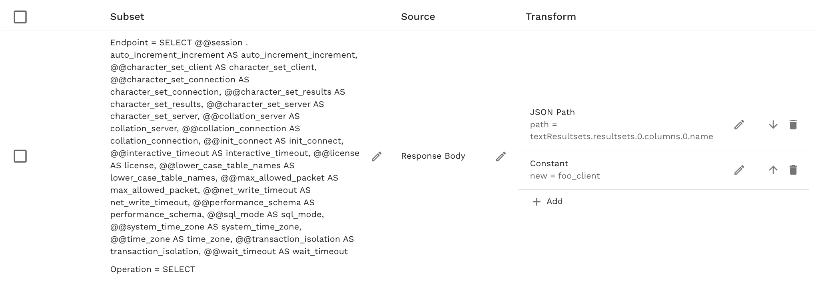

# MySQL Mocking

This guide covers how to use proxymock to mock MySQL database connections and queries for local development and testing.

## Introduction to MySQL {#introduction}

MySQL is one of the world's most popular open-source relational database management systems (RDBMS). It uses Structured Query Language (SQL) for accessing and managing data stored in relational tables. **proxymock** is able to record and mock MySQL databases. This allows you to mock a MySQL database, including real data, without running a MySQL database or populating it with data. To do this, we record your app talking to a MySQL database and simulate the database in subsequent tests. To learn more about proxymock recording and architecture, check out the [quick start](../getting-started/quickstart/index.md).

## Demo App

The following instructions will work with most MySQL clients. However, for demonstration purposes we'll use a simple Java application that connects to a MySQL database. If you are using your own app skip ahead to [recording](#configure-mysql-client) for the environment variables you'll need.

This demo app is available in the [speedscale/demo](https://github.com/speedscale/demo) repository and requires Java to be installed. If you'd like to use the demo app, clone the repository and navigate to the `java-auth` directory, which contains a basic Java authentication service that interacts with MySQL:

```bash
git clone https://github.com/speedscale/demo && cd demo/java-auth/server
```

Build the java *server* normally using maven and start MySQL on your local machine (instructions in the README). Don't worry if you don't have java installed and can't use this app. Just apply the environment variables to your own MySQL client app.

<div style={{textAlign: 'center'}}>
  <iframe src="https://player.vimeo.com/video/1121680327" width="640" height="360" frameborder="0" allow="autoplay; fullscreen; picture-in-picture" allowfullscreen></iframe>
</div>


## Recording MySQL Traffic {#recording-intro}

The `proxymock record` command creates RRPair files from real MySQL interactions. Each request will contain a MySQL command (like a SELECT SQL statement) and the response will usually contain row information and values returned by the database.

### Start the Recorder {#start-recording}

Start a dedicated terminal window to run the proxymock recorder:

```bash
proxymock record --map 13306=localhost:3306 --app-port 8080
```

This tells the recorder to listen on port 13306 for MySQL traffic and forward it to the real MySQL server at 3306. The database request will be forwarded from 13306 to the real MySQL at 3306. Your can learn more about the how *proxymock* records on the [architecture page](../how-it-works/architecture.md).

### MySQL Connection Configuration {#configure-mysql-client}

If you are using the demo app, make sure you have MySQL running and you have created the database. The instructions are in the demo [readme](https://github.com/speedscale/demo/tree/master/java-auth).

For proxymock to capture MySQL traffic, configure your application to route database connections through the proxy using environment variables. Start a new terminal window that will run the demo app server:

```bash
export MYSQL_PORT=13306
export MYSQL_HOST=localhost
export MYSQL_DATABASE=auth_db
java -jar target/auth-1.1.7.jar
```

Normally *MYSQL_PORT* and *MYSQL_HOST* will point at an external system or at your local machine port 3306. Since *proxymock* is intercepting traffic on port `localhost:13306` we set MYSQL to those connection parameters. This is the key ingredient for redirecting traffic to the proxymock recorder.

### What Gets Recorded

You can inspect the recording using the inspect command:

```bash
proxymock inspect
```


proxymock captures MySQL traffic as RRPair files containing:

- **Request Data**: SQL queries, prepared statements, connection handshakes
- **Response Data**: Result sets, error responses, metadata
- **Timing Information**: Query execution times and connection latency

The actual wire protocol is binary but proxymock displays request and response data as JSON. The underlying files can be modified if you want your mock to return different values. You can learn more about the structure of the underlying recording by looking at the `proxymock` directory containing the recording files and the [docs](../how-it-works/rrpair-format.md).

### Troubleshooting Recording

- Ensure your MySQL driver supports SOCKS5 proxy or use reverse proxy mapping
- Check that `tcp_proxy` environment variable is set correctly
- Verify MySQL server is accessible from proxymock

## Starting the Mock Server {#start-mocks}

Make sure to stop your local MySQL server to prevent port conflicts. You can run your app against the normal MySQL port 3306 now and proxymock will simulate the database.

Start the *proxymock* mock server:

```bash
proxymock mock
```

You can now run your MySQL client normally and it will connect to proxymock on port 3306 like a normal database.

## Modifying Responses

To modify the responses manually, you can find the appropriate markdown file and edit the contents. However, to automate data transforamtion you can use the transform system provided by [Speedscale enterprise](https://app.speedscale.com). To edit your snapshot, upload it to the cloud:

```sh
proxymock cloud push snapshot
```

A link to your snapshot will be provided. In the Speedscale UI, add your transforms like the following:



Remember to click Save. Now download the modified snapshot:

```sh
proyxmock cloud pull snapshot <id>
```

You will notice a new `.metadata` directory containing your transform definitions. When you run `proxymock mock` again the transforms will be applied to your mock.