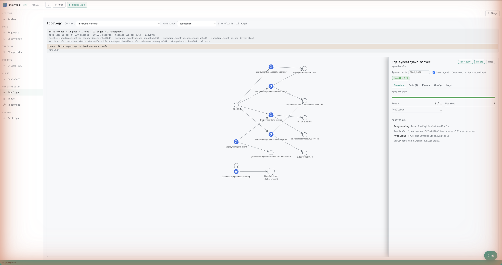
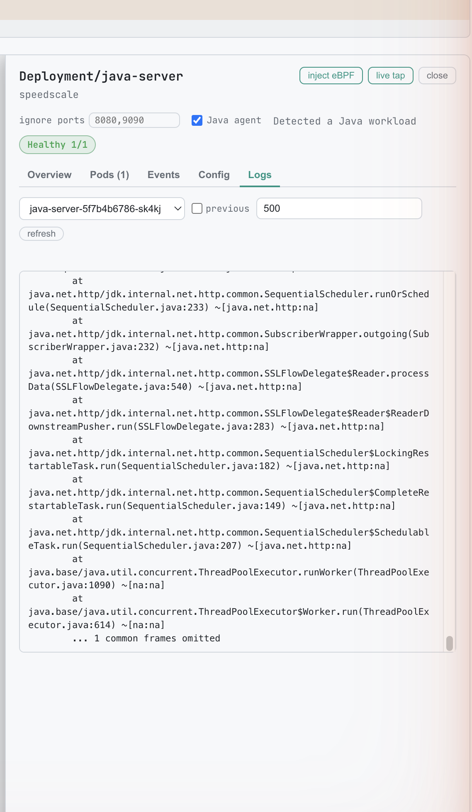
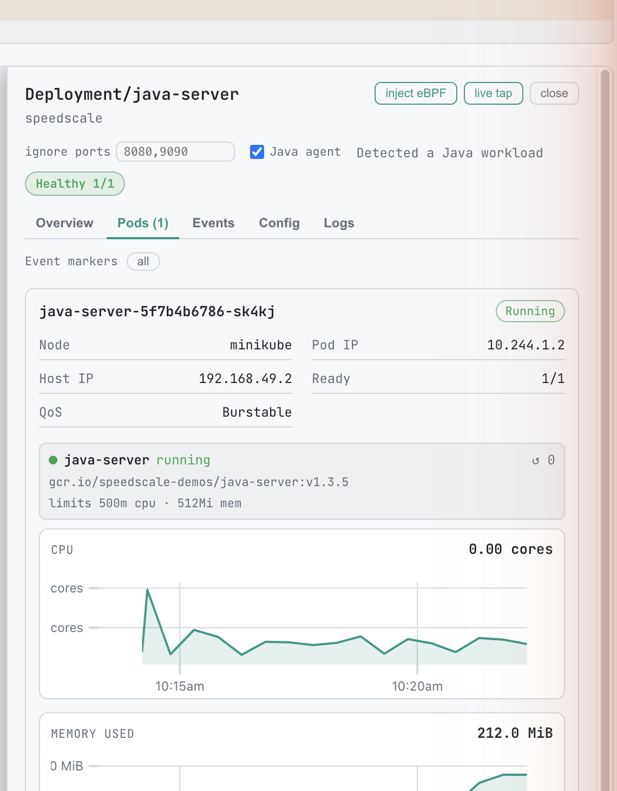
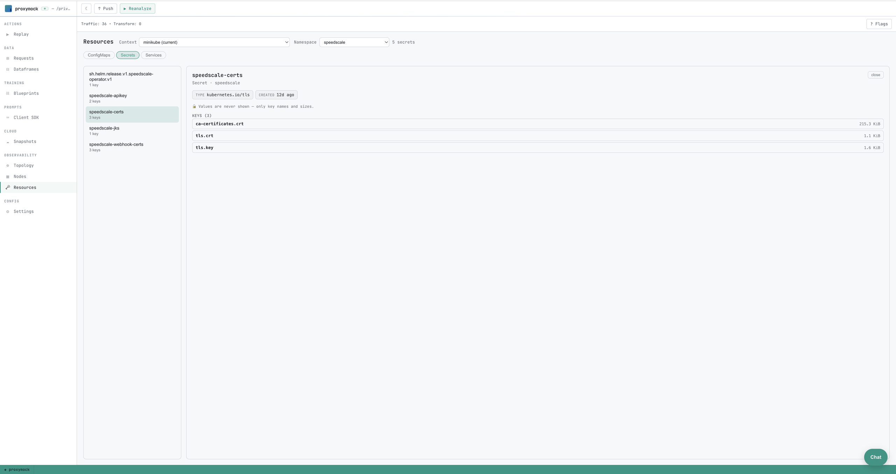
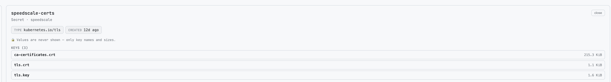

# Topology and cluster visibility

The **Topology** and **Nodes** tabs in `proxymock web` give you a live,
read-only view into a connected Kubernetes cluster. Two in-cluster
Speedscale components back them:

- The **forwarder** supplies the live topology graph and node/pod
  metrics — the moving parts of the Topology and Nodes tabs.
- The **[inspector](/reference/glossary.md#inspector)** supplies
  Kubernetes troubleshooting detail: a workload's describe-style status
  and health, its events, pod logs, its config dependencies, and a
  browsable view of the namespace's ConfigMaps, Secrets, and Services.

This page is in two halves. **[Connecting to the
cluster](#connecting-to-the-cluster)** covers how `proxymock web`
reaches the forwarder (and how to fix it when it can't).
**[Workload and resource visibility](#workload-and-resource-visibility)**
covers everything the inspector adds once you're connected.

## Connecting to the cluster

The forwarder is the same in both viewing paths below — only the
transport between it and your screen differs. `proxymock web` does the
local plumbing for you: by default, it auto-port-forwards to
`speedscale-forwarder` in the `speedscale` namespace using your current
kube-context. When that works, you don't need to do anything. When it
doesn't, the in-app chooser lets you fall back to Speedscale Cloud, or
surfaces what to fix.

### Path 1 — Auto port-forward (default)

```
[Forwarder pod] ◀── kubectl port-forward (auto) ──▶ [proxymock web] ──▶ [Your browser]
```

On startup, `proxymock web` opens a stable local listener, port-forwards
through your kubeconfig to the `speedscale-forwarder` pod's gRPC port
(`8888`), and tells the embedded server to dial that listener. The
supervisor reconnects with exponential backoff if the SPDY connection
dies (pod restart, apiserver blip, transient network failure).

Best when: you have authenticated `kubectl` access to the cluster.

#### Pick a different kube-context

```bash
proxymock web --kube-context=my-other-context
```

Defaults to the current context if omitted. Ignored when
`--forwarder-addr` is set explicitly (see below).

#### Skip the auto port-forward

Pass an explicit address:

```bash
proxymock web --forwarder-addr=localhost:8888
```

This is what you want when something else is already exposing the
forwarder (a tunnel, an SSH port-forward, a previously running
`kubectl port-forward`, a forwarder reachable directly on a flat
network, etc.). When `--forwarder-addr` is set, auto port-forward and
`--kube-context` are both ignored.

#### Disable the Observability surface entirely

```bash
proxymock web --forwarder-addr=""
```

Explicit empty value opts out. Use this on a machine without cluster
access where you only want the local replay/mock workflows.

### Path 2 — Speedscale Cloud

```
[Forwarder pod] ──egress──▶ [Speedscale Cloud] ──▶ [Your browser]
```

The forwarder ships telemetry to Speedscale Cloud, and you view it at
[app.speedscale.com](https://app.speedscale.com). No connection between
your laptop and the cluster is needed — just cluster egress to
Speedscale Cloud.

Best when: you don't have direct cluster credentials on the machine
you're viewing from.

In the in-app chooser, **Open Dashboard** takes you straight there.

### Troubleshooting the connection

The chooser appears whenever the local view can't reach the forwarder.
It distinguishes two states:

- **"Topology is offline"** — the auto port-forward is in place but the
  upstream gRPC dial is failing. The supervisor is reconnecting in the
  background; **Retry connection** re-pings immediately. Common causes:
  the forwarder pod is restarting, the apiserver dropped the SPDY
  connection, the cluster lost connectivity. Usually self-heals.

- **"Topology isn't connected"** — auto port-forward failed at startup,
  or you opted out with `--forwarder-addr=""`. The fix is a process
  restart, so the card is muted and there is no Retry button. Check the
  `proxymock web` stderr for the exact failure — typical messages
  include "load kubeconfig", "no such context", or "no pods matched
  app=speedscale-forwarder".

#### Diagnostic command

Both states show:

```bash
kubectl get svc speedscale-forwarder -n speedscale
```

If this succeeds, you have credentials to the cluster and the forwarder
service exists. If it fails, fix the access problem first — restart
`proxymock web` afterward if you're in the "not connected" state.

#### Switching paths

Both paths can coexist. If your machine loses cluster credentials, fall
back to Speedscale Cloud; if Cloud is unreachable from your network,
fall back to the local auto port-forward. The chooser appears whenever
the local view can't reach the forwarder, so you can always switch.

## Workload and resource visibility

Once you're connected, clicking a workload in the Topology graph opens a
detail drawer, and a third Observability tab — **Resources** — lets you
browse the namespace's ConfigMaps, Secrets, and Services. All of this
data comes from the **[inspector](/reference/glossary.md#inspector)**,
not the forwarder, and is **read-only**.

### How it works

The inspector is a Speedscale in-cluster component that already holds
read access to your cluster under the operator's ServiceAccount.
`proxymock web` opens a second background port-forward — to the
`speedscale-inspector` pod alongside the forwarder one — and the detail
and resource views make REST calls over that tunnel. There is nothing to
configure on the `proxymock web` side; the tabs appear automatically when
the inspector is reachable.

```
[Inspector pod] ◀── kubectl port-forward (auto) ──▶ [proxymock web] ──▶ [Your browser]
```

A few things follow from this design:

- **Reads run under the inspector's ServiceAccount**, which has read
  access to pods, pod logs, events, Deployments/ReplicaSets/StatefulSets,
  Services, ConfigMaps, and Secrets. Nothing runs under your local
  kubeconfig — so what you can see is governed by the inspector's RBAC,
  not your personal cluster permissions.
- **The inspector is deployed by default** whenever the Speedscale
  operator manages a connected cluster, and its REST endpoint is on by
  default. Both are configurable — see
  [Configuration and access control](#configuration-and-access-control).
- **Missing tabs mean a graceful fallback, not an error.** If the
  inspector isn't deployed (an older operator), its REST endpoint is
  disabled, or the port-forward can't be established, the detail drawer
  and Resources tab simply don't appear. The Topology graph and Nodes
  metrics (served by the forwarder) keep working regardless.
- **The port-forward is the trust boundary.** The inspector's REST
  endpoint is cluster-internal (a `ClusterIP` Service, never exposed
  externally). Anyone who can `port-forward` to the inspector gets its
  ServiceAccount-level read access — the same model as the forwarder
  port-forward. Secret *values* are never exposed regardless (see
  [Secrets](#secrets)).



### Workload type icons

Workloads on the graph carry the official Kubernetes icon for their kind —
Deployment, StatefulSet, DaemonSet, ReplicaSet, Job, and CronJob — so you
can tell a stateful set from a daemon set at a glance without reading
labels.

### The workload drawer

Click any workload node to open its drawer. It has five tabs, and each
one **poll-refreshes while it's open**, so the view tracks the live
cluster without a manual reload.

- **Overview** — the describe-style summary: rollout status (desired /
  ready / updated / available replicas), the workload's conditions, and
  **health badges** that call out trouble such as `CrashLoopBackOff`,
  `ImagePullBackOff`, and `OOMKilled`.
- **Pods** — the workload's pods straight from the Kubernetes API: each
  pod's phase, readiness, restart count, and per-container state. Because
  this list is sourced from the inspector (not from telemetry), a pod
  that's restarting or churning doesn't disappear from the list.
- **Events** — the workload's Kubernetes events (and those of its
  ReplicaSets), newest first, with warnings highlighted. This is where a
  `FailedScheduling`, `FailedCreate`, or image-pull error shows up.
- **Logs** — a bounded tail of a pod's logs. Choose the container, and
  toggle **Previous** to read the *last terminated* container's logs
  after a crash. The view poll-refreshes in place. This is a bounded
  tail, not a full-history dump and not a streaming live tail.
- **Config** — the workload's **dependencies**: the ConfigMaps, Secrets,
  PersistentVolumeClaims, and Services it references, plus its
  ServiceAccount. Each reference is annotated with *how* it's reached
  (an environment variable, an `envFrom`, a volume mount, an image-pull
  secret, or a Service selector) and whether it's optional.



#### Event markers on metric charts

The pod metric charts in the drawer mark the times of Kubernetes events
with dashed vertical lines, so you can line a CPU spike or a restart up
against the event that caused it. Hover a marker for the event detail,
and use the toggle to switch between **all** events and **warnings only**.



### Browsing cluster resources

The **Resources** tab is the third entry under Observability. Pick a
namespace, then switch between **ConfigMaps**, **Secrets**, and
**Services** — the list is on the left, the selected item's detail on the
right.



#### ConfigMaps

ConfigMaps are non-secret by Kubernetes' own definition, so both keys and
values are shown in the clear. Binary entries are listed by key name only
(their bytes are omitted as non-text).

#### Secrets

Secrets are shown as a **key inventory only — never values**. For each
Secret you see its type and, for every key, the key name and the *size*
of its value in bytes; the value itself is never read or transmitted by
the inspector. A lock note in the UI reinforces this.

Which Secrets you can see is governed by the operator's **secret
allowlist** (`SECRET_ACCESS_LIST`):

- **Empty (the default)** — every Secret in the namespace is listable, as
  keys-only summaries.
- **Set to a list of names** — Secret *listing* is turned off entirely.
  The Secrets list shows a "restricted by the operator's secret allowlist"
  notice instead of enumerating Secrets, and only the explicitly named
  Secrets remain individually accessible (still keys-only). This is
  enforced at the RBAC layer too: with an allowlist set, the inspector's
  ServiceAccount is granted `get` on those named Secrets but **not**
  `list`, so it cannot enumerate the rest even if asked.



#### Services

Each Service shows its type, cluster IP, any external addressing, its pod
selector (which relates it back to the workloads it routes to), and its
port mappings.

### Configuration and access control

These features are configured **operator-side** — there are no
`proxymock web` flags for them. The relevant settings live in the
Speedscale operator and inspector ConfigMaps:

| Setting | Where | Default | Effect |
| --- | --- | --- | --- |
| `WITH_INSPECTOR` | Operator ConfigMap | `true` | Deploys the inspector. Setting it `false` **removes the inspector entirely** from the cluster — see [High security mode](/security/high_security.md). With no inspector, the detail drawer and Resources tab don't appear. |
| `HTTP_ENABLED` | Inspector ConfigMap | `true` | The inbound REST endpoint `proxymock web` reads. Set it `false` to disable just the detail/resource views while leaving the inspector running for its cloud-facing duties. |
| `SECRET_ACCESS_LIST` | Operator ConfigMap | empty | Comma-separated allowlist of Secret names. Empty = all Secrets listable (keys-only). Non-empty = Secret listing disabled; only the named Secrets are individually readable (keys-only). See [Secrets](#secrets). |

:::note
The inspector's REST listen port is fixed — `proxymock web` discovers the
pod by label and dials it, so there's no port to configure.
:::

### Troubleshooting the workload and resource views

- **The detail drawer or Resources tab never appears.** The inspector
  isn't reachable. Either it isn't deployed (`WITH_INSPECTOR=false` or an
  older operator), its REST endpoint is off (`HTTP_ENABLED=false`), or the
  port-forward couldn't be established. Confirm the inspector is running:

  ```bash
  kubectl get deploy speedscale-inspector -n speedscale
  ```

- **A tab shows a permission error (403 / not found).** The inspector's
  ServiceAccount is missing RBAC for that resource. This is expected for
  Secrets when an allowlist is in effect (see below); for other resources
  it points to a customized or stripped-down operator RBAC.
- **Secrets show "restricted" or a Secret is missing.** An
  `SECRET_ACCESS_LIST` allowlist is set and the Secret isn't on it. This
  is the intended behavior, not a bug — widen the allowlist (or clear it)
  operator-side if you need broader visibility.
- **Logs are empty right after a crash.** With **Previous** toggled on,
  an empty result just means there's no prior terminated container to read
  yet.

### What these views do not do

- **They never display Secret values** — only key names and sizes, by
  design. The inspector has no mode that returns Secret values.
- **Logs are a bounded tail, not a live stream** and not full history.
- **All reads run in-cluster under the inspector's ServiceAccount.** There
  is no fallback to your local kubeconfig for this data, so visibility is
  bounded by the inspector's RBAC.
