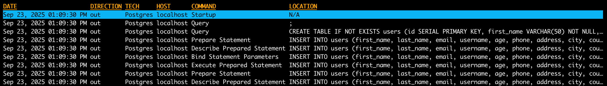

# PostgreSQL Mocking

This guide covers how to use proxymock to mock PostgreSQL database connections and queries for local development and testing.

## Introduction to PostgreSQL {#introduction}

PostgreSQL is one of the world's most advanced open-source relational database management systems (RDBMS). It uses Structured Query Language (SQL) for accessing and managing data stored in relational tables. **proxymock** is able to record and mock PostgreSQL databases. This allows you to mock a PostgreSQL database, including real data, without running a PostgreSQL database or populating it with data. To do this, we record your app talking to a PostgreSQL database and simulate the database in subsequent tests. To learn more about proxymock recording and architecture, check out the [quick start](../getting-started/quickstart/index.md).

## Demo App

The following instructions will work with most PostgreSQL clients. However, for demonstration purposes we'll use a simple gp application that connects to a PostgreSQL database. If you are using your own app skip ahead to [recording](#configure-postgresql-client) for the environment variables you'll need.

This demo app is available in the [speedscale/demo](https://github.com/speedscale/demo) repository and requires Go to be installed. If you'd like to use the demo app, clone the repository and navigate to the `go-postgres` directory, which contains a basic golang user service that interacts with PostgreSQL:

```bash
git clone https://github.com/speedscale/demo && cd demo/go-postgres
```

Start PostgreSQL on your local machine (instructions in the README). Don't worry if you don't have go installed and can't use this app. Just apply the environment variables to your own PostgreSQL client app.

<div style={{textAlign: 'center'}}>
  <iframe src="https://player.vimeo.com/video/1121659640" width="640" height="360" frameborder="0" allow="autoplay; fullscreen; picture-in-picture" allowfullscreen></iframe>
</div>

## Recording PostgreSQL Traffic {#recording-intro}

The `proxymock record` command creates RRPair files from real PostgreSQL interactions. Each request will contain a PostgreSQL command (like a SELECT SQL statement) and the response will usually contain row information and values returned by the database.

### Start the Recorder {#start-recording}

Start a dedicated terminal window to run the proxymock recorder:

```bash
proxymock record --reverse-proxy 15432=localhost:5432 --app-port 8080
```

This tells the recorder to listen on port 15432 for PostgreSQL traffic and forward it to the real PostgreSQL server at 5432. Your can learn more about the how *proxymock* records on the [architecture page](../how-it-works/architecture.md).

### PostgreSQL Connection Configuration {#configure-postgresql-client}

If you are using the demo app, make sure you have PostgreSQL running and you have created the database. The instructions are in the demo [readme](https://github.com/speedscale/demo/tree/master/go-postgres).

For proxymock to capture PostgreSQL traffic, configure your application to route database connections through the proxy using environment variables. Start a new terminal window that will run the demo app server:

```bash
PGUSER=<user> PGPORT=15432 go run main.go
```

Normally *PGPORT* and *PGUSER* will default to the default postgres installation values. With homebrew on mac that means your $username and 5432. Since *proxymock* is intercepting traffic on port `localhost:15432` we set PGPORT to use those connection parameters. This is the key ingredient for redirecting traffic to the proxymock recorder.

### What Gets Recorded

You can inspect the recording using the inspect command:

```bash
proxymock inspect
```



proxymock captures PostgreSQL traffic as RRPair files containing:

- **Request Data**: SQL queries, prepared statements, connection handshakes
- **Response Data**: Result sets, error responses, metadata
- **Timing Information**: Query execution times and connection latency

The actual wire protocol is binary but proxymock displays request and response data as JSON. The underlying files can be modified if you want your mock to return different values. You can learn more about the structure of the underlying recording by looking at the `proxymock` directory containing the recording files and the [docs](../how-it-works/rrpair-format.md).

### Troubleshooting Recording

- Ensure your PostgreSQL driver supports SOCKS5 proxy or use reverse proxy mapping
- Check that `tcp_proxy` environment variable is set correctly
- Verify PostgreSQL server is accessible from proxymock

## Starting the Mock Server {#start-mocks}

Make sure to stop your local PostgreSQL server to prevent port conflicts. You can run your app against the normal PostgreSQL port 5432 now.

Start the *proxymock* mock server:

```bash
proxymock mock
```

You can now run your PostgreSQL client normally and it will connect to proxymock on port 5432 like a normal database.

## Modifying Responses

To modify the responses manually, you can find the appropriate markdown file and edit the contents. However, to automate data transforamtion you can use the transform system provided by [Speedscale enterprise](https://app.speedscale.com). To edit your snapshot, upload it to the cloud:

```sh
proxymock cloud push snapshot
```

A link to your snapshot will be provided. In the Speedscale UI, add your transforms like the following:


Remember to click Save. Now download the modified snapshot:

```sh
proxymock cloud pull snapshot <id>
```

You will notice a new `.metadata` directory containing your transform definitions. When you run `proxymock mock` again the transforms will be applied to your mock.