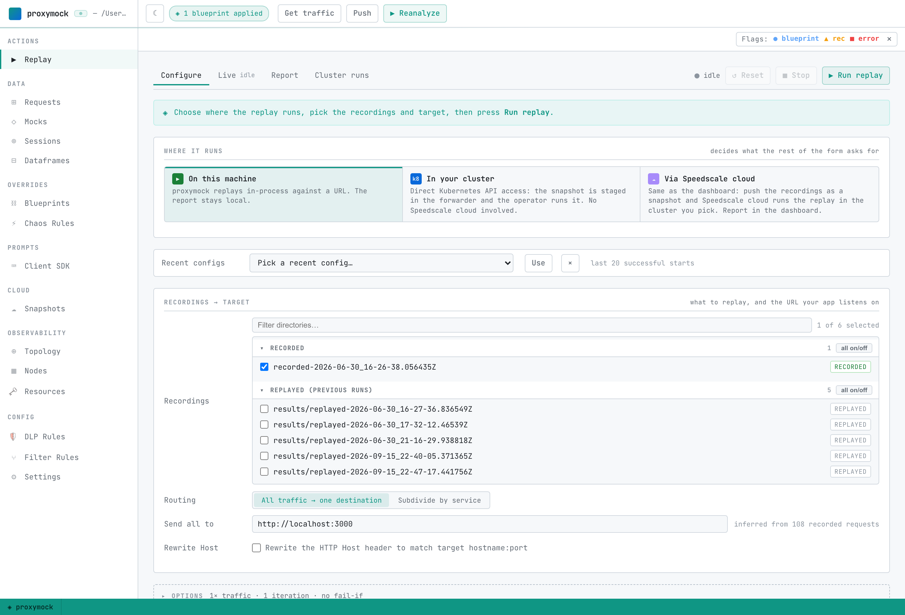
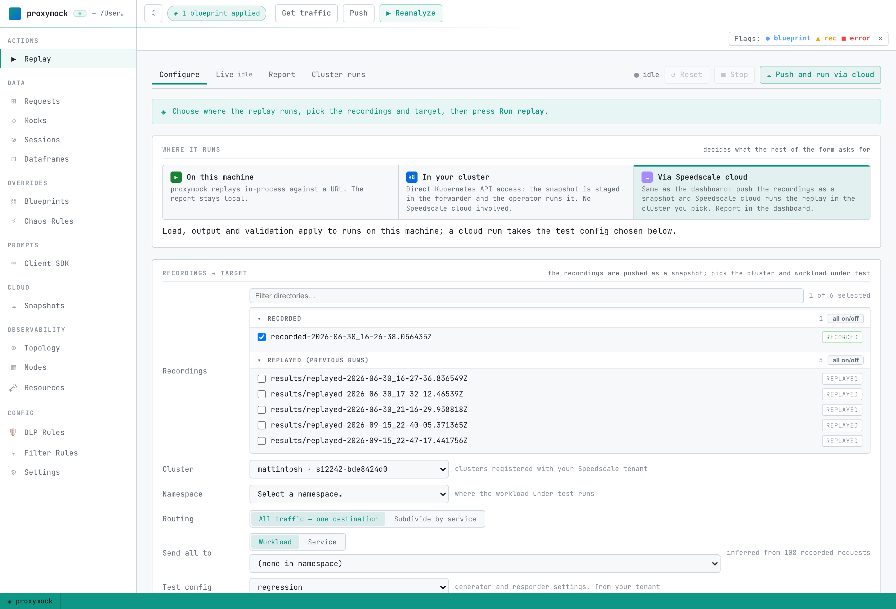

# Choose Where a Replay Runs

Every replay sends recorded requests at a target and reports how the responses compare. What changes is *where* the replay runs and *what it needs from you*. proxymock offers three paths, and they are independent: having a cluster does not stop you replaying locally, and being logged in to Speedscale cloud does not force a replay through it.

| | On this machine | In your cluster | Via Speedscale cloud |
|---|---|---|---|
| Where traffic is sent from | proxymock, in-process | a generator pod the operator creates | a generator pod the operator creates |
| Target | any URL your machine can reach | a workload or Service in the cluster | a workload in a cluster registered with your tenant |
| Needs a kubeconfig | no | yes | no |
| Needs the Speedscale operator | no | yes | yes |
| Needs a Speedscale cloud login | no | no | yes |
| Does anything leave the cluster or laptop | no | no | yes: the recordings are pushed as a snapshot |
| Where the report lands | your workspace | the cluster, read with proxymock | the Speedscale dashboard |

In proxymock web all three live in the **Where it runs** strip at the top of the Replay tab. Picking one decides what the rest of the form asks for, and the run button changes with it. The **Test config** picker below it applies to all three paths; see [Configure a Replay with Test Configs](./test-configs.md).

## On this machine

The replay runs inside proxymock and sends traffic to a URL. Use it while you are editing code: your service runs locally, the replay hits it directly, and nothing else has to exist.



1. Start your service so it is listening.
2. In the Replay tab pick **On this machine**.
3. Select the recordings to replay.
4. Leave routing on **All traffic to one destination** and set the URL your service listens on.
5. Press **Run replay**.

The same run from the CLI:

```shell
proxymock replay --in ./proxymock --test-against localhost:3000
```

If your service calls dependencies you do not want to reach for real, run `proxymock mock` alongside it and point the service at the mock. See [Mock a dependency](./index.md).

A replay that cannot open a connection fails with `tcp probe against "HOST:PORT": unable to connect`. That means nothing was listening, so start the service first.

## In your cluster

The replay runs inside Kubernetes against a real workload, and **no part of it involves Speedscale cloud**. proxymock analyzes the recordings locally, stages the snapshot in the in-cluster forwarder over a port-forward, and the operator runs the replay from there. The report stays in the cluster.


Prerequisites: a kubeconfig context for the cluster and the Speedscale operator installed in it. No login.

1. Start proxymock web with the context you want, for example `proxymock web --kube-context minikube`.
2. Pick **In your cluster**, then the cluster context and the namespace your workload runs in.
3. Set the destination to a **Workload** or **Service**. A plain URL is resolved inside the generator pod, where your laptop's `localhost` does not exist.
4. Optionally open **Options** and choose dependencies to mock, so the workload answers from the recording instead of reaching the real thing.
5. Press **Run in cluster**.

The same run from the CLI:

```shell
proxymock cluster replay start --in ./proxymock -n my-namespace --workload my-service --wait -o json
```

The result reports `snapshotSource`. `local` means the snapshot was staged in the cluster. `cloud` means staging failed and proxymock fell back to pushing it, which needs a login. Watch and read a run with `proxymock cluster replay status` and `proxymock cluster replay logs`; see [Work a Kubernetes Cluster from the CLI](./cluster.md).

## Via Speedscale cloud

This is the same replay the Speedscale dashboard starts. The recordings are pushed as a snapshot, Speedscale cloud starts the replay in the cluster you choose, and the report lands in the dashboard where it can be shared, compared, and kept.



Prerequisites: a Speedscale cloud login (`proxymock init`) and a cluster registered with your tenant, which means the operator there is connected to Speedscale cloud.

1. Pick **Via Speedscale cloud**.
2. Choose the **Cluster**, the **Namespace**, and the workload under test. These lists come from your tenant, not your kubeconfig, so you do not need cluster credentials on this machine.
3. Choose a **Test config** if you want something other than `regression`.
4. Press **Push and run via cloud**.

The same run from the CLI:

```shell
proxymock cloud replay --in ./proxymock --cluster my-cluster -n my-namespace --workload my-service --wait
```

Add `--dry-run` to print what would be pushed and started without doing either. `--wait` polls until the report reaches a terminal status and prints its dashboard link. This is the proxymock equivalent of [replaying with speedctl](/guides/replay/via-speedctl).

## From an AI agent

The MCP server exposes all three paths, so an assistant can pick one:

| Path | Tool and action |
|---|---|
| On this machine | `replay_traffic`, with `mock_server_start` for dependencies |
| In your cluster | the `cluster` tool, action `replay-start`, then `replay-status` and `replay-logs` |
| Via Speedscale cloud | the `cloud_replay` tool: `clusters`, `namespaces`, `workloads`, `start`, `status` |

`replay-start` takes `snapshot_source`. The default, `auto`, stages the snapshot in the cluster and falls back to a cloud push. Use `local` to refuse the fallback, so a run that cannot stage in the cluster fails instead of sending recordings to Speedscale cloud. See the [MCP tools reference](../how-it-works/mcp-tools.md).
