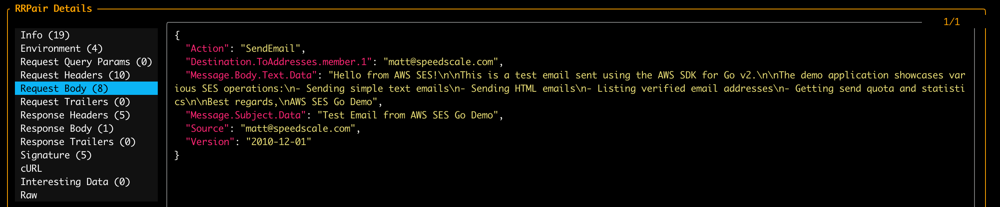

# AWS SES Mocking

This guide covers how to use proxymock to mock AWS Simple Email Service (SES) connections and API calls for local development and testing.

## Introduction to AWS SES {#introduction}

Amazon Simple Email Service (SES) is a cloud-based email sending service designed to help digital marketers and application developers send marketing, notification, and transactional emails. **proxymock** is able to record and mock AWS SES API calls. This allows you to test email functionality without actually sending emails, incurring AWS costs or triggering spam filters. To do this, we record your app talking to AWS SES and simulate the service in subsequent tests. To learn more about proxymock recording and architecture, check out the [quick start](../getting-started/quickstart/index.md).

## Demo App

The following instructions will work with most AWS SDK clients. However, for demonstration purposes we'll use a simple application that sends emails via AWS SES. If you are using your own app skip ahead to [recording](#configure-ses-client) for the environment variables you'll need.

This demo app is available in the [speedscale/demo](https://github.com/speedscale/demo) repository. If you'd like to use the demo app, clone the repository and navigate to the appropriate directory, which contains a basic email service that interacts with AWS SES:

```bash
git clone https://github.com/speedscale/demo && cd demo/go-ses-demo
```

Don't worry if you can't use this demo app. Just apply the environment variables to your own AWS SES client app.

<div style={{textAlign: 'center'}}>
  <iframe src="https://player.vimeo.com/video/1133183871" width="640" height="360" frameborder="0" allow="autoplay; fullscreen; picture-in-picture" allowfullscreen></iframe>
</div>

## Recording AWS SES Traffic {#recording-intro}

The `proxymock record` command creates RRPair files from real AWS SES interactions. Each request will contain an SES API call (like SendEmail or SendRawEmail) and the response will contain the message ID and other metadata returned by AWS.

### Start the Recorder {#start-recording}

Start a dedicated terminal window to run the proxymock recorder:

```bash
proxymock record
```

This tells the recorder to listen on port 4140 (the default) for HTTPS traffic and capture AWS SES API calls. You can learn more about how *proxymock* records on the [architecture page](../how-it-works/architecture.md).

### AWS SES Client Configuration {#configure-ses-client}

For proxymock to capture AWS SES traffic, configure your application to route API calls through the proxy using environment variables. Start a new terminal window that will run your application:

```bash
cd demo/go-ses-demo &&
FROM_EMAIL=matt@speedscale.com \
TO_EMAIL=matt@speedscale.com \
HTTP_PROXY=http://localhost:4140 \
HTTPS_PROXY=http://localhost:4140 \
go run main.go
```

The key ingredient is setting `HTTP_PROXY` and `HTTPS_PROXY` to redirect traffic to the proxymock recorder. Your AWS credentials should be configured normally (via environment variables, AWS config files, or IAM roles).

### What Gets Recorded

You can inspect the recording using the inspect command:

```bash
proxymock inspect
```



proxymock captures AWS SES traffic as RRPair files containing:

- **Request Data**: API operation (SendEmail, SendRawEmail, etc.), email content, recipients, subject lines
- **Response Data**: Message IDs, success/error responses, metadata
- **Timing Information**: API call latency and response times

The actual wire protocol is HTTPS/JSON but proxymock displays request and response data in a readable format. The underlying files can be modified if you want your mock to return different values or simulate failures. You can learn more about the structure of the underlying recording by looking at the `proxymock` directory containing the recording files and the [docs](../how-it-works/rrpair-format.md).

### Troubleshooting Recording

- Ensure your AWS SDK is configured to use the HTTP/HTTPS proxy
- Check that proxy environment variables are set correctly
- Verify your AWS credentials are valid and have SES permissions
- Some SDKs may require additional proxy configuration

## Starting the Mock Server {#start-mocks}

Once you have recorded AWS SES traffic, you can replay it without actually sending emails or connecting to AWS.

Start the *proxymock* mock server:

```bash
proxymock mock
```

You can now run your application with the same proxy settings and it will receive mocked responses:

```bash
HTTP_PROXY=http://localhost:4140 \
HTTPS_PROXY=http://localhost:4140 \
go run main.go
```

Your application will behave as if it's sending emails through AWS SES, but no actual emails will be sent.

## Modifying Responses

To modify the responses manually, you can find the appropriate RRPair file and edit the contents. However, to automate data transformation you can use the transform system provided by [Speedscale enterprise](https://app.speedscale.com). To edit your snapshot, upload it to the cloud:

```sh
proxymock cloud push snapshot
```

A link to your snapshot will be provided. You can then transform your snapshot in an automated fashion using the Speedscale UI. This is not necessary if you want to make spot modifications in the markdown file.

You can download your modified snapshot from the cloud if you added transforms:

```sh
proxymock cloud pull snapshot <id>
```

You will notice a new `.metadata` directory containing your transform definitions. When you run `proxymock mock` again the transforms will be applied to your mock.

## Common Use Cases

### Testing Error Scenarios

Modify recorded responses to simulate SES errors:
- Rate limiting errors (throttling)
- Invalid email addresses
- Bounce and complaint notifications
- Service unavailability

### Testing Email Content

Verify your application correctly:
- Formats email bodies (HTML and text)
- Sets proper headers and metadata
- Handles attachments in raw emails
- Manages recipient lists

### Integration Testing

Use mocked SES in your CI/CD pipeline to:
- Test email workflows without sending real emails
- Avoid AWS costs during testing
- Ensure consistent test results
- Speed up test execution
