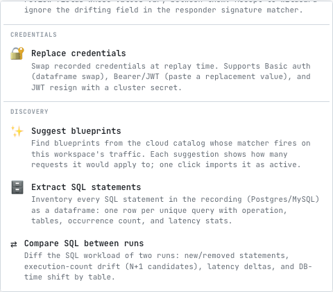
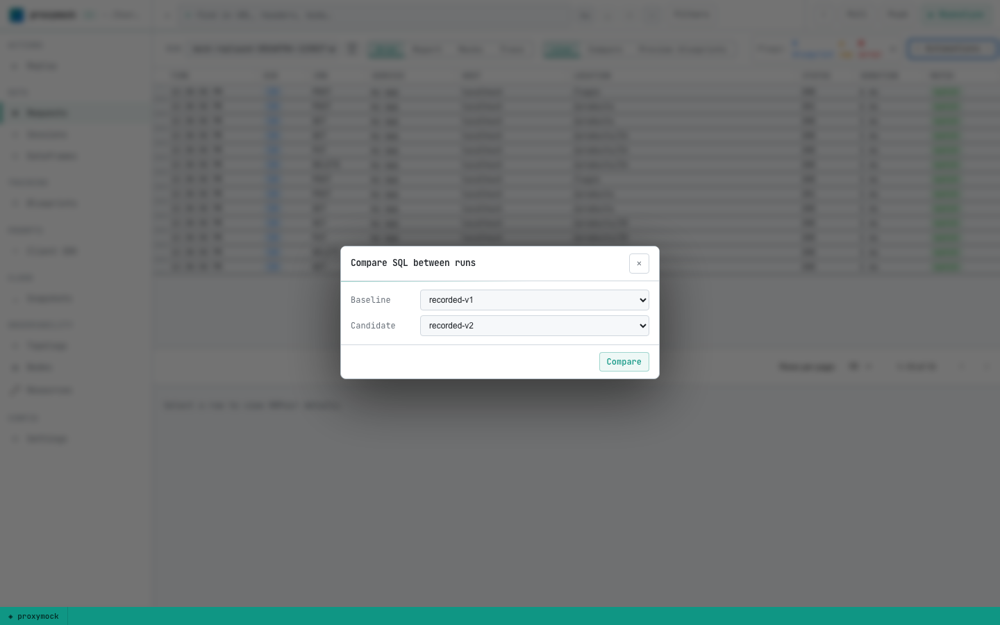
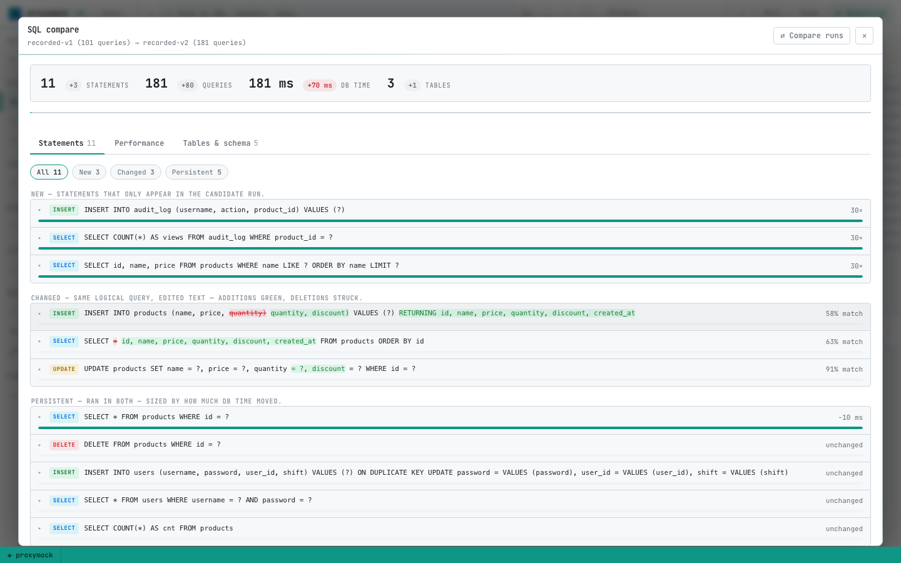
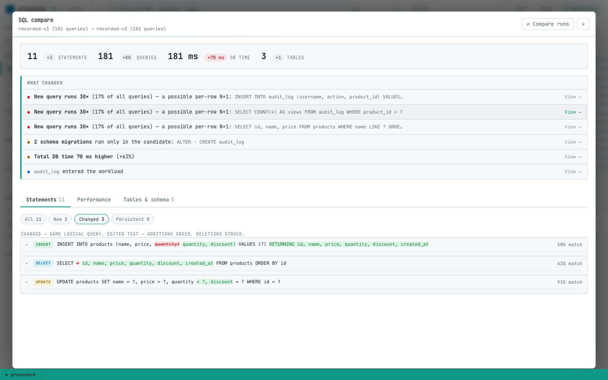
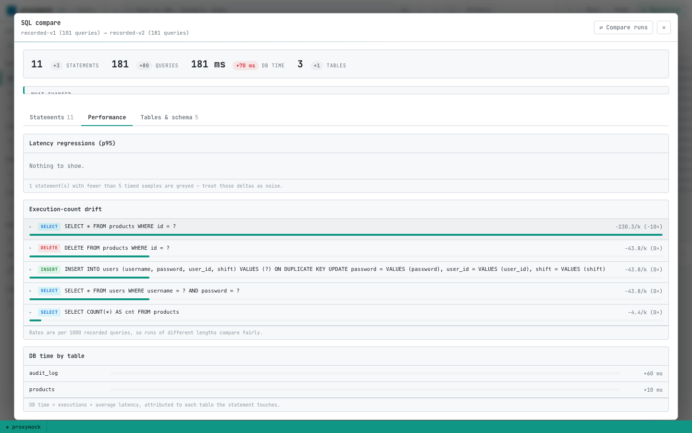
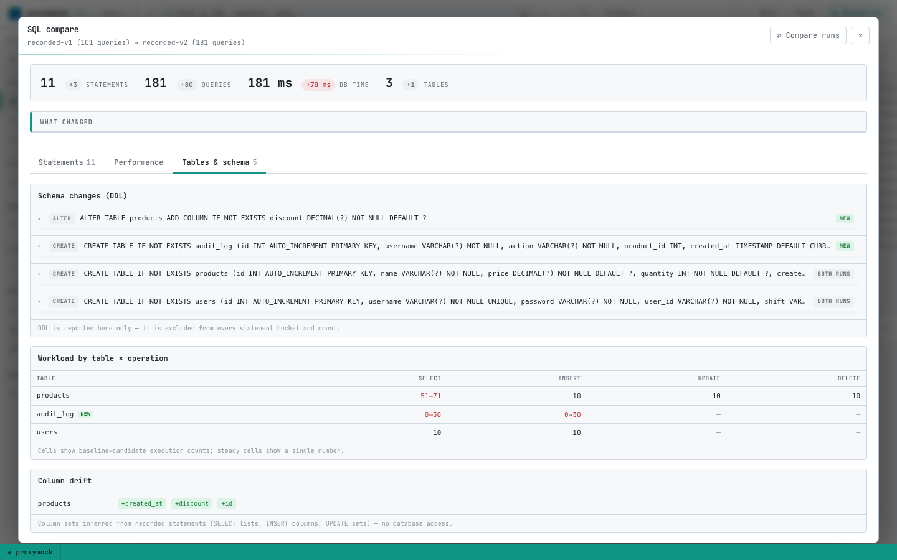

# Compare SQL between runs

When a release changes how your app talks to the database, the diff rarely shows up in HTTP tests alone. A new endpoint might look fine while the service quietly adds an N+1 loop, a migration runs at startup, or a `SELECT *` becomes a wider column list. You need to compare the **SQL workload** — not just the API surface.

proxymock's **SQL compare** automation does exactly that. Record traffic from two runs (a baseline and a candidate), and proxymock inventories every SQL statement each version executed, normalizes literals to `?`, and produces a guided diff report covering:

- **Statement inventory** — new, removed, changed, and persistent queries
- **Execution-count drift** — rate-normalized per 1000 queries so N+1 regressions stand out even when runs differ in length
- **Latency regressions** — avg and p95 deltas for statements that ran in both versions
- **DB-time attribution** — which statements and tables absorbed more database time
- **Schema and structural changes** — DDL captured in the recording, operation × table workload matrix, and column drift inferred from query text

Everything comes from recorded MariaDB (or Postgres) wire traffic. You never connect to the database to run the comparison.

This guide walks through the full flow using the **node-mariadb** demo — a Node.js products API backed by MariaDB. The demo ships two simulated releases (`APP_VERSION=v1` and `APP_VERSION=v2`) with deliberate database regressions baked in so the compare report has real findings to show.

## What you'll need

- [proxymock installed](/proxymock/getting-started/installation.md) (the SQL compare automation ships in current proxymock builds).
- [Node.js](https://nodejs.org/) 18+ and [Docker](https://docs.docker.com/get-docker/) (for MariaDB and KrakenD).
- About 15 minutes and three terminal windows for the recording steps.

## Step 1 — Clone the demo

Clone the Speedscale demo repository and move into the MariaDB example:

```bash
git clone https://github.com/speedscale/demo.git
cd demo/node-mariadb
```

Generate TLS certificates for MariaDB, start the infrastructure, and install Node dependencies:

```bash
make certs
make infra
npm install
```

The demo runs the Node.js API on your **host** (port 3001) so proxymock can intercept both inbound HTTP and outbound database traffic. MariaDB and the KrakenD gateway run in Docker.

## Step 2 — Allow plaintext DB connections while recording

MariaDB in this demo enforces TLS by default. proxymock decodes the MySQL wire protocol from recorded traffic, which requires a plaintext connection through the recorder's mapped port. With TLS enabled end-to-end, HTTP capture still works but **SQL decoding returns zero statements**.

Disable the TLS requirement for the recording session (a container restart resets it):

```bash
docker exec demo-mariadb mariadb -uroot -prootpass --ssl \
  -e "SET GLOBAL require_secure_transport=OFF"
```

While recording, point the app at proxymock's mapped DB port **without** `DB_SSL_CA` so the client speaks plaintext to the recorder.

## What v2 changes (on purpose)

The demo uses an `APP_VERSION` environment variable to simulate two releases. v1 is the default; v2 introduces realistic database changes you would want a compare report to catch:

| v2 change | What the compare report shows |
|---|---|
| Startup migration: `ALTER TABLE products ADD COLUMN discount`, `CREATE TABLE audit_log` | Schema-change panel lists the DDL statements captured during recording |
| Product list: `SELECT *` → explicit column list including `discount` | **Changed** statement with an inline token diff (same logical query, edited shape) |
| Product list runs a per-product `SELECT COUNT(*) FROM audit_log WHERE product_id = ?` | **Execution-count drift** — tops the N+1 panel with an outsized rate per 1000 queries |
| Create: `INSERT` grows a `discount` column and uses `INSERT..RETURNING`; v1's follow-up re-read `SELECT` disappears | Column drift on `products`; one statement removed, one added |
| Update: `discount = ?` added to the `SET` list | Shape change on the UPDATE statement |
| Create/update/delete write `INSERT INTO audit_log (...)` | New statements; `audit_log` appears in the DB-time-by-table panel |
| New endpoint `GET /products/search?q=` (`LIKE '%…%'`) | Net-new SELECT statement |

The traffic generator (`generate-users-traffic.sh`) runs the same login + CRUD loop for both versions and auto-detects v2 from `/health` to add search calls, so per-statement rates stay comparable between recordings.

## Step 3 — Record the baseline (v1)

You need three terminals. Start the recorder first — the app connects to the recorder's mapped DB port, so the recorder must be listening before the app starts.

**Terminal A — recorder**

The `mysql://` prefix on the port map turns on SQL decoding. A bare `13306=localhost:3306` records opaque TCP bytes instead of parsed statements:

```bash
proxymock record \
  --app-port 3001 \
  --map 13306=mysql://localhost:3306 \
  --out proxymock/recorded-v1 \
  --svc-name node-mariadb-v1
```

proxymock immediately warns that it cannot connect to app port `localhost:3001`. That is expected — the app starts in the next terminal. The warning clears once the app is up.

**Terminal B — app (v1 is the default)**

No `DB_SSL_CA` while recording — the app speaks plaintext to the mapped port:

```bash
DB_HOST=127.0.0.1 DB_PORT=13306 PORT=3001 node server.js
```

**Terminal C — traffic**

Send authenticated CRUD traffic through the recorder's inbound proxy:

```bash
LOGIN_AUTH_MODE=basic ./generate-users-traffic.sh 4143
```

Stop the app (terminal B) and the recorder (terminal A, `Ctrl-C`) when traffic completes.

## Step 4 — Record the candidate (v2)

Repeat the same three-terminal flow. Only the output directory and app version change:

**Terminal A**

```bash
proxymock record \
  --app-port 3001 \
  --map 13306=mysql://localhost:3306 \
  --out proxymock/recorded-v2 \
  --svc-name node-mariadb-v2
```

**Terminal B**

```bash
APP_VERSION=v2 DB_HOST=127.0.0.1 DB_PORT=13306 PORT=3001 node server.js
```

**Terminal C**

```bash
LOGIN_AUTH_MODE=basic ./generate-users-traffic.sh 4143
```

Stop both processes when done.

## Step 5 — Compare in proxymock web

Open the workspace:

```bash
proxymock web
```

Run the compare automation:

1. Click **⚡ Automations → Compare SQL between runs**
2. Set **Baseline** to `recorded-v1` and **Candidate** to `recorded-v2`
3. Click **Compare**





proxymock opens a full-screen SQL compare report. The report is organized as a guided read — a headline verdict, a ranked **What changed** digest, and three chapters you can step through: **Statements**, **Performance**, and **Tables & schema**.



### Verdict strip

The top row summarizes the candidate run against the baseline:

- **Statements** — unique normalized query fingerprints
- **Queries** — total SQL executions (DDL excluded from workload counts)
- **DB time** — aggregate time spent in the database
- **Tables** — distinct tables touched

Each KPI shows the delta from baseline to candidate so you can see at a glance whether v2 added database work.

### What changed (ranked findings)

The digest surfaces the highest-severity findings first and links each one to the evidence panel:

- **N+1 candidates** — new statements whose execution rate exceeds 100 per 1000 queries (the per-product audit COUNT in v2 triggers this)
- **Schema migrations** — DDL that ran only in the candidate (`ALTER TABLE products`, `CREATE TABLE audit_log`)
- **Tables that became write targets** — tables that were read-only in the baseline but receive INSERT/UPDATE/DELETE in the candidate (`audit_log`)
- **p95 latency regressions** — persistent statements whose p95 latency rose meaningfully (requires at least 5 timed samples on each side)
- **Total DB time increase** — when aggregate database time rises more than 25% between runs
- **Shape changes** — statements paired by operation and table set whose text changed but represent the same logical query

Click any finding's **View →** link to jump to the relevant chapter and filter.

### Statements chapter

Statements are bucketed into four groups:

| Bucket | Meaning |
|---|---|
| **New** | Fingerprints that appear only in the candidate run |
| **Changed** | Same logical query with edited text — inline token diff shows additions (green) and deletions (struck through). The v1 `SELECT *` → v2 explicit column list lands here. |
| **Removed** | Baseline statements that no longer execute |
| **Persistent** | Ran in both runs — sized by how much DB time moved between them |

Statement text uses **fingerprints**: literal values are masked as `?`, so `WHERE id = 42` and `WHERE id = 7` count as one statement. That is why the same query shape matches across runs even when IDs differ.

Expand any row to see occurrence count, rate per 1000 queries, avg/p95 latency, tables touched, and DB time on each side.



:::tip Optional precursor
Run **⚡ Automations → Extract SQL statements** on a single recording first if you want a one-run inventory (operation, tables, counts, latency stats) before diffing two runs.
:::

### Performance chapter

This chapter focuses on regressions and drift among statements that ran in **both** versions:

**Latency regressions (p95)**

Statements ranked by p95 increase. Only deltas marked **reliable** (≥ 5 timed samples on each side) are treated as actionable; others appear greyed with a "low samples" tag. Treat low-sample deltas as noise, not proof of a regression.

**Execution-count drift**

Rates normalized to **per 1000 recorded queries** so a longer candidate run does not inflate counts. This is where N+1 patterns stand out: the v2 per-product audit COUNT runs once per product in the list response, producing a rate far above every other statement.

Look for statements whose rate jumped while the HTTP traffic pattern stayed the same — that is the signature of a loop that fires a query per row.

**DB time by table**

DB time is approximated as `executions × average latency`, attributed to every table a statement touches. The v2 run shows `audit_log` appearing from zero and `products` rising — visual confirmation that the new audit writes and wider SELECTs shifted where time is spent.



### Tables & schema chapter

**Schema changes (DDL)**

DDL statements are captured from the recording (v2's startup migration) and reported separately. They do not appear in the statement workload buckets or query counts — schema changes are events, not recurring traffic.

**Workload by table × operation**

A matrix of baseline → candidate execution counts per table and operation (SELECT, INSERT, UPDATE, DELETE). Badges call out tables that entered or left the workload, or that **now receive writes** after being read-only in the baseline.

**Column drift**

Column sets inferred from recorded statement text — SELECT lists, INSERT column lists, UPDATE sets — without connecting to the database. v2 shows `discount` added to `products` and new columns on `audit_log`.



## Step 6 — Compare headlessly (CI and scripts)

The web automation has a CLI mirror for pipelines and local scripting:

```bash
proxymock automation sql-compare \
  --baseline proxymock/recorded-v1 \
  --candidate proxymock/recorded-v2 \
  --output json
```

The JSON payload includes the same buckets the web report renders: `new`, `removed`, `changed`, `persistent`, `tableDbTime`, `schemaChanges`, `tableOps`, and `columnDrift`.

Extract just the statement lists:

```bash
proxymock automation sql-compare \
  --baseline proxymock/recorded-v1 \
  --candidate proxymock/recorded-v2 \
  --output json | jq '{new: [.new[].sql], removed: [.removed[].sql]}'
```

Flag N+1 candidates by rate:

```bash
proxymock automation sql-compare \
  --baseline proxymock/recorded-v1 \
  --candidate proxymock/recorded-v2 \
  --output json | jq '[.new[] | select(.stat.ratePerK >= 100) | {sql, ratePerK: .stat.ratePerK, count: .stat.count}]'
```

Find p95 regressions among reliable persistent statements:

```bash
proxymock automation sql-compare \
  --baseline proxymock/recorded-v1 \
  --candidate proxymock/recorded-v2 \
  --output json | jq '[.persistent[] | select(.latencyReliable and .p95DeltaMs > 0) | {sql, p95DeltaMs, baselineP95: .baseline.latencyP95Ms, candidateP95: .candidate.latencyP95Ms}]'
```

Exit code **2** means one side contained no SQL statements — usually a recording that missed the `mysql://` port map or ran with TLS enabled on the DB connection.

Repeat `--baseline` or `--candidate` to merge multiple run directories into one side (for example, combining two recorded sessions into a single baseline).

## Expected results for this demo

After following the steps above, the v1 → v2 compare should surface findings along these lines:

- **8 new statements** — audit INSERT, the per-product audit COUNT (N+1), `INSERT..RETURNING` with `discount`, the explicit-column product SELECT, the `discount` UPDATE, the search `LIKE`, and both migration DDL statements
- **3 removed statements** — v1's `SELECT * FROM products ORDER BY id`, the 3-column `INSERT INTO products`, and the 3-column `UPDATE`
- **Changed statements** — the product list SELECT shape change with an inline diff
- **DB-time shift** — `audit_log` leads the table panel; `products` rises
- **Schema changes** — `ALTER TABLE products` and `CREATE TABLE audit_log` under candidate-only DDL
- **Execution-count drift** — the audit COUNT query dominates the drift panel

Your exact counts may vary slightly depending on traffic volume, but the qualitative pattern — N+1 on the list endpoint, new audit writes, schema migration, and search query — should match.

## Troubleshooting

| Symptom | Likely cause | Fix |
|---|---|---|
| Compare exits 2 / "no SQL statements found" | DB traffic recorded as opaque TCP or not captured | Use `--map 13306=mysql://localhost:3306` (note the `mysql://` prefix); disable `require_secure_transport`; omit `DB_SSL_CA` while recording |
| Empty SQL inventory | Same as above | Re-record with the correct map and plaintext DB connection |
| Latency deltas all greyed / "low samples" | Too few timed query occurrences | Send more traffic, or treat latency panels as directional only |
| Baseline and candidate counts differ wildly | Different traffic scripts or run lengths | Use the same `generate-users-traffic.sh` for both; rates are normalized per 1000 queries but very short runs produce noisy latency stats |

## Cleanup

```bash
make down
```

## Related

- [MySQL mocking and recording](/proxymock/guides/mysql.md) — background on `--map` and MySQL traffic capture
- [Local quickstart](/proxymock/getting-started/quickstart/local/index.mdx) — proxymock record/replay basics
- [node-mariadb demo on GitHub](https://github.com/speedscale/demo/tree/master/node-mariadb) — source for this walkthrough, including `instructions-sql-compare.md` for a condensed version
