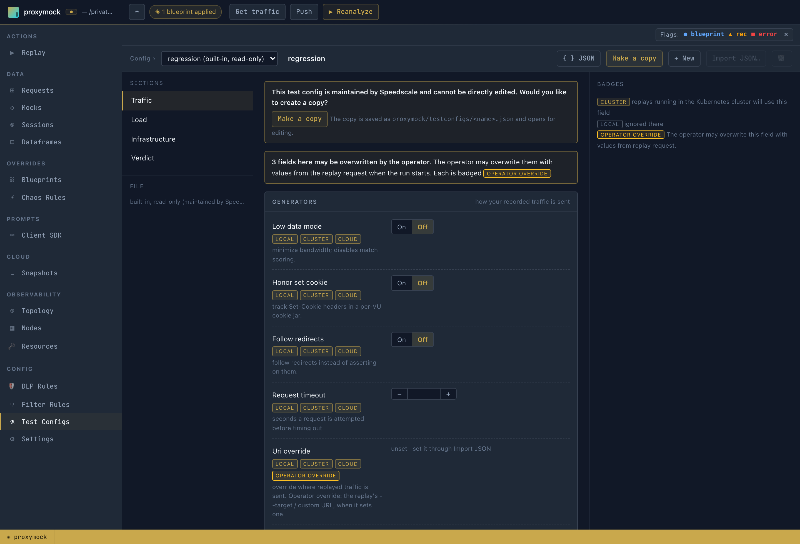
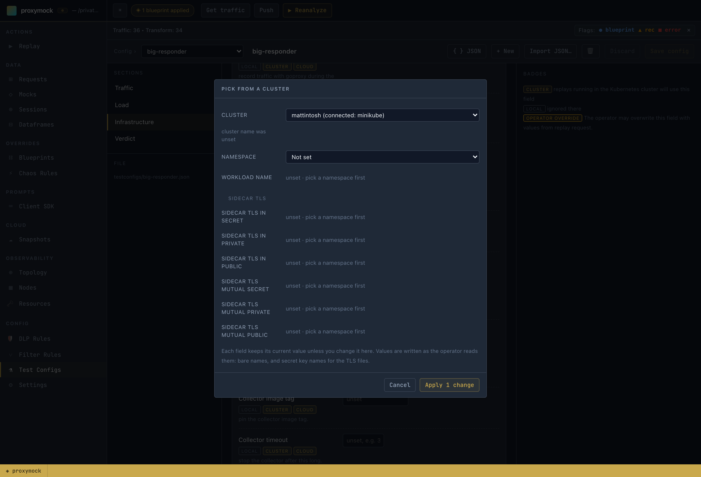
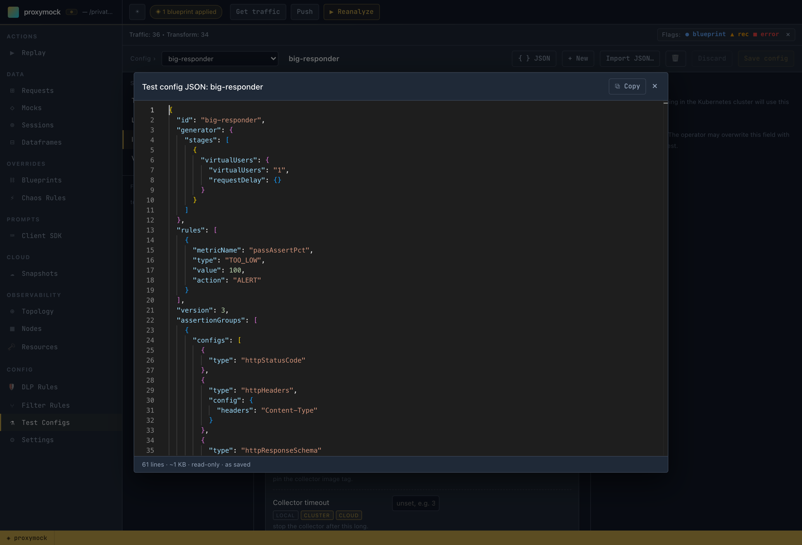
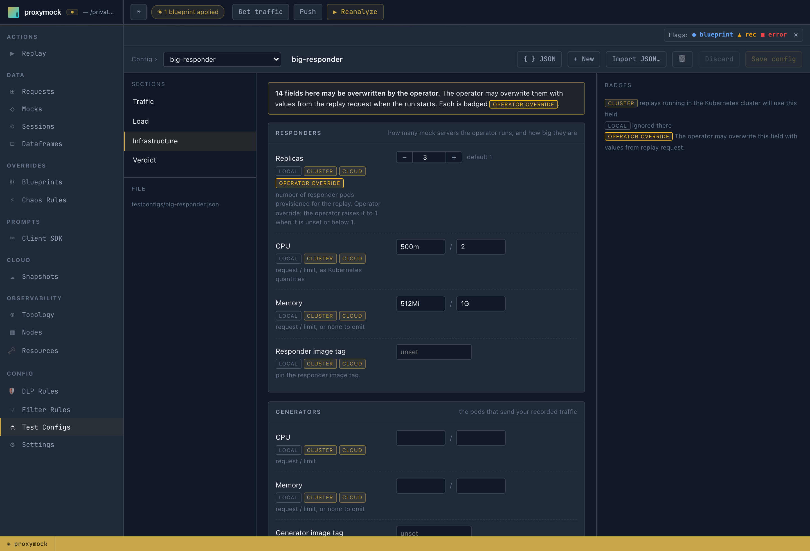
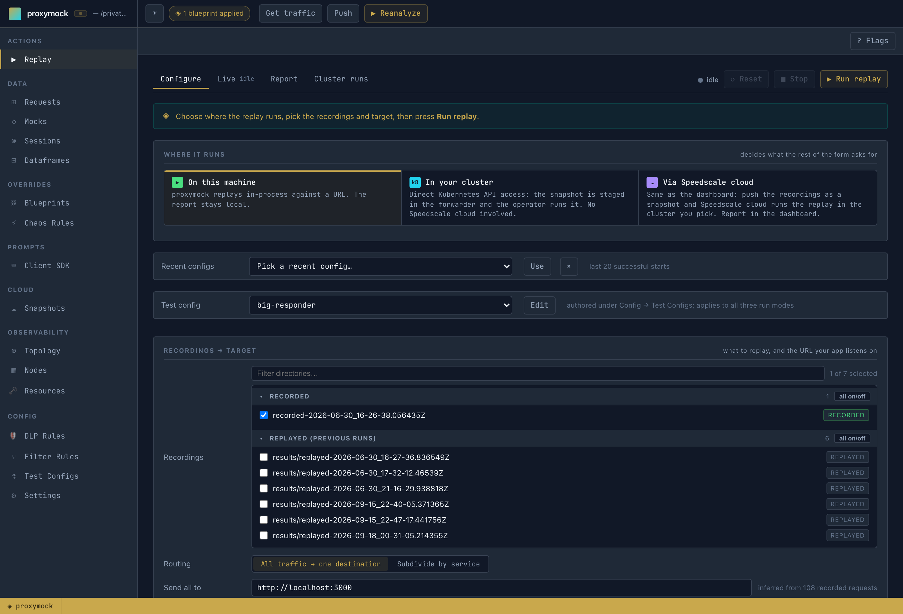

# Configure a Replay with Test Configs

A **test config** controls how a replay runs, separately from the traffic being replayed. It holds the load shape (stages and virtual users), the responder's behaviour and scale (replicas, CPU and memory), chaos, generator settings, and the goals and assertions a report is judged by. It is the same `TestConfig` document Speedscale cloud stores and the dashboard edits, so a config written in proxymock also works in Speedscale cloud.

In proxymock a test config is a file in your workspace. It travels with the repo it tests, gets reviewed in a merge request, and applies the same way on each of the [three replay paths](./replay-paths.md).

## Where test configs live

Each test config is one file:

```text
proxymock/
└── testconfigs/
    ├── big-responder.json
    └── checkout-soak.json
```

- **One complete config per file.** A file holds exactly one `TestConfig` as JSON, the same shape Speedscale cloud stores. There is no include or merge mechanism.
- **The id is the file name.** `big-responder.json` is the config `big-responder`. If the document has an `"id"` field, it must match the file name. Ids use letters, digits, `.`, `_` and `-`.
- **Parsing is strict.** An unknown field is an error that names the field, so a typo fails loudly instead of being ignored.
- **The workspace is the only location.** `--in` can point at the repo root, at the `proxymock/` directory or at a recording inside it. All three find the same `proxymock/testconfigs/` directory, the same way [blueprints](./blueprints.md) are found. proxymock never reads test configs from `~/.speedscale`.

See the [workspace layout reference](../how-it-works/workspace-layout.md#testconfigs) for the rest of the workspace.

## The built-in `regression` config

If you do not choose a config, every replay uses the built-in `regression` config. It is the same default Speedscale cloud uses: one virtual user, the standard assertions on status code, `Content-Type` header and response schema, and a responder in passthrough mode.

`regression` is maintained by Speedscale and is **read-only**. You can view it and copy it, but not edit it. To change a setting, make a copy under your own name and edit the copy. The names of all Speedscale default configs (`regression`, `standard` and the others) are reserved, and workspace configs cannot use them. Names are case-sensitive.



## Edit test configs in proxymock web

Open **Config → Test Configs** in `proxymock web`. You do not need a Speedscale login or a cluster to author a config.

- **Config** selects the config to edit. `regression (built-in, read-only)` is always listed first, followed by the workspace configs. The file being edited is shown under **File**.
- **Make a copy**, shown on the read-only `regression`, saves a copy as `proxymock/testconfigs/<name>.json` and opens it for editing. **+ New** starts a new config. **Import JSON…** loads a document you already have.
- **Sections** group the fields: **Traffic** (generator and responder behaviour, chaos), **Load** (stages, virtual users, target TPS), **Infrastructure** (responder and generator replicas, resources, image tags and other cluster settings) and **Verdict** (goals and assertions).
- **Save config** writes the file. **Discard** drops unsaved edits.

### Badges: which replay path uses a field

Each field has three badges, **local**, **cluster** and **cloud**. A highlighted badge means replays on that path use the field. A dimmed badge means that path ignores it. For example, responder replicas are highlighted for cluster and cloud but not for local: a local replay runs its mock server in-process, so there are no responder pods to scale.

Some fields also carry an **operator override** badge, and the section shows a note counting them. The legend explains: "The operator may overwrite this field with values from replay request." On cluster and cloud replays the Speedscale operator sets these fields from the replay request, not from the config:

| Field | What the operator uses instead |
|---|---|
| `cluster.workloadName`, `cluster.namespace` | the workload and namespace the replay targets |
| `snapshotId` | the snapshot being replayed |
| `responder.numReplicas` | raised to 1 when it is unset or below 1 |
| `cluster.cleanup`, `cluster.replayMode`, `cluster.buildTag` | the replay's own setting, when it sets one |
| `cluster.logLevel` | the operator's own log level, when the field is unset |
| `cluster.sidecarTls*` | the replay's sidecar TLS settings, when it sets them |
| `generator.uriOverride` | the replay's target or custom URL, when it sets one |
| `generator.dlpConfigId`, `responder.dlpConfigId` | the operator's DLP config, when DLP is on and the field is unset |

A config can still set these fields, but on a cluster or cloud replay the request takes priority.

### Pick values from a cluster

Fields that name something in a cluster, such as the cluster name, namespace, workload and sidecar TLS secrets, are plain text boxes, so you can type any value. Next to each one, **Pick…** opens a dialog for browsing a cluster: either the one `proxymock web` is connected to through your kubeconfig, or a cluster registered with Speedscale cloud. Choose the cluster, then the namespace, workload and secrets together. **Apply** writes only the fields you changed.



### See the JSON

**{ } JSON** shows the config exactly as it is saved or sent, including fields the editor does not display, such as deprecated settings. The document is read-only here. Use **Copy** to take it elsewhere, or edit the file directly.



## Worked example: more responder replicas and resources

A common request is to run more mock-server (responder) pods, and larger ones, for a cluster replay under heavy load. The `regression` default runs one responder with the operator's default resources.

1. In **Config → Test Configs**, select `regression (built-in, read-only)` and press **Make a copy**. Name the copy `big-responder`.
2. Open **Infrastructure**. Under **Responders**, set **Replicas** to `3`, **CPU** to `500m` / `2` (request / limit) and **Memory** to `512Mi` / `1Gi`. Values are Kubernetes quantities, and one Kubernetes would reject is refused with the field named.
3. Press **Save config**. The file is now `proxymock/testconfigs/big-responder.json`.



The relevant part of the saved file (the other fields are copied unchanged from `regression`):

```json
{
  "id": "big-responder",
  "responder": {
    "numReplicas": 3,
    "passthroughMode": true
  },
  "cluster": {
    "responderResources": {
      "requests": { "cpu": "500m", "memory": "512Mi" },
      "limits": { "cpu": "2", "memory": "1Gi" }
    }
  }
}
```

Replicas and responder resources are **cluster** and **cloud** fields, so run the config on one of those paths:

```shell
proxymock cluster replay start --in ./proxymock -n my-namespace --workload my-service \
  --test-config big-responder --wait
```

See the [responder sizing guide](/reference/responder-sizing-guide.md) to choose values.

## Use a test config on each replay path

All three replay paths take the same config name and resolve it the same way. `--test-config` accepts a workspace config name, a path to a config JSON file, or `regression` (the default).

| Path | CLI | What happens to the config |
|---|---|---|
| On this machine | `proxymock replay --test-config NAME` | Used as the base for the in-process run. Flags on the command override it. |
| In your cluster | `proxymock cluster replay start --test-config NAME` | Staged in the in-cluster forwarder next to the snapshot. The operator reads it from there, so no cloud login is needed. |
| Via Speedscale cloud | `proxymock cloud replay --test-config NAME` | A workspace config is pushed to Speedscale cloud under its id, then the replay runs with it. `regression` is not pushed because the cloud already has it. |

```shell
# on this machine
proxymock replay --in ./proxymock --test-against localhost:3000 --test-config big-responder

# in your cluster
proxymock cluster replay start --in ./proxymock -n my-namespace --workload my-service --test-config big-responder --wait

# via Speedscale cloud
proxymock cloud replay --in ./proxymock --cluster my-cluster -n my-namespace --workload my-service --test-config big-responder --wait
```

In `proxymock web`, the **Test config** picker in the Replay tab is the only test config choice, and it applies to all three run modes. It defaults to `regression (built-in, read-only)`. **Edit** opens the selected config in the editor, or offers to make a copy of `regression`.



Each run names the config it used and where it came from, then lists any fields the chosen path ignores, instead of dropping them silently:

```text
Loaded test config "big-responder" from /path/to/repo/proxymock/testconfigs/big-responder.json
‼ a local replay does not honour these fields, so they are ignored: assertionGroups, cluster.cleanup, ...
```

### Precedence

From highest to lowest:

1. **Flags** on the command, or the load controls in the Replay tab.
2. **The named test config.**
3. **The built-in `regression` config.**

For example, `--vus`, `--for`, `--times` or `--stage` on `proxymock replay` replace the config's load schedule. The run then prints a warning that the config's stages will not run. A run with no load flags uses the config's schedule. On cluster and cloud replays, the operator overrides described above take priority over the config.

### Which fields each path uses

| Fields | Local | Cluster | Cloud |
|---|---|---|---|
| Chaos, most generator traffic settings, load stages and virtual users, responder low data mode and response delay | yes | yes | yes |
| Responder replicas and resources, generator resources, image tags, `cluster.*`, responder passthrough mode, DLP config, mock mapping | no | yes | yes |
| Goals (`rules`) and assertions (`assertionGroups`) | no | no | yes |

Goals and assertions are evaluated only by the Speedscale cloud analyzer. A local replay is judged by its own [verdicts and `--fail-if` gates](./replay-verdicts.md). A cloud-free in-cluster replay does not produce a verdict yet.

:::note Load stages on a local replay
Running a test config's load stages on a local replay requires a proxymock release newer than v2.5.1017. On v2.5.1017 and earlier, set local load with `--stage`, `--vus` or `--for`.
:::

The editor badges are built from the same table, which you can also print from the CLI: `proxymock test-config meta`.

## Test configs from the CLI

`proxymock test-config` reads the workspace given by `--in` (default: the current directory):

```shell
# the configs in this workspace, plus the built-in regression
proxymock test-config list -o pretty

# one config, where it came from, its warnings and validation problems
proxymock test-config show big-responder

# validate a config and print it exactly as the local runner, operator or cloud receives it
proxymock test-config compile big-responder

# which run paths honour each field, and which fields the operator overrides
proxymock test-config meta
```

`compile` exits with an error listing every problem when a config is not valid: an unknown field, an id that does not match the file name, a Kubernetes quantity that would be rejected, or a stage whose arithmetic does not work. Run it in CI to catch a broken config before a replay does.

To create or change a config from the CLI, edit the JSON file directly. `compile` checks it.

## Test configs and Speedscale cloud

Test configs move with your snapshots, the same way blueprints do:

- **Snapshot push** uploads every workspace test config along with the traffic. A config that does not parse is skipped and reported rather than dropped silently.
- **Snapshot pull** restores those configs into `proxymock/testconfigs/`. If a pulled config would replace a local config with different contents, proxymock asks before overwriting it.

To pull a single config by id:

```shell
proxymock cloud pull test-config checkout-soak --in ./proxymock
```

This writes `<workspace>/proxymock/testconfigs/checkout-soak.json`. If that file exists and differs from the cloud copy, proxymock warns, naming the file and the local values that would be lost, and asks for confirmation (default no). Without a terminal, such as in CI or a pipe, the pull refuses and names the file. `--force` overwrites without asking. A local copy that already matches is not rewritten.

Protected Speedscale configs such as `standard` are never written under their own name. Pull an editable copy instead:

```shell
proxymock cloud pull test-config standard --as standard-tuned
```

`proxymock cloud replay --test-config` pushes the config it runs with, so you do not need to push it separately.

## From an AI agent

Every replay tool on the MCP server takes a `test_config` parameter with the same meaning as `--test-config`. `cluster` (action `replay-start`) and `cloud_replay` (action `start`) accept it today.

:::info Available in the next proxymock release
The `test_config` MCP tool, and `test_config` on `replay_traffic`, are merged but not yet released. They ship in the first proxymock release after v2.5.1017.
:::

The `test_config` tool lets an agent author workspace configs with the same rules as the web editor. Files it writes open unchanged in the editor. It works offline with no Speedscale account and never reads or writes `~/.speedscale`.

| Action | Does |
|---|---|
| `list` | Workspace configs plus the read-only built-in `regression` |
| `show` | One config as JSON, with warnings and validation problems |
| `meta` | Field paths, types, defaults, which run paths honour each field, and operator overrides. Filter by `section` or `path_prefix` |
| `create` | A new config under `id`, copied from `regression` by default, from another config with `from`, or from a full `config` document. Refuses an existing id unless `force` is true |
| `set` | Change fields by path, for example `{"responder.numReplicas": 3}`. Unknown and deprecated paths are refused; `null` removes a field |
| `validate` | Check a saved config by `id`, or an unsaved `config` document, without writing |
| `delete` | Remove a workspace config. Requires `confirm: true` |

A typical agent workflow for "run this replay with 3 responder replicas":

1. `test_config` `meta` with `path_prefix: "responder."` to find the field.
2. `test_config` `create` with `id: "big-responder"`, which copies `regression`.
3. `test_config` `set` with `fields: {"responder.numReplicas": 3}`.
4. `cluster` `replay-start` with `test_config: "big-responder"`.

Reserved names cannot be created, changed or deleted, and `protected` can never be set. `create` and `set` refuse to write a config that fails validation and name each problem.

## Related

- [Choose Where a Replay Runs](./replay-paths.md) compares the three replay paths.
- [Test configs in Speedscale](/concepts/test_config.md) and the [test config reference](/reference/configuration/README.md) describe the fields from the dashboard's side.
- [Workspace layout](../how-it-works/workspace-layout.md) covers everything else stored in the workspace.
